# 🐝 Bee 架构设计说明书 v2

> **范围**：本文档描述 Bee 分布式数据流管道计算服务的完整架构——数据流模型、调度、注册中心、故障转移，以及承载它们的 BRP 网络协议。
>
> **阅读建议**：先浏览 [CONTEXT.md](../CONTEXT.md) 了解领域术语，再回到本文档。BRP 协议的 4 层 / 报文格式独立于上层数据模型，可按需跳读。

## 目录

0. [修订记录](#0-修订记录)
1. [设计目标](#1-设计目标)
2. [核心数据模型（静态）](#2-核心数据模型静态)
3. [运行实体（动态）](#3-运行实体动态)
4. [生命周期状态机](#4-生命周期状态机)
5. [系统拓扑](#5-系统拓扑)
6. [BRP 协议分层](#6-brp-协议分层)
7. [二进制报文格式](#7-二进制报文格式)
8. [关键流程](#8-关键流程)
9. [注册中心（Registry）](#9-注册中心registry)
10. [时序图](#10-时序图)
11. [路线图](#11-路线图)
12. [附录：crate 边界草案](#附录crate-边界草案)

---

## 0. 修订记录

| 版本 | 范围 | 关键变化 |
| --- | --- | --- |
| **v1** | 仅 BRP 网络协议 | 4 层分层、15 字节 Header、两个时序图 |
| **v2** | 完整 Bee 系统 | 引入 DAG 数据模型、Job/Task、Producer Pipeline、Datasource-as-Phase、Failover 流程；BRP 协议部分保留为第 6、7 章 |

v1 中"控制面 / 数据面"是协议内部的分层；v2 中这两个术语上升到**系统架构**层面（见 ADR-0001），含义更广。

---

## 1. 设计目标

| 类别 | 目标 | 体现 |
| --- | --- | --- |
| **架构** | 数据面 P2P，控制面 Raft | 详见 ADR-0001 |
| **可表达** | 用户用 SQL / Lua 写 Pipeline，编译为 DAG | 运行时支持多 DSL 互译 |
| **可扩展** | 跨 Pipeline 边实现 Pipeline 组合与 Datasource 共享 | Producer Pipeline 模式（§8.3） |
| **可插拔** | Handler 与 Adapter 通过动态库加载 | Plugin Manager + 热重载 |
| **高可用** | 节点失效 → Task 自动 Work-Stealing | Orphaned / Migrating 状态机 |
| **限流友好** | 5 个 Pipeline 共用一个外部数据源 → 1 个网络连接 | Producer Pipeline 自动共享 |
| **零运行时外部依赖** | 仅 `tokio` + `bytes` + `bincode` | 传输与编解码 |

---

## 2. 核心数据模型（静态）

### 2.1 静态实体关系

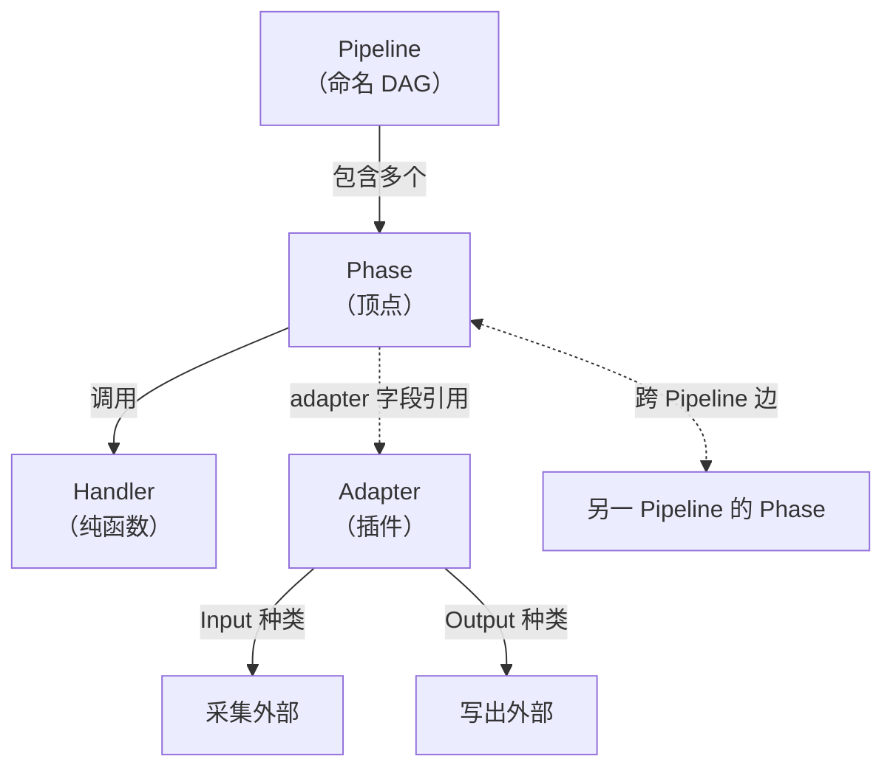

### 2.2 定义

| 概念 | 性质 | 备注 |
| --- | --- | --- |
| **Pipeline** | 命名 DAG，编译后不可变 | 见 [CONTEXT.md](../CONTEXT.md) |
| **Phase** | DAG 顶点，调用 Handler；带可选 `adapter` 字段 | 一切 Phase 地位平等，Datasource 是带 Adapter 的 Phase |
| **Handler** | 纯计算函数 | 状态在 Job / Task 层 |
| **Adapter** | 外部系统插件；Input / Output 两种 kind | 通过 Plugin Manager 加载 |
| **Cross-Pipeline Edge** | 源 Phase 与目标 Phase 分属不同 Pipeline | 部署时按 Job 归属解析为 in-process / BRP 订阅 |

### 2.3 Datasource-as-Phase（ADR-0002）

```
Datasource 不是独立的一等公民，而是"带 Adapter 字段的 Phase"。
所以 SQL 中的 binance.subscribe(...)、EMIT INTO influxdb(...)
在编译器里都生成普通的 Phase 节点。
```

为什么这样设计：

- 模型只有一种节点（Phase），运行时只有一种调度单元（Task）。
- 跨 Pipeline 边、Input、Output 在运行时都是"流过数据的边"，用同一种机制（BRP 数据通道）。
- 限流数据源的共享变成"上游 Phase 的 fork"——见 §8.3。

---

## 3. 运行实体（动态）

### 3.1 动态实体关系

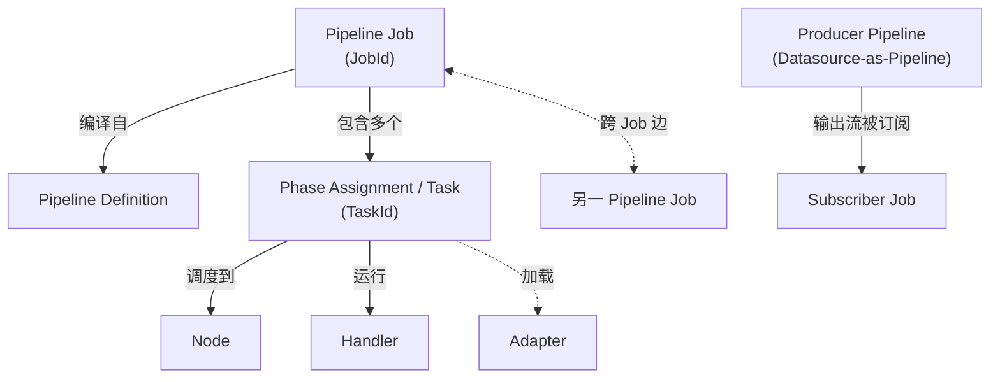

### 3.2 定义

| 概念 | 性质 | 备注 |
| --- | --- | --- |
| **Pipeline Job** | 一次具体的部署运行 | `JobId` 全局唯一 |
| **Phase Assignment (Task)** | Phase 在某 Node 的运行体 | `TaskId` 全局唯一，是 Failover 单元 |
| **Producer Pipeline** | 专门发布流给其他 Job 订阅的 Pipeline | 典型形态是 Datasource-as-Pipeline：单 Phase Pipeline，零上游 |

### 3.3 标识符（建议草案）

```
JobId    = ULID
TaskId   = (JobId, PhaseIndex) 或全局 ULID
AdapterId = 全局字符串（"binance" / "influxdb" / ...）
DatasourceSignature = hash(AdapterId + config_payload)   ← 决定是否共享 Producer
```

`DatasourceSignature` 是 Producer 共享的关键——见 §8.3。

---

## 4. 生命周期状态机

### 4.1 Pipeline Job

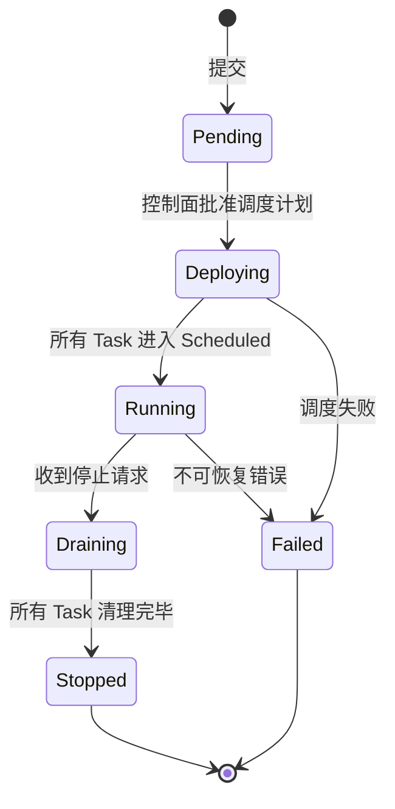

### 4.2 Phase Assignment（Task）

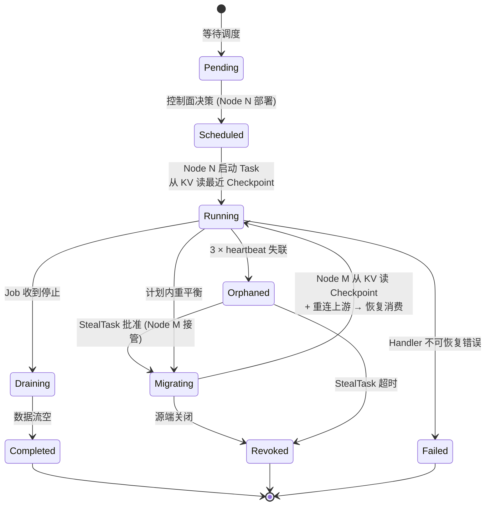

### 4.3 关键状态说明

- **Orphaned**：Task 在 Raft 里登记着 owner Node，但 owner 失联。**3 × heartbeat_interval** 触发（默认 30s）。期间新 StealTask 可被批准。
- **Migrating**：目标 Node 从 **KV 集群**读取最新 Checkpoint（包含 Task State + Saved Offset），恢复状态后重连上游 BRP 数据通道，从 Saved Offset 之后继续消费。源端 Node 若恢复，控制面通知其清空本地缓冲并退出。详细时序见 §8.2。
- **Draining**：Job 收到停止，停止接收新输入；已有数据流空后 Task 退出。

---

## 5. 系统拓扑

### 5.1 节点与集群

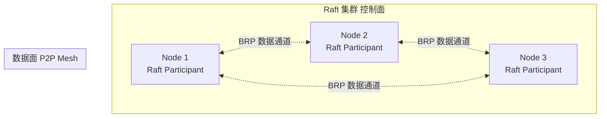

- 简化拓扑下，每个 Bee 进程**同时是 Raft 参与者、KV 节点和数据面 Worker**（ADR-0007）。
- Raft 集群规模由 `bee.cluster.raft_size` 配置；**默认 3（开发） / 5（生产）**。
- 任意两个 Node 之间建立**一条**长 TCP 连接（Full-Mesh），多路复用所有 Phase↔Phase 流量。
- **优先级机制**：控制面 RPC + Heartbeat 走高优先级通道，不和 Worker 数据流抢带宽。这是为了在简化拓扑下，Worker 高负载不至于拖垮 Raft 共识延迟。
- **切到独立控制面（拓扑 B）的触发条件**（任一）：
  1. Raft p99 共识延迟 > 10ms 持续 1 周
  2. Worker 池 > 50 Node
  3. 用户明确要求独立扩缩容控制面
- 简化拓扑下 Raft 集群 ≈ Worker 集群；规模化限制在 7-15 Node 健康共识（与 etcd 同源经验）。

### 5.2 单 Node 内部

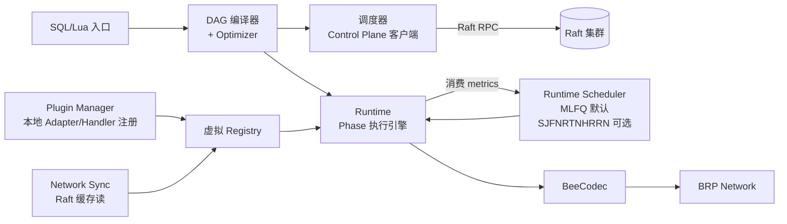

**三层层级（ADR-0008）：**

- **Optimizer**（Compiler 内部）—— 编译期 DAG 重写（Filter+Project 融合、跨 Node 边折叠、Producer/Subscriber 亲和）+ DataFusion SQL 优化
- **Scheduler**（Control Plane）—— 跨 Node Task 放置：bin-packing + Work-Stealing；0.7 加运行时指标反馈再平衡
- **Runtime Scheduler**（Runtime 内部）—— Node 内部 Task CPU-share 调度；默认 MLFQ，备选 SJF / HRRN / SRTN；通过 `bee.runtime.scheduler_policy` 配置

---

## 6. BRP 协议分层

> BRP 是承载数据面与控制面的统一传输协议。分层设计与 v1 保持一致。

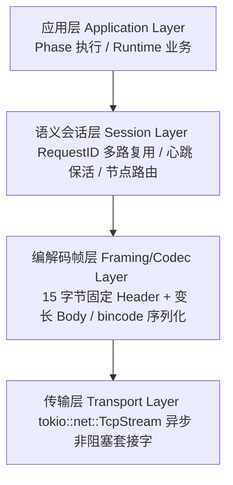

- **应用层**：Runtime 把 Phase 间的 typed stream 切成 BRP 消息体（StreamData / StreamAck / StealTask / StealResponse / Heartbeat …）。
- **会话层**：RequestID 复用单连接；维护对端路由表与心跳。
- **编解码层**：解决 TCP 粘包/半包；Header 固定 15 字节（§7）。
- **传输层**：纯裸 TCP 字节流。

### 6.1 两条逻辑通道

| 通道 | 流量 | 特征 |
| --- | --- | --- |
| **数据通道** | Phase↔Phase 业务流、Handler 远程调用返回 | 量大、对延迟敏感、可丢（流式重传） |
| **控制通道** | StealTask、Heartbeat、Job/Task 元数据同步 | 量小、要求可靠（基于 RequestID 的 RPC） |

两条通道**共用一条 TCP 连接**（多路复用），但 Session 层用不同 Message Type 区分。

---

## 7. 二进制报文格式

> 同 v1。

```
+--------------------+--------------------+--------------------+--------------------+
|  Magic Number (2B) |  Message Type (1B) |   Request ID (8B)  |   Body Length (4B) |  → 固定 Header (15 Bytes)
+--------------------+--------------------+--------------------+--------------------+
|                                                                                   |
|                                Body Data (变长, 由 Body Length 决定)              |  → 变长 Body
|                                                                                   |
+-----------------------------------------------------------------------------------+
```

字段说明见 [CONTEXT.md](../CONTEXT.md) 附注或 v1 文档。

---

## 8. 关键流程

### 8.1 Pipeline 提交与部署

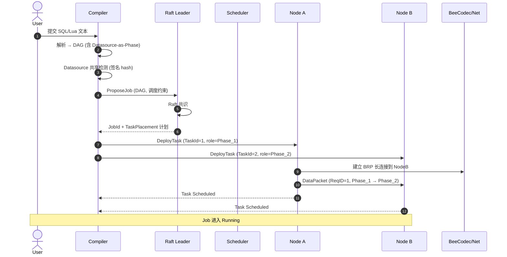

**Datasource 共享检测**是关键步骤：

- 计算每个 Datasource Phase 的 `signature = hash(AdapterId + config_payload)`
- 查找 Raft 中是否已存在 `JobId -> ProducerJob` 的注册（signature 索引）
- 若有：当前 Job 的"该 Datasource Phase"变为订阅边，指向已有 Producer
- 若无：当前 Job 内部标记该 Phase 为 "Producer 候选"；首个匹配此 signature 的 Job 部署时会作为 Producer

### 8.2 Failover：Orphan → Work-Stealing → Migrating (via KV Cluster)

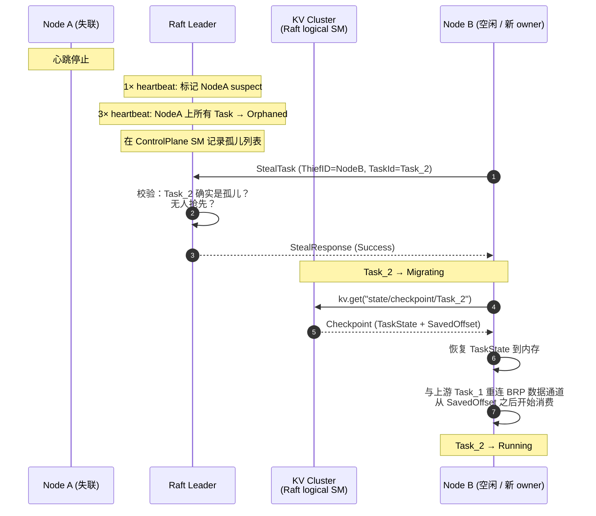

要点：

- **不抢锁**：Leader 是唯一仲裁者；StealTask 失败不会脏状态。
- **状态来自 KV 不来自源端**：旧设计需要源端序列化状态经 BRP 传输；新设计（ADR-0004）新 owner 直接从 KV 读 Checkpoint，延迟 ~1–5ms。
- **依赖重连**：Task_2 上游是 Task_1（可能在另一 Node）；Migrating 完成后由 Node B 与上游 Node 重建 BRP 数据通道，从 SavedOffset 之后开始重放。
- **源端恢复时**：Node A 重新上线后，控制面通知它 Task_2 已被接管；Node A 丢弃本地缓存、清空输出缓冲、退出。

### 8.3 Datasource 共享（Producer Pipeline 模式，ADR-0003）

这是你提的"限流数据源成本"问题的解决方案。**核心思想：把"5 个 Pipeline 用同一 Datasource"翻译成"5 个 Job 订阅 1 个 Producer"**。

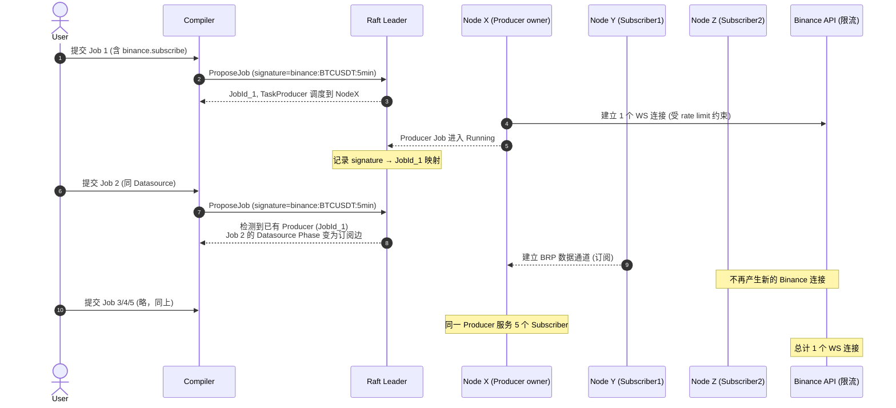

**关键属性：**

- **Producer 是普通 Pipeline Job**：Datasource Phase + 零上游，编译为单 Phase Pipeline；生命周期 = Job 生命周期。
- **订阅是普通 Phase-to-Phase 边**：Subscriber Job 里的"Datasource Phase"在编译时降级为订阅边，运行时等价于"BRP 数据通道 + typed stream 解码"。
- **failover 联动**：Producer 失联 → 所有订阅者 Job 进入 `Waiting for Upstream`；Producer 重新部署后，订阅者自动重连。
- **限流天然成立**：永远只有 1 个连接打到 Binance。

### 8.4 跨 Pipeline 边解析

编译器在编译期做一次全局 DAG 合并（按 Phase 引用关系）：

```
DAG 合并
  ├── 同 Job 内: in-process 通道 (mpsc channel)
  ├── 跨 Job 同 Node: in-process 通道 (省一次网络)
  └── 跨 Job 跨 Node: BRP 数据通道
```

- 部署期：Raft 把"JobId → Node 列表"持久化；运行时 Phase 用 BRP 路由表找到对端 Task。
- Job 失败：见 §8.2；订阅者进入 `Waiting for Upstream`，Producer 恢复后重连。

---

## 9. 注册中心（Registry）

### 9.1 三个层

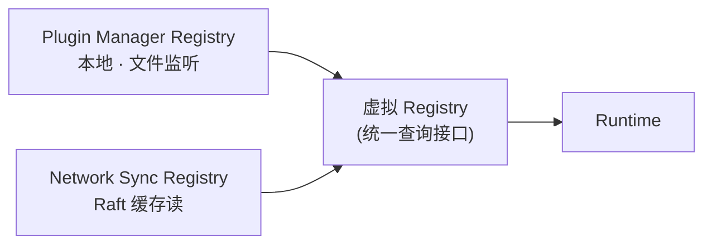

| 层 | 范围 | 一致性 | 触发 |
| --- | --- | --- | --- |
| **Plugin Manager** | 本地动态库插件（Adapter / Handler） | 强一致（本地） | 配置文件目录变更 / 手动 install / reload |
| **Network Sync** | 集群范围内的归属："Handler X 的 owner 是 Node Y" | 写强一致（Raft），读最终一致（本地缓存 + 短 TTL） | Job 部署 / Task 调度 / Adapter 注册 |
| **虚拟 Registry** | Runtime 只看到这个统一接口 | 透传 | — |

### 9.2 解析顺序（推荐）

```
Runtime 收到 "我需要 Handler X"
  1. 查本地缓存 (Network Sync 的副本) → 命中且新鲜 → 用
  2. 查 Plugin Manager (本地) → 命中 → 加载并执行
  3. 转发 Raft (Raft 同步读最新归属) → 拿到 owner Node → 远程调用 BRP
```

### 9.3 Plugin Manager 行为（ADR-0005 + ADR-0009）

- 监听配置的动态库目录（默认如 `/etc/bee/plugins/`）
- 加载：发现 `.so` / `.dylib` → 计算 `sha256(binary)` 作为 `PluginId` → 解析导出符号 → 读取 Plugin Manifest（含 `abi_version`）→ **ABI 兼容性检查**（不通过则拒绝加载并报错）→ 注册到本地
- **多版本共存**：同一逻辑 Plugin 的不同版本（即不同 binary hash）可同时加载。`bee plugin list` 显示所有加载版本 + 各自的 hash + 引用计数。
- 卸载 / Reload：引用计数归零后 `dlclose`；或 `bee plugin unload --force` 强制卸载（中断使用中的 Pipeline，1.x 才完全支持；MVP 警告而非强制）
- 与 Network Sync 协同：本地注册的 Adapter 写一条元数据到 Raft（"Adapter `binance` feature_version=`1.4` abi_version=`1.0` hash=`a3f5...` 存在于 Node A"）
- **Pipeline 引用 Plugin 时的解析**：`binance:^1.0` 这样的版本范围在 Pipeline 提交时由控制面解析为具体 PluginId（hash）；解析不到时编译失败
- **状态隔离**：KV state key 含 hash —— `state/task/{TaskId}/h{hash}/...`；新旧版本的 state 天然分离

---

## 10. 时序图

> §8.1 / §8.2 / §8.3 已包含三个核心时序图。下面补充两个补充场景。

### 10.1 Handler 远程调用（本地无 Handler）

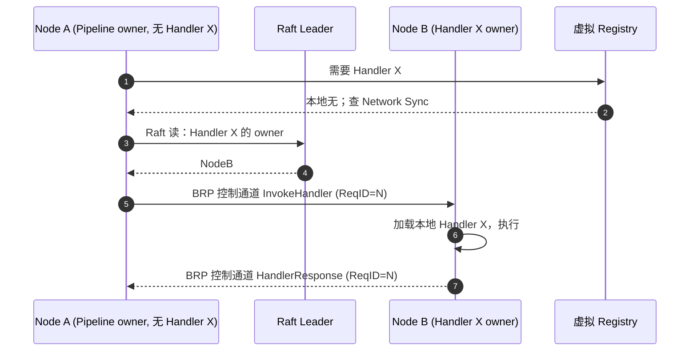

### 10.2 Datasource / Input 远程运行

Input Phase 在某 Node 调度，Input Adapter 必须在该 Node（或可访问的共享位置）。如果当前 Node 没有对应 Adapter 插件：触发与 §10.1 相同的"远程 Adapter 加载 + 调用"路径，但负载更重（要走 Plugin Manager 调度而非 in-process invoke）。

> **实际建议**：限流/敏感 Adapter 由 Producer 模式承担（§8.3）；只在边缘场景用远程 Adapter 加载。

---

## 11. 路线图

| 阶段 | 范围 | 里程碑 |
| --- | --- | --- |
| **0.1** | BRP PoC：4 层编解码 + 15 字节 Header + 单节点 echo | 协议可独立测试 |
| **0.2** | Pipeline 编译：SQL/Lua → DAG；本地单 Job 部署 | 一个 Pipeline 跑通，无跨 Job |
| **0.3** | Raft 控制面：Job/Task 调度、Heartbeat、Orphan 检测 | Failover 雏形 |
| **0.4** | Work-Stealing + Migrating | 节点失效自动恢复 |
| **0.5** | 跨 Pipeline 边 + Datasource 共享 (Producer Pipeline) | 限流场景落地 |
| **0.6** | 插件系统 (Plugin Manager + Adapter / Handler 动态库) | 第三方扩展能力 |
| **0.7** | 优化器：基于运行时指标的 Phase 重排 + DataFusion 优化器扩展点暴露 + **Runtime Scheduler (MLFQ 默认 + SJF/HRRN/SRTN 可选)** + 跨 Node 再平衡 | 调度策略可调 |
| **0.8** | SQL 性能调优：毫秒级微批 / UDF 性能分析 / Hint 语法 | 量化场景可调 |
| **1.0** | 公开 API 稳定化 + 首版 crate 发布 | 生产可用 |

---

## 附录：crate 边界草案

> 与 v1 保持一致；随实现推进可能调整。

| Crate | 层级 | 关键导出 |
| --- | --- | --- |
| `bee-transport` | 传输层 | `TcpFramed`、`Listener` |
| `bee-codec` | 编解码层 | `Frame`、`BeeCodec`、`BeeMessage` |
| `bee-session` | 会话层 | `ConnectionPool`、`RequestRouter` |
| `bee-runtime` | 应用层 / 编译 | `Phase`、`Handler`、`Dag`、`Compiler` |
| `bee-control` | 控制面 | `RaftClient`、`Scheduler`、`StealArbiter` |
| `bee-registry` | 注册中心 | `PluginManager`、`NetworkSync`、`Registry` (trait) |
| `bee-dsl-sql` | DSL | SQL parser / planner (DataFusion-based, ADR-0006) |
