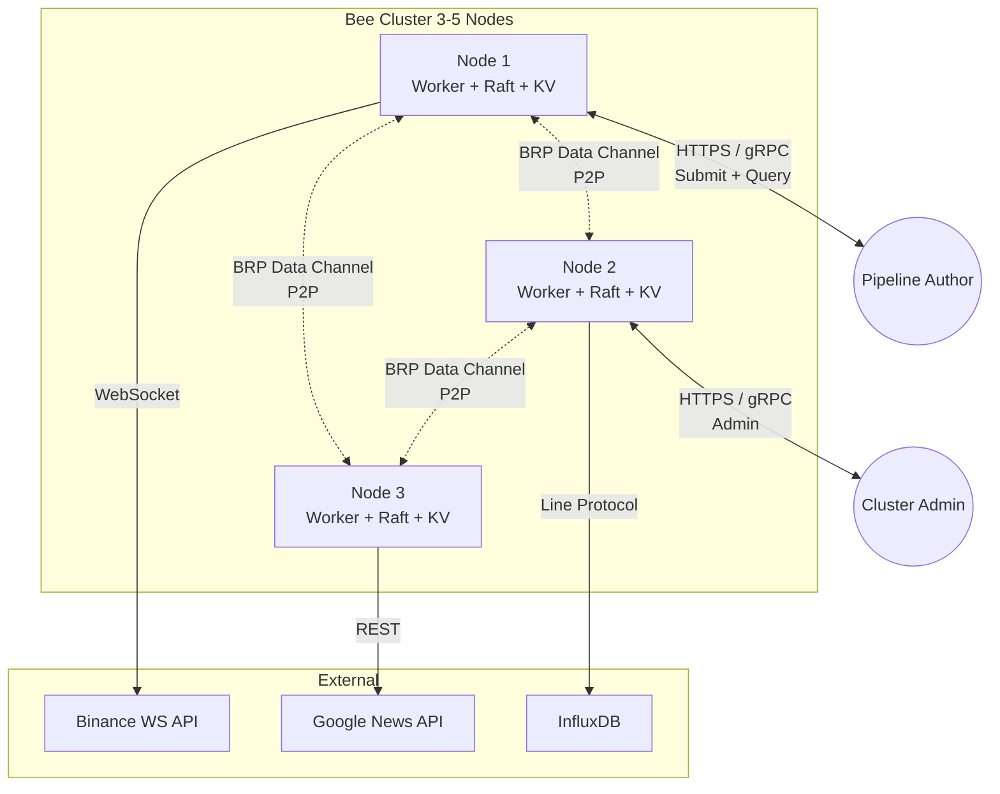
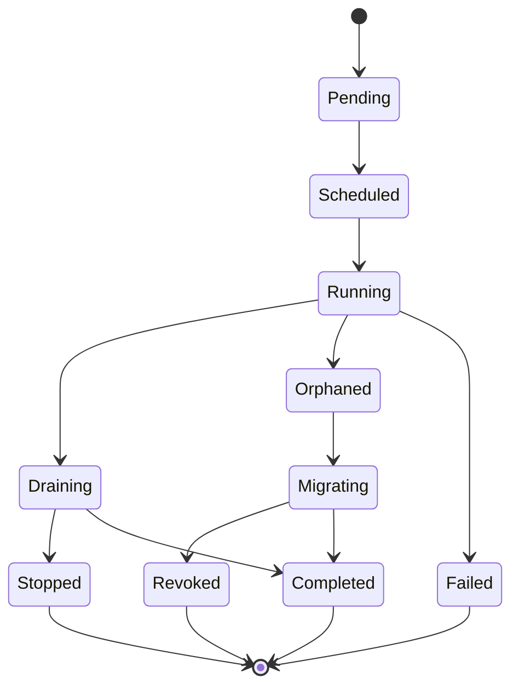
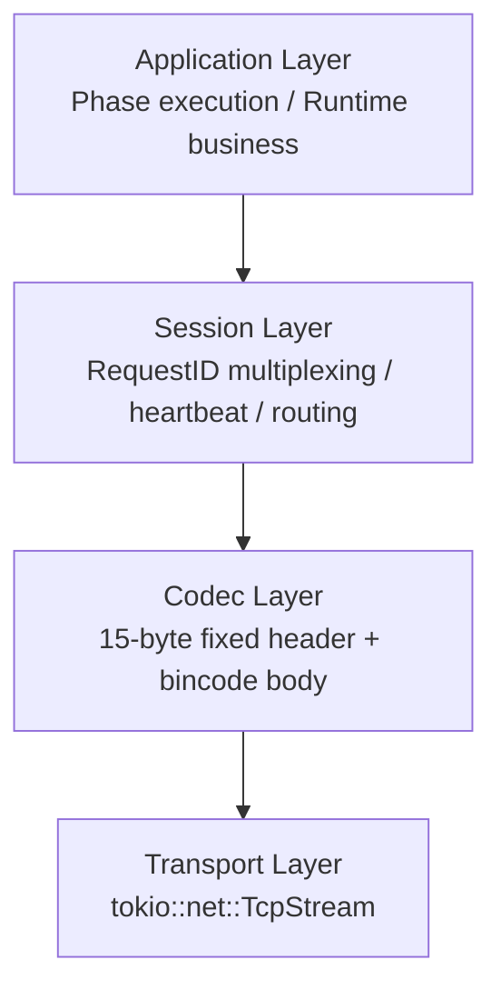
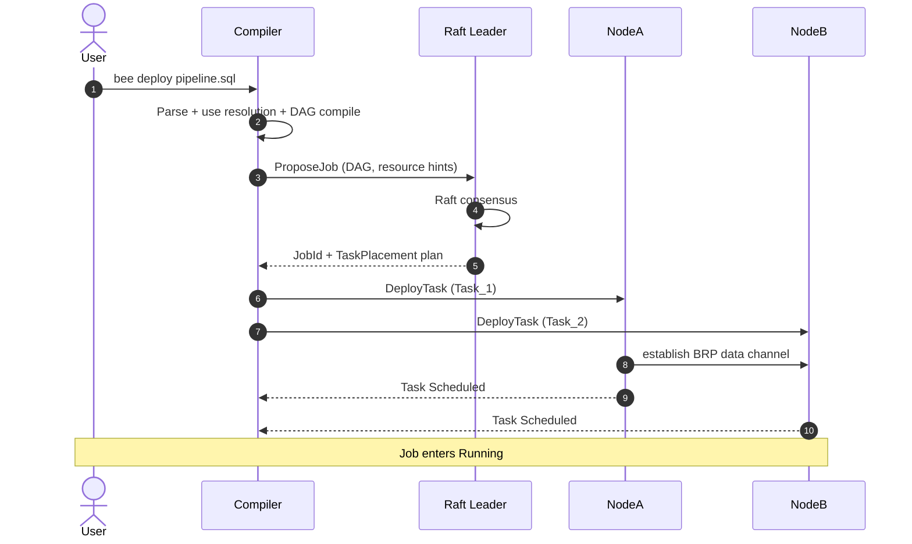
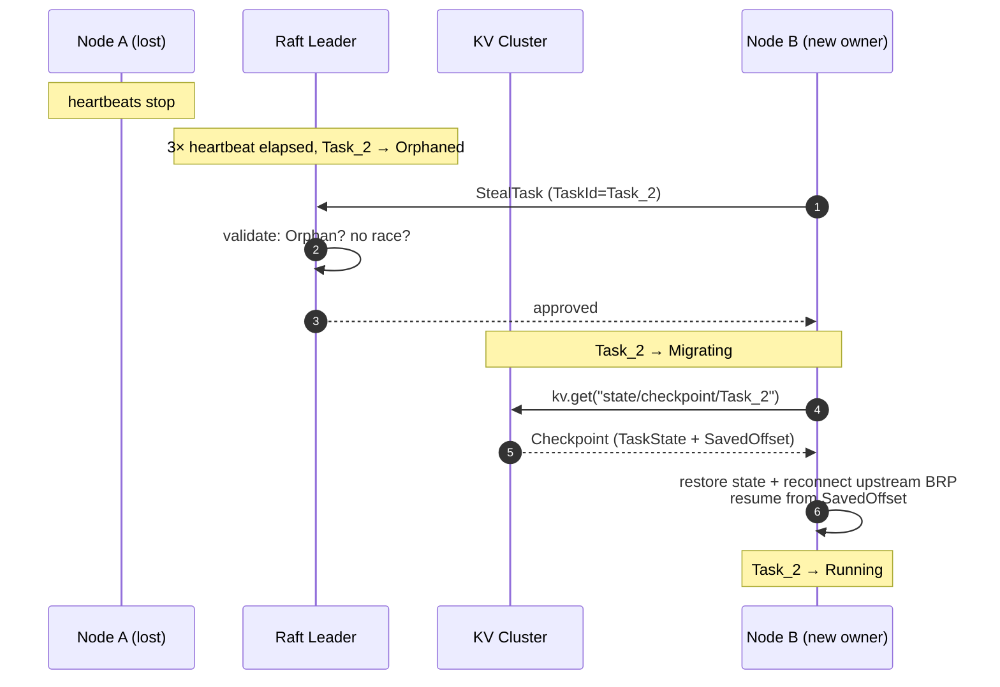
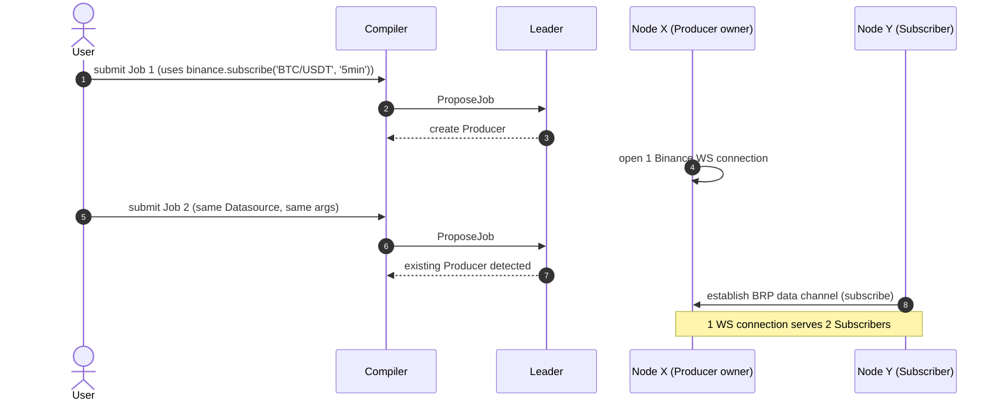

# 🐝 Bee Architecture

> **Audience**: This document is for **everyone** evaluating, operating, extending, or reviewing Bee. It describes the system at the architectural level — what it does, why, how the pieces fit together, and how to operate it. Implementation details (crate boundaries, wire format, build instructions) live in [docs/internals.md](./internals.md).
>
> **Reading order**: §1 → §2 → §3 for the pitch and rules. §4–§6 for the system itself. §7–§9 for using and running it. §10–§12 for cross-cutting concerns.
>
> **Related documents**:
> - [CONTEXT.md](../CONTEXT.md) — domain glossary (Pipeline, Phase, Datasource, …)
> - [docs/product-design.md](./product-design.md) — who uses Bee and why
> - [docs/stories.md](./stories.md) — implementation backlog
> - [docs/adr/](./adr/) — irreversible design decisions
> - [docs/internals.md](./internals.md) — implementation details

## Table of contents

1. [Overview](#1-overview)
2. [Why Bee exists](#2-why-bee-exists)
3. [Design principles](#3-design-principles)
4. [High-level architecture](#4-high-level-architecture)
5. [Core abstractions](#5-core-abstractions)
6. [Subsystems](#6-subsystems)
7. [Key flows](#7-key-flows)
8. [Deployment](#8-deployment)
9. [Operations](#9-operations)
10. [Security model](#10-security-model)
11. [Performance characteristics](#11-performance-characteristics)
12. [Roadmap and references](#12-roadmap-and-references)

---

## 1. Overview

**Bee is a distributed compute service for streaming data pipelines.** You write what data to read, how to transform it, and where to send it — in SQL or a Rust plugin — and Bee compiles that into a DAG, schedules it across a cluster, and keeps it running through node failures. Adapters to external systems (exchanges, news feeds, databases) are loaded as plugins, with credentials, rate limits, and lifecycle managed centrally.

The single most distinctive design choice: **data flows peer-to-peer** between nodes over a custom binary protocol (BRP), while **control state lives in a Raft-replicated state machine** on the same nodes. Datasources are first-class managed entities, not inline strings in SQL. Rate-limited external sources are shared across pipelines automatically — five strategies subscribing to the same Binance feed cost one WebSocket connection, not five.

---

## 2. Why Bee exists

### 2.1 The problem

Real-time data pipelines are everywhere — quant trading, IoT, monitoring, ML feature pipelines. Building one in 2026 still means gluing together a half-dozen tools, each with its own deployment model, failure modes, and operational story. Specifically:

- **Multi-source fusion is hard.** Joining exchange ticks with news sentiment, both streaming, requires custom glue between 5 consumers, 3 joiners, 2 state machines.
- **Rate-limited sources are expensive.** Five strategies needing the same BTC feed means five WebSocket connections, possibly hitting the exchange's rate limit.
- **State is awkward.** Stateful operators (EMAs, ASOF JOINs, sliding windows) need somewhere to live. In-memory is fast but loses data on crash; external KV is durable but adds a hop.
- **JVM-heavy stacks are friction.** Flink and Spark pull in JDK, Zookeeper, S3, a config center — high cold-start latency, high operational cost.
- **Plugins are an afterthought.** Adding a new data source to most frameworks means writing Java SPI, rebuilding the world.
- **Failover is reactive, not automatic.** Most operators are paged for a node failure and have to manually reassign work.

### 2.2 Goals

| Goal | What it means |
| --- | --- |
| **Pipelines survive node failures** | Tasks are automatically reassigned within ~30s of a node becoming unreachable; in-flight state is recovered from a shared KV; downstream consumers don't notice. |
| **Rate-limited sources shared by default** | Multiple pipelines calling the same `(Datasource, method, args)` share a single Producer. No code to write for this. |
| **Single binary, zero external runtime deps** | One `bee` process runs the data plane, control plane, KV store, and plugin loader. No JDK, no Zookeeper, no external KV. |
| **Plugins as first-class citizens** | Adapters and Handlers are `.so` files dropped into a directory. Hash-identified, multi-version coexisting, hot-reloadable, ABI-version-checked. |
| **Credentials never touch SQL** | API keys live in a secret store; pipelines reference Datasources by name; the SQL is sharable. |
| **Domain is open, framework is opinionated** | The framework is ours (Bee core). Datasources, UDFs, business logic are all plugins. |
| **Sub-millisecond latency when needed** | Micro-batch windows tunable to 10ms; per-event mode available; in-memory state cache; priority scheduling. |

### 2.3 Non-goals

| Non-goal | Why |
| --- | --- |
| **Batch processing** | Bee is for streams. Batch jobs belong in Airflow, Spark Batch, or DuckDB. |
| **Multi-DSL at MVP** | MVP supports SQL only. Lua is a 1.x addition. Python, JSON DSLs — not on the roadmap. |
| **Cross-language plugins at MVP** | MVP plugins are Rust cdylibs compiled against Bee's exact toolchain version. C ABI for other languages is a 1.x feature. |
| **BYO control plane components** | The control plane and KV live in the same Raft group as the Worker. Splitting them is a 1.x evolution behind explicit trigger conditions, not a configuration option. |
| **Cross-cluster federation** | One Bee cluster = one Raft group. Multi-region deployment is not in scope. |
| **Strong exactly-once across heterogeneous sinks** | We provide at-least-once with deterministic replay from saved offsets. External sinks that don't support idempotency may see duplicates. |
| **Schema evolution in MVP** | Pipeline schema changes are an explicit 1.x feature. Until then, schema changes require a versioned redeploy. |

---

## 3. Design principles

Six rules govern every decision in Bee. If a change violates one of these, the change needs an ADR.

1. **Hybrid by design, not by accident.** Data flows P2P; control state goes through Raft. These are the two channels, and they have different latency, throughput, and consistency budgets. Mixing them corrupts both.
2. **Datasource is a managed Provider, not a runtime Phase.** Connection-level config (credentials, base URL, rate limits) lives in a managed registry. Per-call args (symbol, interval, query) live in the SQL. Same Datasource + different args = different streams + different Producers.
3. **One Datasource, one Provider, multiple Streams.** A Datasource wraps an Adapter with config. The same Datasource can be the source of many Streams (one per call signature). Streams are the unit of Producer sharing; Datasources are the unit of governance.
4. **Per-Task state, shared via DAG, not memory.** State is per-Task private. "Sharing" between two Phases means A's output becomes B's input. There's no shared mutable state in the runtime — DAG composition is the only coupling.
5. **Plugin identity is content, not version.** Two binaries with the same `version = "1.0"` string are different Plugins if their bytes differ. State is keyed by `sha256(binary)`. Version strings are human-readable metadata; the hash is the binding truth.
6. **Bee core is business-agnostic.** No exchange, no database, no ML model lives in the Bee binary. Every concrete Datasource or UDF is a Plugin. The only Adapter in core is a generic test fixture.

---

## 4. High-level architecture

### 4.1 The big picture



A Bee cluster is **3 or 5 identical nodes** running the same `bee` binary. Each node is simultaneously a Worker (executes Phases), a Raft participant (consensus for control state and KV), and a KV node (serves `get/put/cas/txn`). External systems are touched only by Adapters loaded as Plugins.

### 4.2 Hybrid: Data Plane P2P + Control Plane Raft

The data plane carries Phase-to-Phase business events (e.g., a K-line tick, a sentiment score) — high volume, latency-sensitive, can tolerate occasional loss with replay. It runs over BRP (see §6.1), full-mesh TCP connections between nodes, with multi-plexed RequestID-correlated RPC.

The control plane carries ownership metadata, heartbeats, Job/Task state, and KV operations — low volume, requires strong consistency. It runs as a single Raft group on the same nodes, with two logical state machines: a ControlPlane SM (Job/Task registry) and a KV SM (Task state, checkpoints, Datasource metadata).

The two planes are physically separate channels over the same TCP connections. Control RPCs and heartbeats run at high priority; worker data flows are best-effort. This keeps Raft consensus latency from being dragged down by worker load.

→ Decision rationale: [ADR-0001](./adr/0001-data-plane-p2p-control-plane-raft.md)

### 4.3 Data flow narrative

When you `bee deploy pipeline.sql`:

1. Compiler reads SQL → resolves `use` directives against the Datasource Registry → checks per-call args match Adapter method signatures → emits a physical DAG.
2. Control plane proposes a placement (which Task runs on which Node) — bin-packing by declared resource needs vs Node capacity.
3. Each Node receives a `TaskPlacement` over the BRP control channel; spawns the local Task.
4. Tasks that depend on each other establish BRP data channels; events flow P2P.
5. When a Task calls a Datasource method (e.g., `binance.subscribe('BTC/USDT', '5min')`), the runtime checks the StreamSignature against the existing Producers. If one already exists, the Task subscribes; if not, a Producer is created on some Node (the one with the matching Adapter loaded and capacity available).
6. Events flow: external source → Producer → stream → Subscriber Tasks → next Phase → ... → Output Adapter → external sink.

---

## 5. Core abstractions

Bee's domain has 4 layers of concepts. The full glossary is in [CONTEXT.md](../CONTEXT.md). This section gives the mental model.

### 5.1 Definitions (what you write)

| Concept | One-line description | Example |
| --- | --- | --- |
| **Pipeline** | A named DAG of Phases. Compiled once, immutable. | `pipeline_btc_strategy1.sql` |
| **Phase** | A vertex in the DAG. One input, one transform, one output. | `MACD(...)` UDF Phase |
| **Handler** | A pure compute function invoked by a Phase. | `MACD(open_price, 26, 12, 9, timestamp)` |
| **Datasource (Provider)** | A managed connection to an external system. Has name, Adapter, config (credentials, base URL). | `binance`, `google_news` |
| **Adapter** | A plugin that provides methods to talk to an external system. | `binance_subscribe` (the Rust trait) |
| **Cross-Pipeline Edge** | An edge whose endpoints live in different Pipelines. | `pipeline_b.output → pipeline_a.input` |

### 5.2 Instances (what runs at runtime)

| Concept | One-line description |
| --- | --- |
| **Pipeline Job** | A running instance of a Pipeline, identified by `JobId`. |
| **Phase Assignment (Task)** | A running instance of a Phase, scheduled to a specific Node. The unit of failover. |
| **Producer Pipeline** | A single-Phase Pipeline whose stream N other Jobs subscribe to. The canonical case is "one Datasource, one Producer, N Subscribers". |

### 5.3 Lifecycle states

Every Task goes through these states:



### 5.4 The shared state backbone (KV Cluster)

Task state, checkpoints, saved offsets, and Datasource metadata all live in a **cluster-shared KV** built as a second logical state machine on the same Raft group. API: `get / put / cas / txn(ops)` over opaque bincode values. Linearizable reads/writes. No range scan, no secondary index in MVP.

When a Task migrates, the new owner reads the latest Checkpoint from the KV (one Raft read) and resumes from the saved offset. State is never transferred over BRP — the KV is the single source of truth.

→ Decision rationale: [ADR-0004](./adr/0004-bee-kv-cluster.md)

---

## 6. Subsystems

### 6.1 Data Plane (BRP Protocol)

BRP (Bee Transport Protocol) is a custom binary protocol layered over TCP. Four layers, top-down:



The wire format is **fixed 15-byte Header + variable Body** — magic bytes `0x42 0x45` ("BE"), 1-byte Message Type, 8-byte Request ID, 4-byte Body Length. Body is `bincode`-serialized. Magic bytes filter obvious garbage; Header length solves TCP framing; bincode keeps payloads tight.

**Why not HTTP/2 or gRPC?** We considered both. BRP wins on:
- Per-message overhead (~15B vs HTTP/2's ~9B header + framing overhead)
- No protocol negotiation cost on every connection
- Trivially extensible Message Type space
- Zero external dependency (gRPC needs `tonic` + `prost` + more)

The cost: we own the protocol. Mitigation: keep Message Type list small (~10 types), use a single shared repo for the `.proto`-like spec (Rust structs, not IDL).

→ Wire format details: [internals.md §1 BRP wire format](./internals.md#1-brp-wire-format)

### 6.2 Control Plane (Raft)

The control plane is a single Raft group on the Bee cluster nodes, with **two logical state machines**:

- **ControlPlane SM** — Job/Task registry, ownership, Orphaned/Migrating status, StealTask arbitration.
- **KV SM** — Task state, checkpoints, saved offsets, Datasource metadata, secrets.

Both SMs share the same Raft log; commands are prefixed to route to the right SM at apply time. A Raft-batched write commits both SMs atomically when needed (e.g., Checkpoint = state + saved offset).

**Priority mechanism**: control RPCs and heartbeats run at high priority and are scheduled on a dedicated channel that bypasses worker data flow. This keeps Raft consensus latency from being dragged down by worker load. Does not eliminate interference — that's the trigger for moving to a dedicated control plane (1.x).

→ Decision rationale: [ADR-0007](./adr/0007-simplified-raft-topology-mvp.md)

**Trigger conditions for splitting control plane to dedicated nodes (1.x):**

1. Raft p99 consensus latency > 10 ms sustained for 1 week
2. Worker pool > 50 Nodes
3. Explicit user request for independent control-plane scaling

### 6.3 Plugin System

Bee is business-agnostic — the only Adapter in core is a generic test fixture. Every concrete Datasource (Binance, InfluxDB, Kafka, …) and every UDF (MACD, decision tree, sentiment analyzer) ships as a separate Plugin.

**MVP scope**: plugins are **Rust crates compiled as `cdylib`**, exposed via `#[no_mangle] extern "C" fn bee_plugin_init(...)`. Loaded with `libloading`. The mechanism (dlopen, opaque handle, vtable) is the same as the future C ABI path; the *content* is Rust.

**Plugin identity** is the content hash: `PluginId = sha256(plugin_binary_content)`. Version strings in the Plugin Manifest are human-readable metadata. Two different builds with the same version string have different PluginIds. State is keyed by hash (`state/task/{TaskId}/h{hash}/...`), so state isolation is robust to author mis-tagging.

**Multi-version coexistence**: multiple `.so` files for the same logical Plugin (same `name`, different `feature_version`, different `sha256`) load simultaneously. Pipelines pin to a specific version via `use binance@1.4.2` or a SemVer range like `use binance@^1.0`. Old Pipelines continue with their bound version; new Pipelines opt in to the new version.

**ABI compatibility is strict.** Each Plugin Manifest declares an `abi_version` (e.g., `"1.0"`). Bee has a configured supported ABI range. An incompatible Plugin is **rejected outright at load time** with a clear error — no fallback, no "best effort". Plugin authors must recompile against the current Bee SDK to ship a compatible upgrade.

→ Decisions: [ADR-0005](./adr/0005-plugin-ffi-rust-cdylib-mvp.md), [ADR-0009](./adr/0009-plugin-multiversion-hash-abi.md)

### 6.4 Datasource Management (Provider / Stream separation)

This is the most distinctive **operational** feature of Bee. Datasources are not just runtime Phases — they are **managed entities** in Bee, with their own lifecycle, credentials, and ACL.

**The Provider/Stream separation (ADR-0010):**

| Layer | What it is | What goes here | Example |
| --- | --- | --- | --- |
| **Datasource (Provider)** | A managed connection | Credentials, base URL, rate limits, Adapter binding | `binance` |
| **Stream** | A specific call signature | Symbol, interval, query string | `binance.subscribe('BTC/USDT', '5min')` |

The Provider is registered by an admin (once per environment, per Datasource). Streams are written by Pipeline Authors in SQL. The Datasource config carries **only connection-level** parameters; per-call args go in the SQL.

**SQL usage:**

```sql
use binance;                                    -- declare Provider
SELECT * FROM binance.subscribe('BTC/USDT', '5min');  -- select Stream
```

**Why strict mode**: a Pipeline cannot reference an Adapter function without a prior `use`. No inline API keys. No permissiveness. Compile error at submit time if the Datasource isn't registered or the method signature doesn't match. This makes Datasources governable, auditable, and rotatable independently of any Pipeline.

**Stream-level Producer sharing**: `StreamSignature = sha256(datasource_name || adapter_method || call_args)`. Two Pipelines calling `binance.subscribe('BTC/USDT', '5min')` with the same args share a Producer. Calling `binance.subscribe('ETH/USDT', '5min')` (different args) creates a separate Producer — even though the Datasource (Provider) is the same and the API key is reused. This is the correct granularity for rate-limit-friendly sharing.

**Multi-tenancy** (structural; not enforced in MVP):

```yaml
Datasource:
  name: "binance"
  tenant: 0                      # uint16; 0 = global
  adapter: "binance_subscribe"
  ...
```

```yaml
PipelineJob:
  job_id: "j-7fa3"
  tenant: 0                      # from submission context
  ...
```

Access rule: `ds.tenant == job.tenant || ds.tenant == 0`. MVP carries the field but doesn't enforce; 1.x turns it on.

→ Decision: [ADR-0010](./adr/0010-datasource-managed-entity.md)

### 6.5 SQL Runtime

Bee's SQL runtime is built on **Apache Arrow DataFusion**, extended with:

- **`ASOF JOIN`** as a new `JoinKind` (essential for financial time-series; matches the behavior of kdb+ / DolphinDB).
- **`EMIT INTO`** as a new top-level statement that drives a continuous query to an Output Adapter.
- **Custom UDFs** for `MACD / EMA / KRONOS / sentiment_analyzer / decision_tree / MAP_CONSTRUCT` etc., loaded via DataFusion's UDF extension mechanism.

Continuous queries are driven by a **micro-batch executor** with a configurable window (default 1 second, can be tightened to 10ms for quant scenarios). A special **per-event mode** is available for ultra-low latency. The DataFusion optimizer is exposed via Bee's Pipeline config — users can override rules, hint the planner, tune cost models.

**Not in MVP**: Lua runtime (deferred to 1.x via mlua), other DSLs (Python, JSON, YAML).

→ Decision: [ADR-0006](./adr/0006-sql-runtime-datafusion.md)

### 6.6 Registry and Discovery

The "Registry" is conceptually a single interface; physically it is three layers:

| Layer | Scope | Consistency | Trigger |
| --- | --- | --- | --- |
| **Plugin Manager** | Local dynamic library plugins (Adapters, Handlers) | Strong (local) | Directory change / manual install / reload |
| **Network Sync** | Cluster-wide ownership: "Handler X's owner is Node Y" | Writes via Raft, reads eventually consistent (local cache + short TTL) | Job deploy / Task schedule / Adapter register |
| **Virtual Registry** | Runtime sees only this unified interface | Transparent | — |

Plugins are loaded from a configured directory (default `/etc/bee/plugins/`). The Plugin Manager watches the directory, computes `sha256(binary)` for each new file, checks `abi_version` against the supported range, and registers Adapters/Handlers with the local Registry. The local Registry replicates metadata into the Network Sync layer (via Raft), so any node can answer "who owns Handler X?" in a Raft read.

---

## 7. Key flows

### 7.1 Pipeline deployment



### 7.2 Failover: Orphan → Work-Stealing → Migrating



### 7.3 Datasource sharing (Producer Pipeline)



---

## 8. Deployment

### 8.1 Single node (development)

```bash
# Build
cargo build --release

# Run
bee run --node-id node-1 --raft-size 1 --data-dir ./data
# → Single-node cluster; no Raft consensus overhead; for local dev only
```

### 8.2 Production cluster

```bash
# On each of 3 (or 5) machines:
bee run \
  --node-id $HOSTNAME \
  --raft-peers node-1,node-2,node-3 \
  --data-dir /var/lib/bee \
  --plugins-dir /etc/bee/plugins
```

Topology: **simplified (all-in-one)** for MVP. Every node is simultaneously a Worker, Raft participant, and KV node. Healthy up to ~7-15 nodes (matching etcd's empirical range). Past that, split to dedicated control plane (1.x, per ADR-0007 trigger conditions).

### 8.3 Plugin installation

Drop a `.so` (Linux) / `.dylib` (macOS) / `.dll` (Windows) into the plugin directory:

```bash
cp libbee_plugin_binance.so /etc/bee/plugins/
# Plugin Manager detects → computes sha256 → checks abi_version → registers
# Or rejects with a clear error if the Plugin is incompatible
```

No restart required. Hot-reload is the default; refcounted `dlclose` on removal.

### 8.4 Datasource registration

```bash
# 1. Store API key in the secret store
bee secret put binance_api_key --value 'XXXX'

# 2. Register the Datasource (Provider), with only connection-level config
bee datasource create binance \
  --adapter binance_subscribe \
  --plugin-version ^1.0 \
  --config '{"base_url":"wss://api.binance.com","rate_limit_per_sec":10}' \
  --secret api_key=secret-001

# 3. Probe connectivity (independent of any Pipeline)
bee datasource test binance
```

Once registered, `binance` is available to any Pipeline that does `use binance;`.

---

## 9. Operations

### 9.1 Monitoring

```bash
bee cluster status
# Raft: Leader=Node 1, term=42, log lag=[0,0,0]
# Datasources:
#   binance         Node 1   156 events/min   0 errors
#   google_news     Node 2   12 events/min    0 errors
# Plugins: 8 loaded

bee jobs list
# JOB ID   NAME           STATUS   TASKS   DATASOURCES
# j-7fa3   btc_strategy1  Running  5/5     binance, google_news, ...

bee jobs inspect j-7fa3
# DAG visualization + per-Task status

bee diagnostics j-7fa3 --phase v_final_decision
# Latency p50/p99, throughput, CPU, mem, backpressure
```

### 9.2 Maintenance windows

```bash
# Pause a Datasource (e.g., during a planned exchange outage)
bee datasource pause binance
# → All 3 referencing Jobs enter Draining
# → Existing in-flight events flush; Subscribers complete; Job lifecycle ends cleanly

# After maintenance
bee datasource resume binance
# → Producer re-establishes connection
# → Subscribers re-attach automatically
```

### 9.3 Failover recovery

Bee handles failover automatically. The operator's only job is to investigate why a node went down (network partition, hardware failure, OOM, etc.) and replace it. After replacing:

```bash
# On the new node:
bee run --node-id node-3 --raft-peers node-1,node-2,node-3 --data-dir /var/lib/bee
# → Joins the existing Raft group
# → Re-replicates log entries it missed
# → Takes ownership of the orphaned Tasks that the cluster assigned to it
```

No manual `StealTask` required. The control plane arbitrates ownership transitions in Raft; new nodes pick up unowned work automatically.

### 9.4 Plugin upgrades

```bash
# 1. Drop the new version into the plugin directory
cp libbee_plugin_binance_v1.5.so /etc/bee/plugins/
# → Bee computes new sha256 (b7c2... vs a3f5...)
# → ABI check passes (same abi_version)
# → New version registered alongside the old

# 2. Update the Datasource to prefer the new version
bee datasource upgrade binance --to ^1.5
# → version_spec updated
# → Future new Pipeline deployments use v1.5
# → Existing Pipelines continue with v1.4 (multi-version coexistence)

# 3. After all old-version Pipelines naturally retire
# → v1.4 .so refcount drops to 0 → dlclose → unloaded
```

---

## 10. Security model

### 10.1 Credential management

**Credentials never appear in SQL.** API keys, tokens, and connection strings are stored in Bee's **secret store** (KV-backed in MVP; 1.x integration with HashiCorp Vault / AWS Secrets Manager planned). Datasource configs reference secrets by ID:

```yaml
config:
  api_key_secret_id: "secret-001"     # not the raw key
  base_url: "wss://api.binance.com"
```

The Plugin reads the actual value at runtime via `BeeHost.secret_get(secret_id)`. SQL authors never see or write API keys.

### 10.2 Multi-tenancy

Structural support via `tenant: u16` on both Datasource and Job:

- Tenant `0` is the global / public namespace.
- Tenants `1`–`65535` are reserved for individual tenants.
- Access rule: `ds.tenant == job.tenant || ds.tenant == 0`.
- MVP enforces the field but not the rule. 1.x turns enforcement on.

A Datasource's `tenant` is set at registration. A Job's `tenant` is set by the submission context (API key, CLI auth, etc.).

### 10.3 Threat model

| Threat | Mitigation |
| --- | --- |
| Operator reads raw API key from config | Secret store; config references ID, not value |
| Cross-tenant Datasource access | `tenant` ACL (1.x enforcement) |
| Malicious plugin | ABI version check; Plugins are loaded from a controlled directory; in 1.x consider a WASM sandbox for untrusted plugins |
| Datasource credentials leaked in logs | Logging filter strips secret IDs from output; secret values are read at runtime, never serialized to logs |
| Network MITM on BRP | TLS termination at the load balancer (1.x); MVP assumes trusted internal network |

### 10.4 Audit

`bee jobs inspect` shows the full provenance: which Datasource, which Plugin, which version, which Tenant. Suitable for compliance review.

---

## 11. Performance characteristics

Quantitative targets. These are aspirational MVP targets; actual numbers will be measured as the implementation lands.

| Metric | Target | Notes |
| --- | --- | --- |
| Cross-Node p99 latency | < 10 ms | For typical stream events at 5min K-line granularity |
| Single-Node throughput | > 100K events/sec | Without network hops |
| Failover recovery time | < 60 s | 1 Orphaned period (3× heartbeat_interval at default 10s) + ~30s migration |
| Micro-batch window | 10 ms — 1 s | Tunable; tighter window reduces latency at higher CPU cost |
| Heartbeat interval | 10 s | Orphaned threshold = 3× = 30s |
| Plugin load time | < 100 ms | `dlopen` + symbol resolution |
| Bee binary size (release) | < 50 MB | Single statically-linked binary |
| Memory per Task | < 100 MB (default cap) | Plus in-memory state cache |

Per-Task state size default cap: **1 GB** (over the cap falls back to upstream replay). Job-stop TTL for state: **7 days**.

---

## 12. Roadmap and references

### 12.1 Roadmap

The full implementation backlog is in [docs/stories.md](./stories.md) — 32 vertical slices organized into 7 parallel paths after the foundational MVP layer.

**Milestone slices** (each is a demoable end-to-end artifact):

- **S07**: 3-node Raft cluster; control plane SM visible
- **S10**: First end-to-end demoable — 3-node Bee running a hard-coded multi-Phase Pipeline
- **S12**: Full failover loop — kill a node, see Task go Orphaned, auto-Work-Stealing recovers
- **S17**: Quant scenario A — binance mock + multiple Pipelines sharing 1 Producer
- **S25**: 0.7 roadmap core — runtime adaptive scheduling
- **S28**: 0.x → 1.0 production-ready (CLI observability + scheduling + diagnostic)
- **S29–S31**: Datasource management — `use` syntax + secret store + pause/resume

### 12.2 Where to next?

- **If you want to evaluate Bee** for your use case: start with [docs/product-design.md](./product-design.md) §4 (use cases) and §5 (capabilities).
- **If you want to run Bee**: see [§8 Deployment](#8-deployment) and [internals.md](./internals.md) for build instructions.
- **If you want to extend Bee** (write a Plugin): see [§6.3 Plugin System](#63-plugin-system) and the planned `bee-plugin-sdk` crate.
- **If you want to understand a design decision**: see [docs/adr/](./adr/) for 10 ADRs covering hybrid architecture, KV cluster, Plugin identity, MLFQ scheduler, Datasource management, and more.
- **If you want to implement a slice**: see [docs/stories.md](./stories.md) for the 32 vertical slices, each with acceptance criteria.

### 12.3 Glossary and decisions

- **Domain glossary**: [CONTEXT.md](../CONTEXT.md) — every term used in this document
- **Architecture decisions**: [docs/adr/](./adr/) — 10 ADRs, all Accepted
- **Implementation backlog**: [docs/stories.md](./stories.md) — 32 vertical slices
- **Product context**: [docs/product-design.md](./product-design.md) — who uses Bee and why
- **Implementation details**: [docs/internals.md](./internals.md) — crate structure, BRP wire format, build configuration
