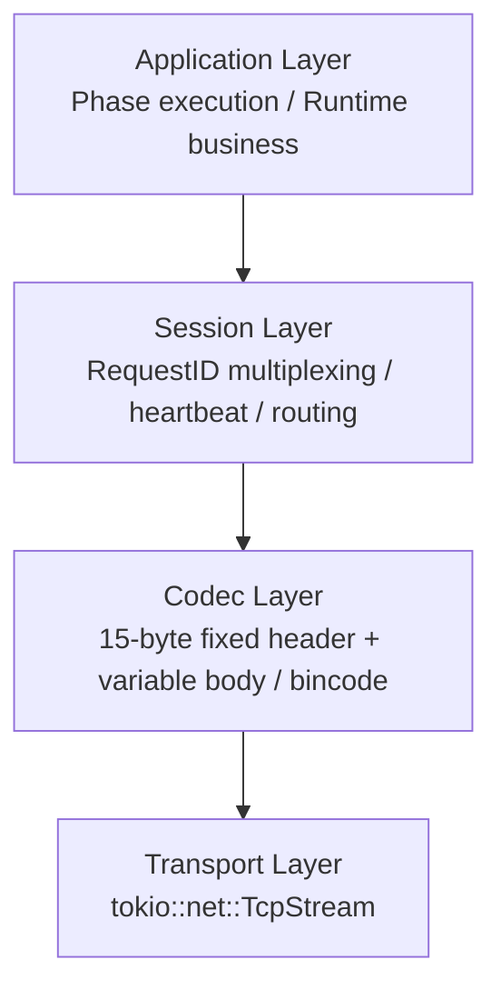
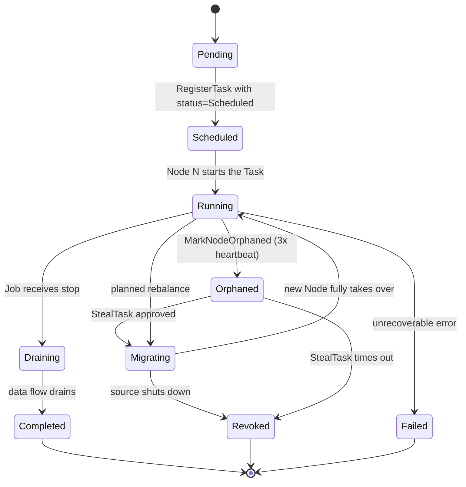
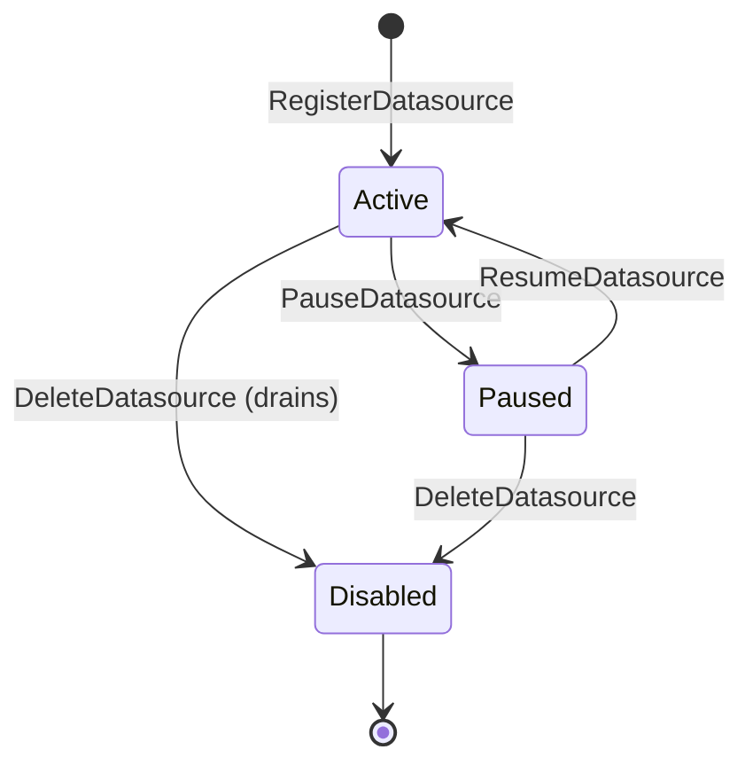

# 🔧 Bee Internals

> **Audience**: This document is for **contributors and operators** who need to know how Bee is built — crate structure, wire format, build configuration, and implementation details. If you're evaluating Bee or want to use it, start with [docs/architecture.md](./architecture.md).
>
> **Reading order**: §1 for the wire format (the only thing here that everyone might need); §2-§3 for the crate map; §4+ only if you're touching the specific subsystem.
>
> **Related documents**:
> - [docs/architecture.md](./architecture.md) — system architecture
> - [docs/adr/](./adr/) — design decisions
> - [docs/stories.md](./stories.md) — implementation backlog

## Table of contents

1. [BRP wire format](#1-brp-wire-format)
2. [Crate structure](#2-crate-structure)
3. [Build configuration](#3-build-configuration)
4. [Plugin SDK contract](#4-plugin-sdk-contract)
5. [KV cluster internal layout](#5-kv-cluster-internal-layout)
6. [Control plane state machines](#6-control-plane-state-machines)

---

## 1. BRP wire format

### 1.1 Four-layer model

BRP is layered, top-down:



- **Application** — Runtime shapes Phase-to-Phase typed streams into BRP messages (`StreamData` / `StreamAck` / `StealTask` / `StealResponse` / `Heartbeat`).
- **Session** — multiplexes RPCs on a single TCP connection via RequestID; per-peer routing table; heartbeat.
- **Codec** — solves TCP framing with a fixed 15-byte header.
- **Transport** — raw `tokio::net::TcpStream`.

### 1.2 Wire format

A BRP message is a **fixed 15-byte Header** plus a **variable Body**:

```
+--------------------+--------------------+--------------------+--------------------+
|  Magic Number (2B) |  Message Type (1B) |   Request ID (8B)  |   Body Length (4B) |  → Fixed Header (15 Bytes)
+--------------------+--------------------+--------------------+--------------------+
|                                                                                   |
|                                Body Data (variable, per Body Length)               |  → Variable Body
|                                                                                   |
+-----------------------------------------------------------------------------------+
```

#### Field reference

| Field | Size | Description |
| --- | --- | --- |
| `Magic` | 2 B | Fixed `0x42 0x45` (ASCII `'B'`, `'E'`). Filters obvious garbage. |
| `MessageType` | 1 B | One of the registered types (see below). |
| `RequestID` | 8 B | `u64` monotonic per Node. Used to correlate Request ↔ Response. |
| `BodyLength` | 4 B | Little-endian `u32`. Bytes in the Body. Solves TCP framing. |
| `Body` | variable | `bincode`-serialized payload. |

#### Message types (registered)

| Code | Type | Direction | Purpose |
| --- | --- | --- | --- |
| `0x01` | `Heartbeat` | Node → Leader | Keep-alive; carries timestamp |
| `0x02` | `DataPacket` | Phase → Phase | One event from upstream to downstream |
| `0x03` | `StreamAck` | Downstream → Upstream | Ack for last received Seq; sliding-window backpressure |
| `0x04` | `StealTask` | Free Node → Leader | Request to take over an Orphaned Task |
| `0x05` | `StealResponse` | Leader → Free Node | Approve or reject the StealTask |
| `0x06` | `TaskPlacement` | Control → Node | Deploy a Task on this Node |
| `0x07` | `DatasourceQuery` | Node → Node | Read Datasource metadata |
| `0x08` | `KVGet` / `0x09` `KVPut` / `0x0A` `KVTxn` | Node → Leader | KV operations routed through Raft |
| `0x0B`–`0xFF` | Reserved | | Future expansion |

Body schemas are Rust structs serialized with `bincode`. The canonical source is `bee-codec` (one source of truth). Adding a new Message Type requires updating this list, the `bee-codec` source, and incrementing the `BRP_VERSION` constant.

### 1.3 Two logical channels over one connection

Data channel (carries `DataPacket`, `StreamAck`) and control channel (carries everything else) **share one TCP connection per peer pair**, but are prioritized at the application layer: control traffic (and heartbeats) run at high priority, worker data at best-effort. This keeps Raft consensus latency from being dragged down by worker load.

---

## 2. Crate structure

The 8-crate boundary established in [architecture.md §6.6](./architecture.md#66-registry-and-discovery). One binary, multiple libraries.

```
bee/
├── Cargo.toml                          # workspace
├── crates/
│   ├── bee-transport/                  # transport layer
│   ├── bee-codec/                      # codec layer
│   ├── bee-session/                     # session layer
│   ├── bee-runtime/                     # application / compilation
│   ├── bee-control/                     # control plane
│   ├── bee-registry/                    # registry
│   ├── bee-dsl-sql/                     # SQL DSL (DataFusion)
│   └── bee-plugin-sdk/                  # Plugin SDK (used by plugin authors)
├── bin/
│   └── bee/                            # the binary
└── docs/
```

### 2.1 Crate responsibilities

| Crate | Layer | Key exports | Notes |
| --- | --- | --- | --- |
| `bee-transport` | Transport | `TcpFramed`, `Listener` | Pure async I/O. No protocol knowledge. |
| `bee-codec` | Codec | `Frame`, `BeeCodec`, `BeeMessage` | Single source of truth for wire format. |
| `bee-session` | Session | `ConnectionPool`, `RequestRouter` | Multiplexing + heartbeat + routing. |
| `bee-runtime` | Application / Compile | `Phase`, `Handler`, `Dag`, `Compiler` | Where user-defined Pipelines become executable Tasks. |
| `bee-control` | Control Plane | `RaftClient`, `Scheduler`, `StealArbiter` | Talks to the Raft cluster; owns placement decisions. |
| `bee-registry` | Registry | `PluginManager`, `NetworkSync`, `Registry` (trait) | Three-layer registry (see architecture §6.6). |
| `bee-dsl-sql` | DSL | SQL parser / planner (DataFusion-based) | Plus the `ASOF JOIN` and `EMIT INTO` extensions. |
| `bee-plugin-sdk` | SDK | `Plugin` trait, `BeeHostV1` C struct, helper macros | **Used by plugin authors, not by the binary.** |

### 2.2 Dependency direction

```
bee-transport  ←  bee-codec  ←  bee-session  ←  bee-runtime
                                              ↖  bee-control
                                              ↖  bee-registry
                                              ↖  bee-dsl-sql
                                                (bee-plugin-sdk is independent, used by external plugin crates)
```

Strictly acyclic. `bee-runtime` is the topmost layer; it depends on everything else but is not depended on by any core crate.

### 2.3 The `bee` binary

The binary ties everything together. It is the only thing end users run. It contains:

- All 8 core crates
- Built-in Adapters / Handlers (just the generic test fixture `MockInputAdapter`)
- The CLI dispatcher (`bee run`, `bee cluster init`, `bee datasource create`, etc.)

---

## 3. Build configuration

### 3.1 Workspace `Cargo.toml`

```toml
[workspace]
resolver = "2"
members = [
    "crates/bee-transport",
    "crates/bee-codec",
    "crates/bee-session",
    "crates/bee-runtime",
    "crates/bee-control",
    "crates/bee-registry",
    "crates/bee-dsl-sql",
    "crates/bee-plugin-sdk",
    "bin/bee",
]
```

### 3.2 Runtime dependencies (hard constraint)

The only allowed runtime dependencies are:

| Crate | Purpose |
| --- | --- |
| `tokio` | Async runtime |
| `bytes` | Efficient buffer handling |
| `bincode` | Body serialization |

**No other runtime dependencies in core.** This is a hard constraint from the design. Any new dependency must come with an ADR justifying why `tokio` + `bytes` + `bincode` cannot solve the problem.

### 3.3 Build commands

```bash
# Build everything
cargo build --release

# Run unit + integration tests
cargo test --workspace

# Lint
cargo clippy --workspace -- -D warnings

# Format
cargo fmt --all

# Build a Plugin crate (separate workspace or subdir)
cd plugins/bee-plugin-binance
cargo build --release
# → target/release/libbee_plugin_binance.so
```

### 3.4 Rust toolchain

Pinned via `rust-toolchain.toml`:

```toml
[toolchain]
channel = "1.85"   # or whatever the project pins to
components = ["rustfmt", "clippy"]
```

Plugins must use the **same Rust toolchain version** as Bee core. ABI instability between Rust versions means a plugin compiled with a different toolchain will not load (ADR-0009).

---

## 4. Plugin SDK contract

The `bee-plugin-sdk` crate defines the contract between Bee core and Plugins.

### 4.1 Crate type

```toml
[lib]
crate-type = ["cdylib"]
```

`cdylib` produces a dynamic library (`.so` / `.dylib` / `.dll`) that can be loaded at runtime via `libloading`.

### 4.2 The `Plugin` trait

```rust
pub trait Plugin {
    fn register(&self, host: &mut dyn BeeHost);
}
```

A Plugin implements this trait and exposes a single `bee_plugin_init` entry point:

```rust
#[no_mangle]
pub extern "C" fn bee_plugin_init(host: *mut BeeHost) -> *mut PluginHandle {
    let host = unsafe { &mut *host };
    let plugin = MyPlugin::new();
    host.register_input_adapter("binance_subscribe", "1.0", &BinanceSubscribeAdapter::VTABLE);
    host.register_handler("macd", &MacdHandler::VTABLE);
    // ... register more Adapters/Handlers
    Box::into_raw(Box::new(plugin)) as *mut _
}
```

### 4.3 The `BeeHostV1` C struct

```c
typedef struct BeeHost {
    uint32_t version;                    // 1
    int (*register_input_adapter)(
        const char* name,
        const char* version,
        const BeeInputAdapterVTable* vt
    );
    int (*register_output_adapter)(
        const char* name,
        const char* version,
        const BeeOutputAdapterVTable* vt
    );
    int (*register_handler)(
        const char* name,
        const BeeHandlerVTable* vt
    );
    int (*secret_get)(
        const char* secret_id,
        uint8_t* out_buf,
        size_t* out_len
    );
    void* (*alloc)(size_t);
    void  (*free)(void*);
    void  (*log)(int level, const char* msg);
} BeeHost;
```

The `version` field allows future ABI evolution. Adding new function pointers at the end of the struct is allowed; modifying existing signatures is not.

### 4.4 Adapter VTable example (Input)

```c
typedef struct BeeInputAdapterVTable {
    int  (*open)(void* self, const uint8_t* config, size_t config_len);
    int  (*next)(void* self, BeeEvent* out);
    int  (*close)(void* self);
} BeeInputAdapterVTable;
```

`open` takes opaque config bytes (bincode-deserialized by the Plugin if it wants); `next` writes one event; `close` cleans up.

### 4.5 ABI version

The Plugin Manifest declares `abi_version` (e.g., `"1.0"`). Bee's Plugin Manager checks this against the supported range before loading. An incompatible Plugin is rejected outright:

```
ERROR: Plugin 'libbee_plugin_binance.so' rejected
  hash:          a3f5e8c2...
  claimed abi:   2.0
  expected:      1.x
  remediation:   Recompile the plugin against bee-plugin-sdk 1.x
```

### 4.6 Authoring a Plugin

```bash
cargo new --lib bee-plugin-binance
cd bee-plugin-binance

# Cargo.toml
[dependencies]
bee-plugin-sdk = "0.1"
bincode = "1"
# ... other deps (tokio-tungstenite for Binance WS, etc.)

[lib]
crate-type = ["cdylib"]

cargo build --release
# → target/release/libbee_plugin_binance.so
cp target/release/libbee_plugin_binance.so /etc/bee/plugins/
# → Bee auto-loads
```

---

## 5. KV cluster internal layout

### 5.1 Two state machines on one Raft group

The Raft log carries commands prefixed to route to one of two state machines:

```
+-------+----------------+
| Prefix | Target SM      |
+-------+----------------+
| 0x00   | ControlPlane   |
| 0x01   | KV             |
+-------+----------------+
```

A Raft-batched commit applies commands in order to the correct SM.

### 5.2 KV key namespace

| Prefix | Purpose | Owner |
| --- | --- | --- |
| `state/task/{TaskId}/...` | Per-Task state (Handler's private state) | The Task |
| `state/checkpoint/{TaskId}` | Latest Checkpoint (state + saved offset, atomic) | The Task |
| `ds/{tenant}/{name}` | Datasource metadata (Provider manifest) | Admin |
| `secret/{tenant}/{secret_id}` | Secret store (API keys, etc.) | Admin |
| `producer/{signature}` | Active Producer JobId for a Stream | Runtime |

Values are **opaque bincode bytes** — the KV does not interpret them. Schema is the caller's responsibility.

### 5.3 API surface

| Method | Semantics |
| --- | --- |
| `kv.get(key)` | `Option<Vec<u8>>` |
| `kv.put(key, value)` | `()` |
| `kv.cas(key, expected, new)` | `bool` (compare-and-swap; linearizable) |
| `kv.txn(ops: Vec<Op>)` | `Result<Value, Conflict>` (atomic over all ops) |

No range scan, no secondary index in MVP. If a Handler needs those, it builds them on top (e.g., maintains a sorted structure inside its own state blob).

### 5.4 Transaction examples

Atomic state + offset snapshot:

```rust
let snapshot = TaskState { macd_ema: ... };
let offset: u64 = ...;
kv.txn(vec![
    Op::put(format!("state/checkpoint/{task_id}"), serialize(&(snapshot, offset))?),
])?;
```

CAS for race-free state updates:

```rust
let current = kv.get(&key)?;
let new = update(&current)?;
if !kv.cas(&key, current, new) {
    // retry
}
```

---

## 6. Control plane state machines

### 6.1 ControlPlane SM commands

| Command | Effect |
| --- | --- |
| `RegisterJob { job_id, dag_hash, owner_node, tenant }` | Add a Job to the registry |
| `RegisterTask { task_id, job_id, phase_id, owner_node, status }` | Add a Task to a Job |
| `UpdateTaskStatus { task_id, new_status }` | Transition a Task's lifecycle state |
| `MarkNodeOrphaned { node_id }` | Mark all Tasks owned by `node_id` as `Orphaned` (called by Leader after 3× heartbeat) |
| `StealTask { task_id, thief_node }` | Propose ownership transfer (only valid for `Orphaned` Tasks) |
| `RegisterDatasource { name, tenant, manifest }` | Add a Datasource to the registry |
| `PauseDatasource { name, tenant }` | Set a Datasource's `status = Paused` |

All commands go through Raft consensus — linearizable, replicated to majority before any node considers them committed.

### 6.2 Task state machine

The state machine for a Phase Assignment (Task) lives in the ControlPlane SM:



### 6.3 Datasource state machine



`Disabled` is terminal. A `Disabled` Datasource can be re-registered with the same name (new manifest); this is a new entry, not a transition.

### 6.4 Producer (Stream) state

The Producer is **not a first-class state machine entry**; it's an emergent property of a Job. When a Job is deployed and a Task calls a Datasource method, the runtime checks the StreamSignature and either creates a new Producer (if none exists) or subscribes to an existing one. The Producer is the running Pipeline Job for that Stream.

If the Producer's Node dies, the Producer Job goes to `Failed`; the orphaned subscribers enter `Waiting for Upstream`. The control plane can re-deploy the Producer on another Node (this is the same Work-Stealing mechanism as for any other Task).
