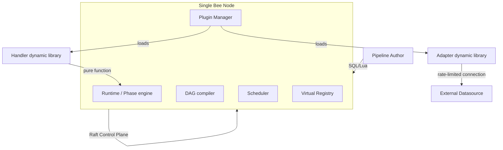

# 🐝 Bee Product Design Document

> **Status**: draft v0.1
> **Companion documents**: [CONTEXT.md](../CONTEXT.md) · [docs/architecture.md](./architecture.md) · [docs/internals.md](./internals.md)
> **Audience**: founding team, early users, potential partners
>
> This document covers **what** the product is, **for whom**, and **why**. For technical implementation details, see architecture.md.

## Table of contents

1. [Product vision](#1-product-vision)
2. [Target users](#2-target-users)
3. [Pain points and opportunities](#3-pain-points-and-opportunities)
4. [Core scenarios](#4-core-scenarios)
5. [Product capabilities](#5-product-capabilities)
6. [User workflows](#6-user-workflows)
7. [User interface and tools](#7-user-interface-and-tools)
8. [Differentiation](#8-differentiation)
9. [Product architecture overview](#9-product-architecture-overview)
10. [Business model](#10-business-model)
11. [Product roadmap](#11-product-roadmap)
12. [Success metrics](#12-success-metrics)
13. [Risks and open questions](#13-risks-and-open-questions)

---

## 1. Product vision

**Bee is a distributed compute service for real-time multi-source data streams.** Users write pipelines in SQL or Rust plugins that say "where does the data come from, how to transform it, where does it go", and Bee compiles this into a DAG, schedules it across a cluster, and keeps it running through node failures. Adapters to external systems (exchanges, news feeds, databases) are loaded as plugins, with credentials, rate limits, and lifecycle managed centrally.

### Why now

- Real-time data sources are exploding (exchange ticks, IoT sensors, user behavior logs, LLM streams), but each has heterogeneous connection / quota / schema problems.
- Traditional stream processing frameworks (Flink / Spark) are heavy, operationally expensive, and unfriendly to plugins and rate limits.
- Quant / LLM / IoT scenarios increasingly need to "compose multi-source heterogeneous streams into a decision", but each time requires building a distributed system from scratch.
- The Rust ecosystem is mature enough to deliver a complete Control Plane + Data Plane in a single binary — no more JVM / Zookeeper / external KV dependencies.

### Where we want to be in three years

- The "SQLite moment" for real-time data streams: a single binary, self-hosted, zero operational threshold; an engineer can spin up a Bee cluster on a laptop in one command.
- A plugin marketplace of our own (Adapters / Handlers), so "adding a new data source" goes from a 2-week engineering project to a 2-hour copy-paste.

---

## 2. Target users

### 2.1 Four core user groups

| Group | Expected share | Persona | Core pain |
| --- | --- | --- | --- |
| **Pipeline Author** | ~50% | Quant researcher, real-time data engineer, ML feature engineer | After writing the stream logic, **deployment, fault tolerance, scaling** are all roadblocks |
| **Plugin Developer** | ~20% | Engineer who needs to integrate a new data source or custom operator | Existing frameworks' extension mechanisms are either JVM black magic (Flink) or unsupported |
| **Cluster Operator** | ~15% | Platform / SRE | Self-built stream clusters need many components; failure diagnosis is painful |
| **Business Consumer** | ~15% | Quant strategy consumer, visualization / alerting / reporting | When they want to "subscribe to a stream" they don't know who to ask or how to connect |

### 2.2 Role collaboration diagram

```
Pipeline Author ──writes SQL/Lua──▶ Bee Cluster
                                    │
                                    ├─▶ Rate-limited external Datasource (Adapter)
                                    │
                                    └─▶ Subscribers (Business Side)
```

---

## 3. Pain points and opportunities

### 3.1 Current pain points

1. **Multi-source fusion is hard.** Joining exchange ticks with news, 5 consumers + 3 joins + 2 state machines across processes / languages.
2. **Rate-limit = cost.** Five strategies needing BTC feed = five WS connections, hitting Binance rate limit.
3. **State is awkward to manage.** EMA / MACD / ASOF JOIN all imply state; either put in Redis (network hop + consistency problem) or local (state lost on failover).
4. **JVM-heavy stacks.** Flink / Spark need JDK + ZK + S3 + config center; hardware cost and cold-start latency are both unfriendly.
5. **Failover is reactive.** Node goes down, ops has 5 minutes to scramble; Work-Stealing is rare.
6. **Extensibility is unfriendly.** Adding a new data source / operator means writing Java SPI for Flink, or writing a CRD for k8s; long learning curve and release cycle.

### 3.2 Shortcomings of existing solutions

| Solution | Shortcoming |
| --- | --- |
| Apache Flink | JVM-heavy, complex state backend choice, weak plugin support |
| Apache Spark Streaming | Micro-batch not true streaming; latency starts at seconds; JVM |
| Materialize | Strong Postgres binding; no solution for rate-limited data sources / plugin system |
| Kafka Streams | Strong Kafka binding; JVM; single-machine ceiling |
| kdb+ / InfluxDB | Time-series-specific, not general pipelines |
| Airflow / n8n | Batch / workflow scenarios, **not streaming** |
| Custom (Python + asyncio + Celery) | Not scalable, observable, or controllable |

### 3.3 Bee's breakthrough points

- **Single binary, zero external dependencies**: one `bee` process is simultaneously a Worker and Raft participant; no external KV / ZK.
- **Data Plane P2P**: low latency, no single point of failure.
- **Control Plane Raft**: strong consistency for ownership, Failover, rate-limit quota allocation.
- **Datasource-as-Phase + Producer pattern**: rate-limited data sources shared naturally (see architecture.md §6.4 / ADR-0003 / ADR-0010).
- **Plugins as first-class citizens**: Handler / Adapter via dynamic libraries, hot-load, hot-upgrade.

---

## 4. Core scenarios

### Scenario A: Performance showcase (the 5-minute evaluator demo)

**User story**: As a new evaluator (engineer, PM, or seed user), I want to run Bee on my laptop, see three classic CS problems solved end-to-end, and get a measurable performance table across 1 / 3 / 5 Nodes — in under 5 minutes, with no third-party services required.

**How Bee supports it**:

- A built-in (test-fixture) `generate_series` and `generate_events` produce deterministic streams — no external system required
- Three demo SQL pipelines showcase three different Bee capabilities
- One stateful Handler plugin (`bee-plugin-perf-fib`) provides the only domain-specific code in the entire demo (≈ 30 lines of real logic)
- One script (`scripts/demo-perf.sh`) builds, starts a cluster, runs all three, prints a measured performance table

**The three demos**

| Demo | What it shows | Why it matters |
| --- | --- | --- |
| **Fibonacci (1M values)** | Stateful Handler UDF + KV-stored sliding state | Smallest possible streaming-compute surface; correctness is trivially checkable (compare to known sequence `0, 1, 1, 2, 3, 5, 8, 13, 21, 34, …`); same code path the quant strategy uses |
| **Prime sieve (≤ 10^8)** | Distributed cross-Node pipelines + parallel scheduling + Work-Stealing | Each sieve pass is a self-contained Phase that the runtime can place on a different Node; tests cross-Node data channels and recovery. Hard correctness check: there are exactly **5,761,455** primes below 10^8 |
| **Multi-stream analytics (160K events)** | `ASOF JOIN` + `WINDOW TUMBLING` + multi-sink `EMIT INTO` | The "real Bee user" shape; closest to a production workload (clicks / views / purchases per user) |

**How to run it**

```bash
# 1-node baseline
BEE_NODES=1 scripts/demo-perf.sh

# 3-node cluster
BEE_NODES=3 scripts/demo-perf.sh

# 5-node cluster
BEE_NODES=5 scripts/demo-perf.sh
```

**Sample output** (numbers filled in once measured, not claimed up-front):

```
==== Measured performance (cluster: 3 Nodes) ====
| Demo                      | Wall-clock   | Throughput             |
|---------------------------|--------------|------------------------|
| Fibonacci (1M values)     |   420 ms     |   2.4 M events/sec     |
| Prime sieve (≤ 10^8)      |  3.8 s       |  26.3 M ints/screened  |
| Multi-stream analytics    |  180 ms      |  888 K events/sec      |
```

The script **measures and prints** the numbers; the user reads off the row that matches their cluster size. Targets are validated on first run and refined on subsequent runs.

**Why this is in the product design (not just internal docs)**: it is the canonical "what does Bee do?" answer for an outsider. The Fibonacci demo is the smallest possible test of Bee's state-management path. The prime sieve is the smallest possible test of Bee's distributed-scheduling path. The multi-stream analytics is the smallest possible test of Bee's SQL runtime. Together they cover the three pillars (state / scheduling / SQL) of the system in 5 minutes and zero external dependencies.

The demo is now runnable via [`scripts/demo-perf.sh`](../../scripts/demo-perf.sh); see [`examples/performance/README.md`](../../examples/performance/README.md) for the math, the Bee design choices, and the perf table. Implementation tracked as **S41** in [`docs/stories.md`](./stories.md).

### Scenario B: Real-time multi-source monitoring

**User story**: As a platform SRE, I want to aggregate "API gateway logs + business error rate + database slow queries + third-party dependency health" in real time to an alerting channel.

**How Bee supports it**:

- 4 Input Adapters: `k8s_logs` / `metrics` / `mysql_slow` / `external_health`.
- A Pipeline does thresholding + EWMA smoothing.
- `EMIT INTO pagerduty.emit(...)` outputs alerts.

### Scenario C: Cross-team data sharing

**User story**: As the data platform team, I want the "user click stream" to be subscribed to by 4 downstream teams (recommendation, risk control, BI, advertising) independently, without affecting each other.

**How Bee supports it**:

- Upstream has a Producer Pipeline running a Kafka consumer.
- 4 downstream Pipelines each subscribe and compute different metrics.
- Any downstream Pipeline going down doesn't affect the others.
- Upstream rate limit / quota is managed centrally on the Producer side.

---

## 5. Product capabilities

| Capability | Description | User value | Status |
| --- | --- | --- | --- |
| **SQL / Lua DSL** | SQL-like syntax with limited extensions (`ASOF JOIN`, `EMIT INTO`), plus Lua operators | Engineers get started with zero learning cost | 0.2 onwards |
| **DAG compilation** | SQL/Lua → typed DAG | Compile-time type validation, no schema drift at runtime | 0.2 |
| **Distributed deployment** | Auto-schedule Phases to cluster Nodes | Users don't care about Node topology | 0.3 |
| **Auto Failover** | Node down → 3× heartbeat → Work-Stealing → auto-migration | Business is 0-aware | 0.4 |
| **Rate-limit Datasource sharing** | Producer Pipeline pattern | 1 external connection serves N Pipelines | 0.5 |
| **Datasource management** | `use binance;` reference model + CLI register/probe/pause + credential custody + tenant isolation | Credentials never in SQL; admin central control; compliance audit | 0.5–0.6 (S29–S31) |
| **Plugin system** | Handler / Adapter dynamic libraries, hot-load | New Datasource = 2 hours | 0.6 |
| **Cross-Pipeline composition** | Cross-Pipeline edges + typed streams | Compose Pipelines like Lego | 0.5 |
| **Pipeline optimizer** | Reorder Phases based on runtime metrics | Auto tuning, no manual parameter tuning | 0.7 |
| **Observability panel** | Phase status / time / resources / error rate | Second-level fault localization | 0.8 |
| **Schema evolution** | Stream fields can be versioned, replayable | Upstream and downstream can evolve independently | 1.x |
| **Multi-tenant isolation** | `uint16` namespace + Datasource ACL | One cluster serves multiple teams / customers | 1.x enforcement enabled |

---

## 6. User workflows

### 6.1 Writing a Pipeline

```
1. Open SQL file (local IDE / VS Code)
2. Reference required Adapters (binance / influxdb / ...) via `use`
3. Reference required UDFs (decision_tree / macd / ...) via `use`
4. Write the DAG: VIEW → JOIN → EMIT
5. bee compile pipeline.sql → check types / dependencies
```

### 6.2 Deployment and operation

```
1. bee deploy pipeline.sql
   → Control plane approves the placement plan
   → Each Node spins up the Task
   → Auto-establish BRP data channels
2. bee jobs
   → See JobId / status / Task owner per Node
3. bee jobs watch <JobId>
   → See data flow / backpressure / errors in real time
```

### 6.3 Monitoring and debugging

```
1. bee jobs list → all Pipeline inventory in the cluster
2. bee jobs inspect <JobId> → DAG visualization
3. bee tasks list --node=N → all Tasks on a given Node
4. bee diagnostics <taskId> → time / CPU / memory / error log
5. Probe mode: bee trace <taskId> → sample actual data flow (redacted)
```

### 6.4 Upgrade and extension

```
1. Upgrade Adapter: replace dynamic library file → Plugin Manager auto-reloads → takes effect after reference count drops to zero
2. Upgrade Pipeline: submit new DAG version → new JobId → old Job Draining
3. Canary: same Pipeline multiple versions in parallel, ratio adjustable (1.x roadmap)
```

### 6.5 Datasource management (admin workflow)

```
1. Register a new Datasource (one Provider wraps one Adapter, config holds only connection-level params):
   bee datasource create binance \
     --adapter binance_subscribe \
     --plugin-version ^1.0 \
     --config '{"base_url":"wss://api.binance.com","rate_limit_per_sec":10}' \
     --secret api_key=secret-001
   → Bee writes to Registry (Raft)
   → Credentials stored in secret store; raw key never appears in SQL
   → The same Datasource can be called by multiple Pipelines via subscribe('...')/ticker('...') etc.

2. Test connectivity:
   bee datasource test binance
   → Actively build connection + take one sample event
   → Show "ok" or error

3. List / search:
   bee datasource list
   bee datasource list --tenant quant-team-a
   bee datasource inspect binance
   → Metadata / current Producer Node / health metrics

4. Pause / resume (maintenance window):
   bee datasource pause binance
   → All referencing Pipelines trigger Draining
   → After maintenance: bee datasource resume binance

5. Upgrade Datasource version:
   bee datasource upgrade binance --to ^1.5
   → Update version_spec in Registry
   → Future new Pipeline deployments use the new version automatically; old Pipelines continue with the old version (multi-version coexistence, ADR-0009)
```

### 6.6 Pipeline Author's Datasource usage

```
1. Declare at the top of SQL (similar to USE database):
   use binance;
   use google_news;
   use influxdb;
   use mongodb;

2. Reference (method names come from the Adapter, per-call args go in the call):
   SELECT * FROM binance.subscribe('BTC/USDT', '5min') AS b
   ASOF JOIN google_news.search('Bitcoin') AS c ON ...;

3. Compile-time validation:
   bee compile pipeline.sql
   → Validate Datasource is registered / Adapter method signature matches / per-call args types are correct
   → Error: Datasource 'foo' is not registered. Run: bee datasource create foo ...

4. Strict mode: inline API keys are forbidden (credentials must come from Datasource config)

5. Stream auto-sharing:
   5 Pipelines each `binance.subscribe('BTC/USDT', '5min')` →
   → 5 Pipelines share 1 Producer (because StreamSignature is the same)
   → 1 external WS connection, no rate-limit collision
```

---

## 7. User interface and tools

| Tool | Target user | Priority |
| --- | --- | --- |
| **CLI** `bee` | Everyone | **P0**: MVP required |
| **REST / gRPC API** | Embed Bee into own platform | P0: API before UI |
| **VS Code extension** | Pipeline Author | P1: syntax highlighting + schema completion |
| **Web Console** | Cluster Operator | P1: Pipeline visualization, status panel |
| **SDK (Rust / Python)** | Business side | P2: library for publishing / subscribing to streams |
| **Plugin marketplace** | Plugin Developer | P2: centralized distribution + ratings |

**MVP (0.x) only promises CLI + API.** Any UI-bearing needs are pushed to 1.x+.

---

## 8. Differentiation

| Dimension | Bee | Flink | Materialize | Spark Streaming | kdb+ |
| --- | --- | --- | --- | --- | --- |
| Runtime | Single Rust binary | JVM + ZK + S3 | Postgres-bound | JVM + YARN/K8s | Commercial |
| Deployment cost | Very low | High | Medium | High | Very high |
| State backend | Embedded (no external deps) | RocksDB / S3 | Postgres | HDFS / S3 | Embedded |
| Rate-limited Datasource | Naturally shared (Producer) | One per Job | One per Job | One per Job | N/A |
| Plugin system | First-class citizen | Weak (Java SPI) | Weak | None | None |
| Cross-Pipeline composition | Native | Requires Savepoint | Requires copy | Not supported | Not supported |
| True latency | ms-level | ms-level | ms-level | s-level | ms-level |
| Learning curve | Low (SQL) | High | Medium | High | Very high |

**Core narrative**: Bee = "**Flink-level real-time + SQLite-level deployment cost + plugin-marketplace extensibility**".

---

## 9. Product architecture overview



**From the user's perspective, Bee is a "cluster black box"**: users only care about writing Pipelines, viewing monitoring, and installing plugins. How Nodes coordinate, how Tasks are scheduled, how Failover runs — all internal.

Full technical architecture: [docs/architecture.md](./architecture.md).

---

## 10. Business model

> **Current stage: open-source core, self-hosted, zero commercialization.** This section is guidance for future 1.x/2.x, not a 0.x commitment.

| Mode | Description | Time window |
| --- | --- | --- |
| **OSS Core** | Apache 2.0 / MIT; `bee` single binary; community-driven | 0.x – 1.x |
| **Enterprise** | Auth / RBAC / multi-tenant / advanced monitoring / SLA guarantees | 1.x+ |
| **Managed Cloud** | Managed Bee service; billed per node × time | 2.x+ |
| **Plugin Marketplace** | Official + third-party Adapter / Handler distribution; Bee takes a cut | 2.x+ |

**Short-term (0.x – 1.x) survival strategy**: bootstrap the core team via consulting + private deployment contracts with quant teams; no SaaS.

---

## 11. Product roadmap

Aligned with [docs/architecture.md §12.1](./architecture.md#121-roadmap) and [docs/stories.md](./stories.md). This list highlights user-visible milestones.

| Stage | User-visible outcome |
| --- | --- |
| **0.1 – 0.2** | **Single-node works**: `bee run pipeline.sql` locally shows the stream. Demo to seed users. |
| **0.3 – 0.4** | **Small cluster**: 3-node Failover demo. **First external paying user**. |
| **0.5** | **Rate-limit sharing + cross-Pipeline**: scenario B (real-time multi-source monitoring) goes to production; quant reference implementation lands in `docs/best-practices/quant/`. |
| **0.6 – 0.7** | **Plugin system**: third parties can write Adapters; **3 external Adapters in the community**. |
| **0.8 – 1.0** | **Production-ready**: observability panel + Schema evolution; **public 1.0 announcement**. |
| **1.x** | Enterprise features + docs site + training. |
| **2.x** | Managed Cloud pilot + plugin marketplace. |

---

## 12. Success metrics

### 12.1 North star metric

> **Total Phase × data items processed by Bee clusters per day** (measures "real distributed workload running").

### 12.2 Key metrics

| Category | Metric | Target (at 1.0) |
| --- | --- | --- |
| Performance | Cross-Node p99 latency | < 10 ms |
| Performance | Single-Node throughput | > 100K events/sec |
| Reliability | Mean Failover recovery time | < 60 s (1 Orphaned period) |
| Availability | Per-Pipeline monthly availability | > 99.9% |
| Usability | Median time from `bee deploy` to first data seen | < 5 min |
| Ecosystem | Public Adapters count | > 20 |
| Community | Monthly active contributors | > 30 |
| Commercial | Self-hosted paying customers | > 10 |

---

## 13. Risks and open questions

| Risk | Description | Mitigation |
| --- | --- | --- |
| **Raft heartbeat dragging down data plane** | Simplified topology: data Workers are also Raft participants; GC pauses / long-tail latency may trigger frequent elections | 1.x consider dedicated control plane; default 5 nodes in production |
| **State storage choice** | EMA / MACD / ASOF JOIN state can be large; where to put it? | Use in-memory + WAL before 0.4; evaluate RocksDB later |
| **Cross-language Handler** | C ABI vs Rust trait objects? | Decide before 0.6; lean toward C ABI (broader ecosystem) |
| **Multi-DSL semantic alignment** | Is `EMIT INTO` in SQL fully equivalent to `emit` in Lua? | 0.8 cover with equivalence tests |
| **Rate-limit quota fairness** | How to allocate bandwidth when multiple subscribers compete for a shared Producer? | 0.5 design weighted round-robin or priority queue |
| **Schema evolution** | When stream fields change, do cross-Pipeline subscribers auto-adapt? | 1.x roadmap; avoid premature design |
| **Cold start latency** | How long from Node 0 to processing? | 0.3 measure once; target < 10 s |
| **Datasource as managed entity — operational burden** | Will admins actually register every Datasource before any Pipeline can use it, or will they revolt? | Prototype the workflow with seed users; make the CLI workflow frictionless; allow `bee datasource auto-create` mode for prototyping only |

---

## Appendix A: Cross-references

- **Terminology**: [CONTEXT.md](../CONTEXT.md)
- **Technical architecture** (with 4 mermaid sequence diagrams): [docs/architecture.md](./architecture.md)
- **Decision records**: [docs/adr/](./adr/) (10 ADRs)
  - 0001 [Data Plane P2P + Control Plane Raft](./adr/0001-data-plane-p2p-control-plane-raft.md)
  - 0002 [Datasource is a Phase with an Adapter](./adr/0002-datasource-is-a-phase.md)
  - 0003 [Producer Pipeline pattern for rate-limited sharing](./adr/0003-producer-pipeline-pattern.md)
  - 0004 [Bee KV Cluster for shared Task State](./adr/0004-bee-kv-cluster.md)
  - 0005 [Plugin FFI — Rust cdylib for MVP](./adr/0005-plugin-ffi-rust-cdylib-mvp.md)
  - 0006 [SQL Runtime — DataFusion with extensions](./adr/0006-sql-runtime-datafusion.md)
  - 0007 [Simplified all-in-one Raft topology for MVP](./adr/0007-simplified-raft-topology-mvp.md)
  - 0008 [Optimizer / Scheduler; runtime adaptive optimization](./adr/0008-optimizer-scheduler-adaptive.md)
  - 0009 [Plugin multi-version + hash identity + strict ABI](./adr/0009-plugin-multiversion-hash-abi.md)
  - 0010 [Datasource as a managed entity with `use` syntax and tenant namespace](./adr/0010-datasource-managed-entity.md)
- **Implementation backlog**: [docs/stories.md](./stories.md) (32 vertical slices)
- **Implementation details**: [docs/internals.md](./internals.md)

## Appendix B: Open questions for this document

- [ ] Add a user journey diagram
- [ ] Decide the open-source license (Apache 2.0 vs MIT)
- [ ] Quant scenario decision latency SLA (p99 should be within X milliseconds)
- [ ] Fill in §2 / §4 with insights from 3 seed user interviews
