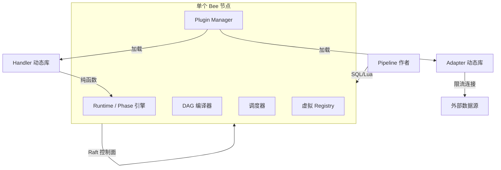

# 🐝 Bee 产品设计文档

> **Status**: draft v0.1
> **配套文档**：[CONTEXT.md](../CONTEXT.md)（领域术语）· [docs/architecture.md](./architecture.md)（技术架构）
> **读者**：创始团队、早期用户、潜在合作方
>
> 本文档讲**是什么 / 给谁用 / 解决什么**。技术实现细节请看 architecture.md。

## 目录

1. [产品愿景](#1-产品愿景)
2. [目标用户](#2-目标用户)
3. [痛点与机会](#3-痛点与机会)
4. [核心场景](#4-核心场景)
5. [产品能力](#5-产品能力)
6. [用户工作流](#6-用户工作流)
7. [用户界面与工具](#7-用户界面与工具)
8. [差异化定位](#8-差异化定位)
9. [产品架构概览](#9-产品架构概览)
10. [商业模式](#10-商业模式)
11. [产品路线图](#11-产品路线图)
12. [成功指标](#12-成功指标)
13. [风险与开放问题](#13-风险与开放问题)

---

## 1. 产品愿景

**Bee 是一个面向实时多源数据流的分布式管道计算服务。**

用户用 SQL / Lua 写一段"数据流从哪来 → 怎么变 → 写到哪去"的程序，编译成一个 DAG，部署到 Bee 集群后由运行时自动调度、容错、跨节点协调。**核心承诺是：让"用多少个数据源、跑多复杂的计算"从工程问题变成配置问题。**

### 为什么是现在

- 实时数据源爆炸（交易所行情、IoT 传感器、用户行为日志、LLM 流）但每个都有连接 / 配额 / Schema 异构问题。
- 传统流处理框架（Flink / Spark）重、运维成本高、对插件和限流不友好。
- 量化 / LLM / IoT 等场景越来越需要"把多源异构流快速组装成决策"，但每次都要从零搭一套分布式系统。
- Rust 生态成熟到可以单二进制交付一个完整的控制面 + 数据面，不再需要 JVM / Zookeeper / 外部 KV。

### 三年后想成为什么

- 实时数据流领域的 **"SQLite 时刻"**：单二进制、自托管、零运维门槛，工程师一台笔记本就能拉起一个 Bee 集群。
- 拥有自己的 **插件市场**（Adapter / Handler），让"接入一个新数据源"从 2 周工程量变成 2 小时复制粘贴。

---

## 2. 目标用户

### 2.1 三类核心用户

| 用户群 | 占比预期 | 画像 | 核心痛点 |
| --- | --- | --- | --- |
| **数据流作者**（Pipeline Author） | ~50% | 量化研究员、实时数据工程师、ML 特征工程师 | 写好流处理逻辑后，**部署、容错、扩缩容**全是拦路虎 |
| **插件开发者**（Plugin Developer） | ~20% | 需要接入新数据源 / 自定义算子的工程师 | 现有框架扩展机制要么是 JVM 黑魔法（Flink），要么干脆不支持 |
| **集群运维**（Operator） | ~15% | 平台 / SRE | 自建流处理集群要管一堆组件，故障定位痛苦 |
| **业务方**（Consumer） | ~15% | 量化策略消费者、可视化 / 告警 / 报表 | 想"订阅某个流"时不知道该找谁、怎么接 |

### 2.2 角色协作图

```
数据流作者 ──写 SQL/Lua──▶ Bee 集群
                              │
                              ├─▶ 限流外部数据源 (Adapter)
                              │
                              └─▶ 订阅者 (业务方)
```

---

## 3. 痛点与机会

### 3.1 现状痛点

1. **多源融合难**：把交易所行情、新闻、订单簿拼成一个决策流，传统方案要写 5 个 consumer、3 个 join、2 个状态机，跨进程 / 跨语言。
2. **限流即成本**：5 个策略都要 BTC 行情就开 5 个 WS 连接，撞 Binance rate limit。
3. **状态难管**：EMA / MACD / ASOF JOIN 都隐含状态；现在要么放 Redis（多一跳网络 + 一致性问题），要么放本地（Failover 就丢）。
4. **JVM 重型依赖**：Flink / Spark 拉起一个集群要 JDK + ZK + S3 + 配置中心；硬件成本和冷启动延迟都不友好。
5. **容错靠吼**：节点挂了，运维要在 5 分钟内抢修；Work-Stealing 是少数派。
6. **扩展不友好**：加一个新的数据源 / 算子，Flink 要写 Java SPI、k8s 要写 CRD；学习曲线和发布周期都长。

### 3.2 现有方案的不足

| 方案 | 短板 |
| --- | --- |
| Apache Flink | JVM 重、状态后端选型复杂、对插件支持薄弱 |
| Apache Spark Streaming | 微批而非真流；延迟秒级起；JVM |
| Materialize | 强 Postgres 绑定；与限流数据源 / 插件系统无解 |
| Kafka Streams | 强 Kafka 绑定；JVM；单机上限 |
| kdb+ / InfluxDB | 时序场景专精；非通用管道 |
| Airflow / n8n | 批 / 工作流场景，**不是流** |
| 自建（Python + asyncio + Celery） | 不可扩展、不可观测、不可控 |

### 3.3 Bee 的破局点

- **单二进制 + 零外部依赖**：一个 `bee` 进程同时是 Worker 和 Raft 参与者；不依赖外部 KV / ZK。
- **数据面 P2P**：低延迟、无单点。
- **控制面 Raft**：强一致的归属、Failover、限流配额分配。
- **Datasource-as-Phase + Producer 模式**：限流数据源天然共享（见 architecture.md §8.3）。
- **插件一等公民**：Handler / Adapter 走动态库，热加载、热升级。

---

## 4. 核心场景

### 场景 A：量化决策流水线（来自 [README §1 SQL 示例](../README.md)）

**用户故事**：作为一个量化研究员，我想把"5 分钟 BTC 行情"和"Google 新闻舆情"拼成决策信号，写入 InfluxDB / MongoDB。

**Bee 的支持方式**：

- 行情流用 `binance.subscribe('BTC/USDT', '5min')` —— Producer Pipeline 自动共享。
- 新闻流用 `google_news.search('BitCoin')` —— 同上。
- 用 `ASOF JOIN` 拼多频流（高低频时间对齐）。
- 决策层用 `decision_tree(...)` UDF。
- 多路输出用 `EMIT INTO influxdb(...)` / `EMIT INTO mongodb(...)`。

> **重要**：以上 `binance` / `google_news` / `influxdb` / `mongodb` / `decision_tree` / `ASOF JOIN` 都是**第三方插件或 SQL 扩展**，**不在 Bee 核心**。Bee 核心提供：DSL 框架、`use` 编译、Adapter / Handler trait、Registry、Producer 共享、跨 Pipeline 边、Failover。具体的行情/新闻/UDF 实现由社区或用户团队在独立的 Plugin crate 中提供，编译为 `cdylib` 由 Bee 加载。

**用户的工作量**：写一段 SQL；剩下的 Bee 自动搞定。

### 场景 B：实时多源监控

**用户故事**：作为平台 SRE，我想把"API 网关日志 + 业务错误率 + 数据库慢查询 + 第三方依赖健康"实时聚合到告警通道。

**Bee 的支持方式**：

- 4 个 Input Adapter：`k8s_logs` / `metrics` / `mysql_slow` / `external_health`。
- 一个 Pipeline 做阈值 + EWMA 平滑。
- `EMIT INTO pagerduty(...)` 输出告警。

### 场景 C：跨团队数据共享

**用户故事**：作为数据中台团队，我想让"用户点击流"被 4 个下游团队（推荐、风控、BI、广告）独立订阅，且互不影响。

**Bee 的支持方式**：

- 上游一个 Producer Pipeline 跑 Kafka consumer。
- 4 个下游 Pipeline 各自订阅、计算不同指标。
- 任何下游 Pipeline 挂掉不影响其他。
- 上游限流 / 配额天然在 Producer 一侧管理。

---

## 5. 产品能力

| 能力 | 描述 | 用户价值 | 状态 |
| --- | --- | --- | --- |
| **SQL / Lua DSL** | 类 SQL 语法 + 有限扩展（`ASOF JOIN`、`EMIT INTO`），同时支持 Lua 算子 | 工程师 0 学习成本即可上手 | 0.2 起步 |
| **DAG 编译** | SQL/Lua → 类型化 DAG | 编译期类型校验，运行时无 schema 漂移 | 0.2 |
| **分布式部署** | 自动把 Phase 调度到集群节点 | 用户不关心 Node 拓扑 | 0.3 |
| **自动 Failover** | 节点挂 → 3× 心跳 → Work-Stealing → 自动迁移 | 业务 0 感知 | 0.4 |
| **限流数据源共享** | Producer Pipeline 模式 | 1 个外部连接服务 N 个 Pipeline | 0.5 |
| **Datasource 管理** | `use binance;` 引用模式 + CLI 注册/探活/挂起 + 凭证托管 + 租户隔离 | 凭证不入 SQL；admin 集中管控；合规可审计 | 0.5–0.6 (S29–S31) |
| **插件系统** | Handler / Adapter 动态库，热加载 | 接入新数据源 = 2 小时 | 0.6 |
| **跨 Pipeline 组合** | Cross-Pipeline 边 + 类型流 | 像搭积木一样拼 Pipeline | 0.5 |
| **Pipeline 优化器** | 基于运行时指标重排 Phase | 自动调优，无需手工调参 | 0.7 |
| **观测面板** | Phase 状态 / 耗时 / 资源 / 错误率 | 故障秒级定位 | 0.8 |
| **Schema 演进** | 流字段可版本化、可回放 | 上下游解耦演进 | 1.x |
| **多租户隔离** | `uint16` 命名空间 + Datasource ACL | 一个集群服务多团队 / 多客户 | 1.x 强制启用 |

---

## 6. 用户工作流

### 6.1 写 Pipeline

```
1. 打开 SQL 文件 (本地 IDE / VS Code)
2. 引用所需的 Adapter (binance / influxdb / ...)
3. 引用所需的 UDF (decision_tree / macd / ...)
4. 写 DAG: VIEW → JOIN → EMIT
5. bee compile pipeline.sql → 检查类型 / 依赖
```

### 6.2 部署与运行

```
1. bee deploy pipeline.sql
   → 控制面批准调度计划
   → 各 Node 拉起 Task
   → 自动建立 BRP 数据通道
2. bee jobs
   → 看到 JobId / 状态 / 各 Task owner
3. bee jobs watch <JobId>
   → 实时看数据流 / 背压 / 错误
```

### 6.3 监控与调试

```
1. bee jobs list → 全集群 Pipeline 清单
2. bee jobs inspect <JobId> → DAG 可视化
3. bee tasks list --node=N → 该 Node 上所有 Task
4. bee diagnostics <TaskId> → 耗时 / CPU / 内存 / 错误日志
5. 探针模式: bee trace <TaskId> → 抽样看实际数据流（脱敏）
```

### 6.4 升级与扩展

```
1. 升级 Adapter: 替换动态库文件 → Plugin Manager 自动 reload → 引用计数归零后生效
2. 升级 Pipeline: 提交新版本 DAG → 新 JobId → 老 Job Draining
3. 灰度: 同一 Pipeline 多版本并行，比例可调（1.x 路线）
```

### 6.5 Datasource 管理（admin 工作流）

```
1. 注册新 Datasource:
   bee datasource create binance \
     --adapter binance \
     --plugin-version ^1.0 \
     --config '{"base_url": "wss://api.binance.com"}' \
     --secret api_key=secret-001
   → Bee 写入 Registry (Raft)
   → 凭证存 secret store，SQL 里看不到原始 key

2. 测试连通性:
   bee datasource test binance
   → 主动建连接 + 取一个 sample event
   → 显示 "ok" 或错误

3. 列出 / 检索:
   bee datasource list
   bee datasource list --tenant quant-team-a
   bee datasource inspect binance
   → 元数据 / 当前 Producer Node / 健康指标

4. 挂起 / 恢复 (维护窗口):
   bee datasource pause binance
   → 所有引用 Pipeline 触发 Draining
   → 维护完后: bee datasource resume binance

5. 升级 Datasource 版本:
   bee datasource upgrade binance --to ^1.5
   → 更新 Registry 中 version_spec
   → 下次新部署的 Pipeline 自动用新版本；旧 Pipeline 继续用旧版本（多版本共存，ADR-0009）
```

### 6.6 Pipeline 作者的 Datasource 使用

```
1. SQL 顶部声明 (类似 USE database):
   use binance;
   use coingecko;
   use influxdb;

2. 引用 (方法名来自 Adapter):
   SELECT * FROM binance.subscribe('BTC/USDT', '5min') AS b
   ASOF JOIN coingecko.subscribe('bitcoin') AS c ON ...;

3. 编译期校验:
   bee compile pipeline.sql
   → 校验 Datasource 存在 / Adapter 方法签名匹配
   → 错误: Datasource 'foo' is not registered. Run: bee datasource create foo ...

4. 严格模式: 禁止 inline 写 API key
```

---

## 7. 用户界面与工具

| 工具 | 目标用户 | 优先级 |
| --- | --- | --- |
| **CLI** `bee` | 所有 | **P0**：MVP 必备 |
| **REST / gRPC API** | 嵌入 Bee 到自家平台 | P0：API 优先于 UI |
| **VS Code 扩展** | Pipeline 作者 | P1：语法高亮 + Schema 补全 |
| **Web Console** | 集群运维 | P1：Pipeline 可视化、状态面板 |
| **SDK (Rust / Python)** | 业务方 | P2：发布 / 订阅流的库 |
| **插件市场** | 插件开发者 | P2：集中分发 + 评分 |

**MVP（0.x）只承诺 CLI + API。** 任何带 UI 的需求都推到 1.x 之后。

---

## 8. 差异化定位

| 维度 | Bee | Flink | Materialize | Spark Streaming | kdb+ |
| --- | --- | --- | --- | --- | --- |
| 运行时 | 单 Rust 二进制 | JVM + ZK + S3 | Postgres 强绑定 | JVM + YARN/K8s | 商业 |
| 部署成本 | 极低 | 高 | 中 | 高 | 极高 |
| 状态后端 | 内嵌（无外部依赖） | RocksDB / S3 | Postgres | HDFS / S3 | 内嵌 |
| 限流数据源 | 天然共享（Producer） | 每 Job 一份 | 每 Job 一份 | 每 Job 一份 | N/A |
| 插件系统 | 一等公民 | 弱（Java SPI） | 弱 | 无 | 无 |
| 跨 Pipeline 组合 | 原生 | 需要 Savepoint | 需要复制 | 不支持 | 不支持 |
| 真延迟 | 毫秒级 | 毫秒级 | 毫秒级 | 秒级 | 毫秒级 |
| 学习曲线 | 低（SQL） | 高 | 中 | 高 | 极高 |

**核心叙事**：Bee = "**Flink 级别的实时性 + SQLite 级别的部署成本 + 插件市场的可扩展性**"。

---

## 9. 产品架构概览



**用户视角的 Bee 是一个"集群黑盒"**：用户只关心写 Pipeline / 看监控 / 装插件；节点之间怎么协调、Task 怎么调度、Failover 怎么走——都是 Bee 内部的事。

完整技术架构见 [docs/architecture.md](./architecture.md)。

---

## 10. 商业模式

> **当前阶段：开源核心、自托管、零商业化。** 本节作为未来 1.x 的指引，不是 0.x 的承诺。

| 模式 | 描述 | 时间窗 |
| --- | --- | --- |
| **OSS Core** | Apache 2.0 / MIT；`bee` 单一二进制；社区驱动 | 0.x – 1.x |
| **Enterprise** | Auth / RBAC / 多租户 / 高级监控 / SLA 保障 | 1.x+ |
| **Managed Cloud** | 托管 Bee 服务；按节点 × 时长计费 | 2.x+ |
| **Plugin Marketplace** | 官方 + 第三方 Adapter / Handler 分发；Bee 抽成 | 2.x+ |

**短期（0.x – 1.x）的生存策略**：靠咨询 + 量化团队的私有部署合同养活核心团队，不做 SaaS。

---

## 11. 产品路线图

与 [docs/architecture.md §11](./architecture.md#11-路线图) 对齐；这里只标用户可见里程碑。

| 阶段 | 用户可见成果 |
| --- | --- |
| **0.1 – 0.2** | **单机能跑**：本机 `bee run pipeline.sql`，能在终端看到流。Demo 给种子用户。 |
| **0.3 – 0.4** | **小集群**：3 节点 Failover 演示。**有第一个外部付费用户在用**。 |
| **0.5** | **限流共享 + 跨 Pipeline**：场景 A（量化）可上线，**第一个量化策略在生产**。 |
| **0.6 – 0.7** | **插件系统**：第三方能写 Adapter；**有 3 个外部 Adapter 在社区**。 |
| **0.8 – 1.0** | **生产可用**：观测面板 + Schema 演进；**公开发布 1.0 公告**。 |
| **1.x** | Enterprise 特性 + 文档站 + 培训。 |
| **2.x** | Managed Cloud 试点 + 插件市场上线。 |

---

## 12. 成功指标

### 12.1 北极星指标

> **Bee 集群每日处理的 Phase × 数据条数**（衡量"实际跑起来的分布式工作量"）。

### 12.2 关键指标

| 类别 | 指标 | 目标（1.0 时） |
| --- | --- | --- |
| 性能 | 跨 Node p99 延迟 | < 10 ms |
| 性能 | 单 Node 吞吐 | > 100K evt/s |
| 可靠性 | Failover 平均恢复时间 | < 60 s（= 1 个 orphan 超时） |
| 可用性 | 单 Pipeline 月度可用率 | > 99.9% |
| 易用 | 从 `bee deploy` 到第一次看到数据的中位时间 | < 5 min |
| 生态 | 公开 Adapter 数量 | > 20 |
| 社区 | 月活贡献者 | > 30 |
| 商业 | 自托管付费客户数 | > 10 |

---

## 13. 风险与开放问题

| 风险 | 描述 | 缓解 |
| --- | --- | --- |
| **Raft 心跳拖垮数据面** | 简化拓扑下数据 Worker 同时是 Raft 参与者；GC 暂停 / 长尾延迟可能触发频繁选举 | 1.x 考虑独立控制面部署；生产默认 5 节点 |
| **状态存储选型** | EMA / MACD / ASOF JOIN 的状态可能很大；放哪里？ | 0.4 之前用 in-memory + WAL；后续评估 RocksDB |
| **跨语言 Handler** | 插件用 C ABI 还是 Rust trait objects？两者扩展性差异巨大 | 0.6 前决定；倾向 C ABI（更广的生态接入） |
| **多 DSL 语义对齐** | SQL 里的 `EMIT INTO` 跟 Lua 里的 `emit` 是否完全等价？ | 0.8 前用一组等价性测试覆盖 |
| **限流配额的公平性** | Producer Pipeline 多个订阅者争抢带宽时如何分配？ | 0.5 设计"加权轮询"或"优先级队列" |
| **Schema 演进** | 流字段增减时，跨 Pipeline 订阅者是否自动适配？ | 1.x 路线，避免过早设计 |
| **冷启动延迟** | 节点从 0 拉起到能处理流要多长时间？ | 0.3 测一次；目标 < 10 s |

---

## 附录 A：与现有文档的交叉引用

- 术语定义：[CONTEXT.md](../CONTEXT.md)
- 技术架构（含 4 个 mermaid 时序图）：[docs/architecture.md](./architecture.md)
- 决策记录：[docs/adr/](./adr/)（共 9 条）
  - 0001 [Data Plane P2P + Control Plane Raft](./adr/0001-data-plane-p2p-control-plane-raft.md)
  - 0002 [Datasource is a Phase with an Adapter](./adr/0002-datasource-is-a-phase.md)
  - 0003 [Producer Pipeline pattern for rate-limited sharing](./adr/0003-producer-pipeline-pattern.md)
  - 0004 [Bee KV Cluster for shared Task State](./adr/0004-bee-kv-cluster.md)
  - 0005 [Plugin FFI — Rust cdylib for MVP](./adr/0005-plugin-ffi-rust-cdylib-mvp.md)
  - 0006 [SQL Runtime — DataFusion with extensions](./adr/0006-sql-runtime-datafusion.md)
  - 0007 [Simplified all-in-one Raft topology for MVP](./adr/0007-simplified-raft-topology-mvp.md)
  - 0008 [Optimizer / Scheduler; runtime adaptive optimization](./adr/0008-optimizer-scheduler-adaptive.md)
  - 0009 [Plugin multi-version + hash identity + strict ABI](./adr/0009-plugin-multiversion-hash-abi.md)
  - 0010 [Datasource as a managed entity with `use` syntax and tenant namespace](./adr/0010-datasource-managed-entity.md)
- 项目概览：[README.md](../README.md)（注：README 仍是 v1 范围，需要同步到 v2）

## 附录 B：本文档待办

- [ ] 加用户旅程图（user journey）
- [ ] 决定商业模式的具体开源协议（Apache 2.0 vs MIT）
- [ ] 量化场景的"决策延迟 SLA"（p99 应在多少毫秒内）
- [ ] 与具体潜在客户（种子用户）做完 3 次访谈后回填 §2 / §4
