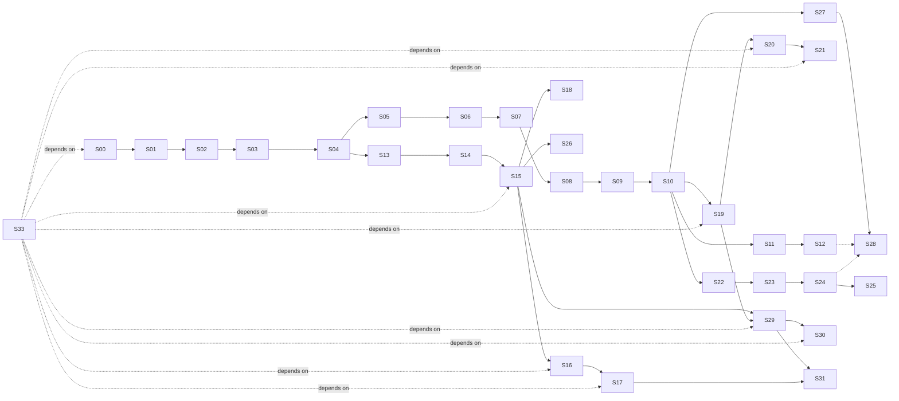

# Bee Implementation Stories

> **Status**: Active implementation backlog
> **Source**: distilled from [CONTEXT.md](../CONTEXT.md), [docs/architecture.md](./architecture.md), [docs/internals.md](./internals.md), [docs/product-design.md](./product-design.md), and [docs/adr/](./adr/) (10 ADRs).
> **Granularity**: 32 vertical slices (tracer bullets), each end-to-end demoable.
> **Conventions**: all stories are AFK (no human-in-the-loop required); HITL can be added per story by setting `Type: HITL` and noting the review milestone.

## How to use this document

1. **Pick a story** whose `Blocked by` list is satisfied.
2. Each story is a thin vertical slice — it should produce a runnable / testable artifact, not a layer-only change.
3. After implementing a story, mark its acceptance criteria and link any commits / PRs.
4. When a story is done, unblock downstream stories. Stories on the same level (no shared dependency) can be done in parallel.

## Naming conventions for examples

Throughout this document, the following names appear in **test scenarios** and **documentation examples**. **None of these are part of Bee core.** They are illustrative names for **separate third-party plugins** (or, where explicitly noted, generic test fixtures that ship with Bee for mechanism verification only).

| Name in docs | What it represents | Ships in Bee core? |
| --- | --- | --- |
| `binance` | A hypothetical exchange-data Datasource plugin | **No** — third-party plugin |
| `coingecko` / `google_news` | Hypothetical market data / news Datasource plugins | **No** — third-party plugins |
| `influxdb` / `mongodb` | Hypothetical sink Adapter plugins | **No** — third-party plugins |
| `macd` / `ema` / `kronos` | Hypothetical quant-indicator UDFs | **No** — third-party Handler plugins (or built-in UDFs in a future `bee-dsl-sql-builtins` crate, also separate) |
| `decision_tree` / `sentiment_analyzer` | Hypothetical UDFs | **No** — third-party Handler plugins |
| `mock_input` (S16) | A **generic test fixture** for verifying the Adapter mechanism | **Yes** — but only as a test util, not a production Datasource |

Bee core provides:
- The framework (Adapter / Handler traits, Registry, Datasource managed entity, `use` syntax, control plane, KV, BRP)
- A **generic mock** for testing the mechanism (`MockInputAdapter` in S16)
- **No domain-specific Datasource implementations**

## Dependency graph (top-level)



## 7 parallel paths after S10

Once **S10 (Scheduler bin-packing)** is done, the work forks into 7 paths that can each be picked up by a different agent:

| Path | Stories | Theme |
| --- | --- | --- |
| **A. Failover** | S11 → S12 | Heartbeat + Work-Stealing + Checkpoint recovery |
| **B. SQL + performance** | S13 → S14 → S15 → S26 | DataFusion integration + ms-level micro-batch / per-event / Hint |
| **C. SQL + Datasource + cross-Pipeline** | S16 → S17, S18 | Rate-limit sharing (Producer Pipeline) + cross-Pipeline edges |
| **D. Plugin system** | S19 → S20 → S21 | Rust plugins + strict ABI check + multi-version + version ranges |
| **E. Adaptive scheduling** | S22 → S23 → S24 → S25 | MLFQ + 4 alternative policies + cross-Node rebalancing |
| **F. Observability** | S27 → S28 | CLI panel (jobs / inspect / diagnostics / cluster status) |
| **G. Datasource management (ADR-0010)** | S29 → S30, S31 | `use` syntax + Datasource Registry + secret store + health / pause |
| **H. Quant trading spike (prod)** | S34 → S35 → S36 → S37 ∥ S38 ∥ S39 → S40 → S33 | 6 production-grade plugin crates (real WS/HTTP/DB/ML) wired end-to-end; S33 is the HITL milestone after S40 delivers |

## Key milestones

- **S07**: 3-node Raft cluster; control plane SM visible
- **S10**: first **end-to-end demoable** — 3-node Bee running a hardcoded multi-Phase Pipeline
- **S12**: **Failover complete loop** — kill a Node, see Task go Orphaned, auto-Work-Stealing recovers
- **S17**: **Cross-Pipeline Producer sharing proven (with mock binance)** — multiple Pipelines share 1 Producer
- **S25**: **0.7 roadmap core** — runtime adaptive scheduling
- **S28**: **0.x → 1.0 production-ready** (CLI observability + scheduling + diagnostic)
- **S29–S31**: **Datasource management** — `use` syntax + secret store + pause/resume (admin governance)
- **S33**: **Quant trading spike complete (HITL)** — end-to-end production deploy with 6 real external systems (Binance WS, NewsAPI, InfluxDB v2, MongoDB, ta-indicators, FinBERT ONNX); validated against seed user
- **S41**: **Performance showcase complete** — Fibonacci + prime sieve + multi-stream analytics demos run in < 5 min, with measured performance table filled in (1 / 3 / 5 Nodes)

---

# Stories

## Phase 0.1 — BRP PoC

---

### S00 · Bootstrap Cargo workspace

- **Type**: AFK
- **Blocked by**: None
- **ADRs**: none (foundation)

**What to build**
Initialize a Rust workspace at the repo root with the 8 crates defined in [docs/architecture.md §2 Crate structure](./internals.md#2-crate-structure):

```
crates/bee-transport   crates/bee-codec      crates/bee-session   crates/bee-runtime
crates/bee-control     crates/bee-registry   crates/bee-dsl-sql   (binary: bin/bee)
```

Each crate has a minimal `lib.rs` (or `main.rs` for `bee`) with a placeholder type, plus `Cargo.toml` declaring its dependencies. The `bee` binary prints `bee <version>` and exits.

**Acceptance criteria**
- [ ] `cargo build --workspace` succeeds
- [ ] `cargo run -p bee -- --version` prints `bee 0.1.0` (or similar)
- [ ] `cargo test --workspace` runs (no tests yet, but the harness works)
- [ ] `git init` + first commit captured
- [ ] `.gitignore` excludes `target/`, `Cargo.lock` for binaries (include for libraries)

---

### S01 · Frame type + 15-byte Header + bincode codec

- **Type**: AFK
- **Blocked by**: S00
- **ADRs**: [0001](./adr/0001-data-plane-p2p-control-plane-raft.md) (BRP wire format)

**What to build**
In `bee-codec`:
- `Frame` struct: `Magic(2B) | MessageType(1B) | RequestId(8B) | BodyLength(4B) | Body(Vec<u8>)`
- `Frame::encode(&self) -> [u8; 15 + body.len()]`
- `Frame::decode(bytes: &[u8]) -> Result<(Frame, usize), CodecError>` (returns frame + bytes consumed)
- `MessageType` enum (at minimum: `Heartbeat = 0x01`, `DataPacket = 0x02`, `StealTask = 0x03`)
- Magic bytes: `[0x42, 0x45]` (ASCII "BE")

**Acceptance criteria**
- [ ] Unit tests cover: encode round-trip, decode round-trip, magic mismatch, body length mismatch, partial buffer (less than 15 bytes), message-type parsing
- [ ] `cargo test -p bee-codec` shows all green
- [ ] No external runtime dependencies added (bincode allowed per ADR-0001)

---

### S02 · TCP transport + BRP echo round-trip

- **Type**: AFK
- **Blocked by**: S01
- **ADRs**: [0001](./adr/0001-data-plane-p2p-control-plane-raft.md)

**What to build**
In `bee-transport`:
- `Listener::bind(addr) -> Result<Listener>` using `tokio::net::TcpListener`
- `Listener::accept() -> Stream<Connection>` (one per incoming TCP connection)
- `Connection::send_frame(&Frame) -> Result<()>` and `Connection::recv_frame() -> Result<Frame>` using `tokio::io::AsyncReadExt` / `AsyncWriteExt` with `BytesMut` for buffering
- A `Framed` wrapper that handles partial reads / writes (TCP framing)

In `bee` binary:
- `bee echo <addr>` subcommand: connects to `<addr>`, sends a Heartbeat Frame, reads back the echoed Frame, prints "ok" or the echoed body, exits

**Acceptance criteria**
- [ ] Integration test: spawn a local listener on `127.0.0.1:0`, connect, send a Frame, read it back
- [ ] Integration test: handle partial reads (send 5 bytes, then 10 more — receiver reconstructs the full Frame)
- [ ] `cargo run -p bee -- echo 127.0.0.1:<port>` round-trips a Heartbeat Frame end-to-end
- [ ] Backpressure: sender pauses when local send buffer is full (deferred to S09 cross-Node Phase flow; for now, `tokio::sync::mpsc` between user code and Connection is sufficient)

---

## Phase 0.2 — Pipeline runtime (single Node)

---

### S03 · Phase + Handler traits + DAG type (1 Phase)

- **Type**: AFK
- **Blocked by**: S02
- **ADRs**: [0001](./adr/0001-data-plane-p2p-control-plane-raft.md), [0002](./adr/0002-datasource-is-a-phase.md)

**What to build**
In `bee-runtime`:
- `trait Handler<I, O>` with `async fn handle(&mut self, input: I) -> Result<O>` and `async fn finish(self) -> Result<()>` (lifecycle hooks)
- `struct Phase<H: Handler>`: holds the Handler instance + metadata (name, optional adapter reference)
- `struct Dag`: a collection of `Phase`s + edges between them; at minimum support 1-Phase DAG
- One example built-in `Handler`: `PassthroughHandler` that just forwards input to output (for testing)

**Acceptance criteria**
- [ ] Unit test: instantiate a 1-Phase DAG with `PassthroughHandler`, feed one input, assert one output
- [ ] `Dag` exposes `vertices() -> &[Phase]` and `edges() -> &[(PhaseId, PhaseId)]`
- [ ] No SQL / no Raft / no plugin loading in this slice (deferred)

---

### S04 · Runtime executes DAG + in-process mpsc channels

- **Type**: AFK
- **Blocked by**: S03
- **ADRs**: [0001](./adr/0001-data-plane-p2p-control-plane-raft.md)

**What to build**
In `bee-runtime`:
- `Runtime::run(dag: Dag) -> JoinHandle<Result<()>>` that:
  - Spawns one async task per Phase on `tokio::runtime::Runtime`
  - Connects adjacent Phases via `tokio::sync::mpsc` channels (in-process edges)
  - Topological order: source Phases start first; sink Phases last
- `Runtime` reads input from a user-provided `mpsc::Receiver<Event>`, sinks output to a user-provided `mpsc::Sender<Event>`

**Acceptance criteria**
- [ ] Integration test: 2-Phase chain (A → B), A uses `MapHandler(x => x+1)`, B uses `FilterHandler(x => x > 5)`, feed [1..10], assert output [6,7,8,9,10]
- [ ] Runtime cleanly shuts down when input channel closes
- [ ] No network, no Raft, no cross-Node edges in this slice

---

### S05 · DAG fork (1 input → 2 outputs) + topological order

- **Type**: AFK
- **Blocked by**: S04
- **ADRs**: [0001](./adr/0001-data-plane-p2p-control-plane-raft.md)

**What to build**
Extend `Dag` and `Runtime`:
- `Dag` supports a vertex with multiple outgoing edges (fan-out)
- `Runtime` correctly duplicates events to all downstream Phases
- Add a test DAG: Source → [BranchA, BranchB] → Sink (where Sink merges two streams)

**Acceptance criteria**
- [ ] Integration test: fork DAG, each branch produces N events, sink receives 2N events
- [ ] Topological order: when 3 Phases A, B, C where A → B, A → C, B and C can run in parallel
- [ ] DAG cycle detection at construction time (return error if cycle present)

---

## Phase 0.3 — Raft control plane + KV cluster

---

### S06 · Single-Node Raft loop + KV state machine

- **Type**: AFK
- **Blocked by**: S05
- **ADRs**: [0001](./adr/0001-data-plane-p2p-control-plane-raft.md), [0004](./adr/0004-bee-kv-cluster.md)

**What to build**
Choose a Raft library (recommendation: `openraft` 0.x or `raft-rs`). In a new `bee-raft` module (or fold into `bee-control`):
- Single-Node Raft loop: a Raft state machine that applies commands
- `KVStateMachine` implementing the Raft `StateMachine` trait
- `kv.get(key) -> Option<Vec<u8>>`, `kv.put(key, value)`, `kv.cas(key, expected, new) -> bool`, `kv.txn(ops: Vec<Op>) -> Result<(), TxnError>` (atomic)
- Keys are arbitrary strings; values are opaque bytes (bincode-serializable by caller)
- Namespace convention documented: `state/task/{TaskId}/...` (per [CONTEXT.md](../CONTEXT.md))

**Acceptance criteria**
- [ ] Unit test: single-node Raft loop applies a put, subsequent get returns the value
- [ ] Unit test: `cas` rejects mismatched `expected`
- [ ] Unit test: `txn` either applies all ops or none
- [ ] Smoke test: `bee-kv-test` binary spins up the single-node raft, runs 100 put/get round-trips, prints "ok"

---

### S07 · 3-Node Raft cluster bootstrap + leader election

- **Type**: AFK
- **Blocked by**: S06
- **ADRs**: [0001](./adr/0001-data-plane-p2p-control-plane-raft.md), [0007](./adr/0007-simplified-raft-topology-mvp.md)

**What to build**
- 3 separate `bee` processes (or threads) form a Raft cluster
- `bee cluster init --node 1,2,3` subcommand bootstraps the cluster (one node is initial leader, others join)
- `bee cluster status` prints: current leader, each node's `last_heartbeat`, Raft term, log length
- Leader election: kill the leader, watch a new leader be elected within `election_timeout` (default 1s)
- BRP control channel (over the same TCP stack from S02) carries Raft RPCs

**Acceptance criteria**
- [ ] Integration test: 3 processes on `127.0.0.1:7001/7002/7003`, init cluster, one leader elected
- [ ] Integration test: kill leader (SIGKILL), within 2s a new leader is elected
- [ ] `bee cluster status` returns correct info
- [ ] Raft logs persisted across process restart (replay on boot)

---

### S08 · ControlPlane SM (Job/Task metadata in Raft)

- **Type**: AFK
- **Blocked by**: S07
- **ADRs**: [0001](./adr/0001-data-plane-p2p-control-plane-raft.md), [0007](./adr/0007-simplified-raft-topology-mvp.md)

**What to build**
In `bee-control`, add a second logical state machine on the same Raft group:
- `ControlPlaneStateMachine` with commands:
  - `RegisterJob { job_id, dag_hash, owner_node, tenant }`
  - `RegisterTask { task_id, job_id, phase_id, owner_node, status }`
  - `UpdateTaskStatus { task_id, new_status: TaskStatus }`
- `TaskStatus` enum: `Pending | Scheduled | Running | Orphaned | Migrating | Revoked | Completed | Failed` (per [architecture.md §5.3](./architecture.md#53-lifecycle-states))
- `bee jobs list` CLI subcommand: reads from any Raft node, returns all `RegisterJob` entries

**Acceptance criteria**
- [ ] Integration test: 3-node cluster, submit a job on node 1, query `bee jobs list` from node 2 — returns the job
- [ ] Task status transitions are linearizable (read on any node returns the latest committed state)
- [ ] KV SM (S06) and ControlPlane SM coexist on the same Raft group without interference

---

## Phase 0.4 — Cross-Node + scheduler

---

### S09 · TaskPlacement + cross-Node Task execution

- **Type**: AFK
- **Blocked by**: S08
- **ADRs**: [0001](./adr/0001-data-plane-p2p-control-plane-raft.md), [0008](./adr/0008-optimizer-scheduler-adaptive.md)

**What to build**
- New BRP message type: `TaskPlacement { task_id, job_id, phase_id, dag_fragment }` (over the control channel)
- `bee deploy pipeline.json` CLI: parses a hardcoded DAG, computes a placement plan (for now: round-robin or random across Nodes), submits `RegisterJob` + `RegisterTask` per Task to ControlPlane SM, then sends `TaskPlacement` to each Task's assigned Node over BRP
- Receiving Node spawns the Task locally (re-uses S04 Runtime) and starts processing

**Acceptance criteria**
- [ ] Integration test: 3 nodes, deploy a 3-Task DAG (one Task per node), all Tasks start, each emits "started" log line
- [ ] Cross-Node edge: Task on node A emits to Task on node B — verified by a test that asserts the BRP data channel carries events
- [ ] `bee jobs inspect <JobId>` shows Task → Node mapping

---

### S10 · Scheduler module: bin-packing by resource declaration

- **Type**: AFK
- **Blocked by**: S09
- **ADRs**: [0008](./adr/0008-optimizer-scheduler-adaptive.md)

**What to build**
- `Scheduler` trait with method `place(dag: &Dag, nodes: &[NodeCapacity]) -> Vec<TaskPlacement>`
- Default implementation: bin-packing by `cpu` and `mem` declarations in the DAG
- Each Task declares resource needs (e.g., `cpu_millicores`, `mem_mb`); each Node reports current load
- Replace the "round-robin" placement in S09 with the real Scheduler

**Acceptance criteria**
- [ ] Unit test: 3 Tasks each requesting 500m CPU, 3 Nodes each with 1000m available — packing fits 2 on node 1, 1 on node 2
- [ ] Integration test: deploy 5 Tasks to 3 Nodes; verify the placement respects capacity
- [ ] Scheduler is pluggable: can be replaced with a different strategy (e.g., for S25 rebalance)

---

## Phase 0.5 — Heartbeat + Failover

---

### S11 · Heartbeat loop + 3× missed = Orphaned

- **Type**: AFK
- **Blocked by**: S10
- **ADRs**: [0001](./adr/0001-data-plane-p2p-control-plane-raft.md)

**What to build**
- Each Node sends `Heartbeat { node_id, timestamp }` to the Raft Leader every `heartbeat_interval` (default 10s)
- Leader tracks `last_heartbeat` per Node in ControlPlane SM
- Background task on Leader: if `now - last_heartbeat > 3 × heartbeat_interval`, mark all Tasks owned by that Node as `Orphaned` (via `UpdateTaskStatus` command)
- `bee jobs list` shows `Orphaned` Tasks distinctly (CLI: `STATUS: orphaned (was on node 2)`)

**Acceptance criteria**
- [ ] Integration test: 3-node cluster, kill node 2 (SIGKILL), within 35s node 2's Tasks show `Orphaned` on `bee jobs list`
- [ ] Heartbeat is high-priority (per ADR-0007): uses a dedicated channel, not contended with worker data flow
- [ ] Heartbeat interval and orphan threshold are configurable

---

### S12 · Work-Stealing RPC + KV Checkpoint recovery

- **Type**: AFK
- **Blocked by**: S11, S18 (Checkpoint is implemented in S18; S12 can read latest Checkpoint, S18 makes Checkpoint writes happen)

> **Note**: S12 logically needs S18 (Checkpoint writing). If a strict linear order is required, swap to `Blocked by: S11, S18`. If parallelizing is preferred, S12 can be implemented first to read whatever Checkpoint exists (S18 will fill it in later).

- **ADRs**: [0004](./adr/0004-bee-kv-cluster.md), [0001](./adr/0001-data-plane-p2p-control-plane-raft.md)

**What to build**
- `StealTask { thief_node, task_id }` BRP message (control channel)
- Free Node sends `StealTask` to Leader for an `Orphaned` Task
- Leader arbitrates: verifies the Task is still Orphaned and no other StealTask won; if yes, approves and changes Task status to `Migrating` with new owner
- Thief Node receives approval, reads `state/checkpoint/{TaskId}` from KV (gets Task state + saved offset)
- Thief restores Task state, re-establishes BRP data channel to upstream Task, resumes processing from saved offset
- Original (recovered) Node, if it comes back, is told the Task was stolen and cleans up

**Acceptance criteria**
- [ ] Integration test: 3-node cluster, deploy a 3-Task DAG, kill node 2, observe Work-Stealing, new owner resumes, output stream continues seamlessly
- [ ] Concurrent StealTask from two thieves: only one wins; the other gets a rejection
- [ ] No data loss: events between the original owner's last checkpoint and the crash are replayed

---

## Phase 0.6 — SQL DSL

---

### S13 · DataFusion SQL parser integration + simple SELECT

- **Type**: AFK
- **Blocked by**: S04
- **ADRs**: [0006](./adr/0006-sql-runtime-datafusion.md)

**What to build**
In `bee-dsl-sql`:
- Add `datafusion` as a dependency (verify version, Apache 2.0 compatible)
- `parse_sql(source: &str) -> Result<datafusion::sql::parser::Statement>`
- `analyze(statement) -> Result<datafusion::logical_expr::LogicalPlan>`
- Test: parse `SELECT a + 1 FROM stream WHERE a > 0` — assert it produces a valid LogicalPlan

**Acceptance criteria**
- [ ] Unit test: a few representative SQL statements parse and analyze without error
- [ ] No Bee-level extensions yet (ASOF JOIN, EMIT INTO) — those are in S14 / S15

---

### S14 · DataFusion LogicalPlan → Bee DAG type

- **Type**: AFK
- **Blocked by**: S13
- **ADRs**: [0006](./adr/0006-sql-runtime-datafusion.md), [0002](./adr/0002-datasource-is-a-phase.md)

**What to build**
- Mapping: each DataFusion LogicalPlan operator → Bee Phase (with corresponding Handler impl)
- Projection → `ProjectionHandler`
- Filter → `FilterHandler`
- Aggregate (basic) → `AggregateHandler`
- Source (table) → `DatasourcePhase` (per ADR-0002, a Phase with adapter field)
- `compile_to_dag(plan: LogicalPlan) -> Result<Dag>`

**Acceptance criteria**
- [ ] Unit test: `SELECT a + 1 AS b FROM stream WHERE a > 0` → DAG with [DatasourcePhase → FilterPhase → ProjectionPhase]
- [ ] DAG is executable by S04 Runtime (after S15 wires the executor)
- [ ] Schema is preserved across Phase boundaries

---

### S15 · DataFusion executor wrapper as Bee Phase + `bee run pipeline.sql`

- **Type**: AFK
- **Blocked by**: S14
- **ADRs**: [0006](./adr/0006-sql-runtime-datafusion.md)

**What to build**
- `DataFusionPhase` wraps a `datafusion::physical_plan::ExecutionPlan` and exposes the Bee `Handler` trait
- `bee run pipeline.sql` CLI: reads SQL file, parses → analyzes → compiles to DAG → runs via S04 Runtime
- Micro-batch executor loop: every `micro_batch_window_ms` (default 1s), drain input streams into a `RecordBatch`, run the DataFusion plan, emit results
- For MVP, the input is a mock "stream" (e.g., a CSV file read once and replayed)

**Acceptance criteria**
- [ ] `bee run tests/data/simple_select.sql` (test fixture with a small CSV) prints the projection output
- [ ] Micro-batch window is configurable
- [ ] Output schema matches the SQL projection

---

## Phase 0.7 — Datasource sharing (Producer Pipeline)

---

### S16 · Datasource Adapter trait + test fixture Adapter (no business code)

- **Type**: AFK
- **Blocked by**: S15
- **ADRs**: [0002](./adr/0002-datasource-is-a-phase.md), [0003](./adr/0003-producer-pipeline-pattern.md)

> **Bee core is business-agnostic.** This story defines the **mechanism** (Adapter trait + registry) and a **generic test fixture**. Concrete business Datasources (Binance, Google News, InfluxDB, etc.) ship as **separate plugins** in their own crates — they are NOT compiled into the Bee binary. The test fixture in this story is a generic `MockInputAdapter` for verifying the mechanism, with no domain-specific logic.

**What to build**
- `trait InputAdapter`: `async fn open(config) -> Result<Self>`, `async fn next(&mut self) -> Result<Option<Event>>`, `async fn close(self)`
- `trait OutputAdapter`: `async fn open`, `async fn emit(&mut self, event)`, `async fn close`
- Generic **test fixture** `MockInputAdapter` (lives in `bee-runtime` test-utils, NOT in main): emits `Event { timestamp: u64, sequence: u64, payload: Vec<u8> }` at a configurable rate. Configurable count so tests can deterministically produce N events then close.
- Adapter discovery mechanism: Adapters are looked up by name in the Plugin Manager (S19). Built-in Adapters for the runtime are **limited to the trait implementations themselves**; concrete business Adapters (binance, etc.) are **plugins**.

**Acceptance criteria**
- [ ] `MockInputAdapter` produces exactly N events then returns `Ok(None)` (deterministic, testable)
- [ ] No domain-specific Datasource implementation in `bee-runtime` or any other Bee core crate
- [ ] The `binance` / `coingecko` / `influxdb` examples used elsewhere in this doc are clearly labeled as **external plugins** (not built-in) — see S19
- [ ] A test Pipeline using `MockInputAdapter` (registered via S29's Datasource mechanism with `--adapter mock_input`) runs end-to-end and emits events

---

### S17 · Datasource signature (hash) + Producer Pipeline detection + Subscriber mode

- **Type**: AFK
- **Blocked by**: S16
- **ADRs**: [0003](./adr/0003-producer-pipeline-pattern.md), [0004](./adr/0004-bee-kv-cluster.md), [0010](./adr/0010-datasource-managed-entity.md)

**What to build**
- `DatasourceSignature` (Provider-level): `sha256(adapter_id + config_payload)` (per ADR-0003) — used to identify if a Provider already exists
- `StreamSignature` (Stream-level): `sha256(datasource_name || adapter_method || canonicalized_call_args)` (per ADR-0010 refinement) — used to identify if a Stream already exists
- During deploy, control plane checks the KV: is there a Job with this StreamSignature?
  - **No**: this Job's "Stream-producing Phase" is marked as a "Producer" (becomes a single-Phase Pipeline Job that runs the Adapter)
  - **Yes**: this Job's "Stream-consuming Phases" are "degraded" into subscriber edges pointing to the existing Producer
- Subscribers consume the Producer's stream over BRP (S09 cross-Node machinery, or in-process if same Node)
- KV state key: `state/producer/{stream_signature} -> JobId`

**Acceptance criteria**
- [ ] Integration test: deploy Job A with `binance.subscribe('BTC/USDT', '5min')` — creates Producer
- [ ] Integration test: deploy Job B with same StreamSignature — does NOT create a second Adapter instance; instead subscribes to Job A's Producer
- [ ] `bee jobs list` shows Job A as a Producer (one Phase, the Datasource), Job B as a Subscriber (no Datasource Phase, just a subscription edge)
- [ ] Kill Job A's Node: subscribers enter `Waiting for Upstream`; on Producer re-deploy, they reconnect
- [ ] Different args create different Producers: `binance.subscribe('ETH/USDT', '5min')` gets its own Producer (different StreamSignature), even though the Provider config is the same

---

### S18 · Cross-Pipeline edge SQL syntax + resolution + dependency tracking

- **Type**: AFK
- **Blocked by**: S15
- **ADRs**: [0001](./adr/0001-data-plane-p2p-control-plane-raft.md), [0006](./adr/0006-sql-runtime-datafusion.md)

**What to build**
- SQL syntax: `CREATE VIEW v_x AS SELECT ... FROM pipeline_a.output` where `pipeline_a` is a known JobId
- Compiler resolves the cross-Pipeline reference: if both Jobs are deployed to the same Node, the edge is in-process; if different Nodes, it's a BRP data channel subscription
- ControlPlane SM tracks cross-Pipeline dependencies: `Job B depends on Job A's output stream X`
- A dependent Job waits for upstream to be `Running` before its consumer Phase starts

**Acceptance criteria**
- [ ] Integration test: 2 Jobs deployed, Job B subscribes to Job A's output, both running, events flow A → B
- [ ] Kill Job A: Job B enters `Waiting for Upstream` (visible in `bee jobs list`)
- [ ] Restart Job A on a different Node: Job B reconnects automatically

---

## Phase 0.9 — Plugin system

---

### S19 · Plugin trait + BeeHostV1 + libloading + sha256 → PluginId

- **Type**: AFK
- **Blocked by**: S10
- **ADRs**: [0005](./adr/0005-plugin-ffi-rust-cdylib-mvp.md), [0009](./adr/0009-plugin-multiversion-hash-abi.md)

**What to build**
- `bee-plugin-sdk` crate: defines `Plugin` trait, `BeeHostV1` C struct (opaque handle + function pointer table)
- `PluginManager` in `bee-registry`:
  - Watches a configured directory (default `/etc/bee/plugins/`) for `.so` / `.dylib` / `.dll`
  - On new file: compute `sha256(binary_content)` → `PluginId`; load via `libloading`; resolve `bee_plugin_init` symbol; call init with `BeeHost*`; register returned Adapters/Handlers
  - On file removal: unload (after refcount drops to zero)
- `bee plugin list` CLI: shows all loaded plugins with their `PluginId` (full hash) and refcount

**Acceptance criteria**
- [ ] Integration test: drop a sample `libbee_plugin_fake.so` into the plugin dir, see it appear in `bee plugin list` with its hash
- [ ] ABI mismatched plugin: rejected with clear error log (precise error format in S20)
- [ ] `bee plugin list` output format documented

---

### S20 · ABI version check at load

- **Type**: AFK
- **Blocked by**: S19
- **ADRs**: [0009](./adr/0009-plugin-multiversion-hash-abi.md)

**What to build**
- Each Plugin declares `abi_version` in its Plugin Manifest
- Bee has a configured supported `abi_version_range` (e.g., "1.x")
- During load, if plugin's `abi_version` not in range: reject with a clear error log including the plugin's claimed `abi_version`, Bee's expected range, and remediation instructions
- The plugin's `.so` remains on disk for inspection; it is not deleted

**Acceptance criteria**
- [ ] Integration test: plugin with `abi_version = "2.0"` is rejected when Bee expects `1.x`
- [ ] Error log format includes: plugin path, computed hash, claimed `abi_version`, expected range, link to migration docs
- [ ] `bee plugin inspect <path>` shows the would-be hash + claimed `abi_version` (useful for debugging before placing the plugin)

---

### S21 · Multi-version coexistence + version range resolution

- **Type**: AFK
- **Blocked by**: S20
- **ADRs**: [0009](./adr/0009-plugin-multiversion-hash-abi.md), [0010](./adr/0010-datasource-managed-entity.md)

**What to build**
- Multiple `.so` files for the same logical Plugin (same `name` in Manifest, different `version`, different `sha256`) load simultaneously
- Each version gets a unique `PluginId` (its hash)
- Pipeline references Plugin with SemVer range syntax: `binance:1.0` (exact) / `binance:^1.0` (1.x compatible) / `binance:latest`
- At Pipeline submit time, the compiler resolves the range to a specific `PluginId`; the resolution result is part of the Job's spec
- If no matching plugin is available, Pipeline submit fails with a clear error
- For Datasource-managed Plugin references: `use binance;` defaults to the Datasource's configured `version_spec`; `use binance@1.4.2;` overrides

**Acceptance criteria**
- [ ] Integration test: 2 versions of `binance` (1.4.2 and 2.0.0) both loaded; 2 Pipelines each referencing one version; both run independently
- [ ] Integration test: `binance:^1.0` resolves to 1.4.2; `binance:latest` resolves to 2.0.0
- [ ] `bee plugin list` shows both versions with their distinct hashes and refcounts
- [ ] Old versions auto-unload when all referencing Pipelines stop (refcount = 0)

---

## Phase 0.10 — Runtime Scheduler

---

### S22 · Tokio task wrapper + per-Task priority queue (cooperative)

- **Type**: AFK
- **Blocked by**: S10
- **ADRs**: [0008](./adr/0008-optimizer-scheduler-adaptive.md)

**What to build**
- A `RuntimeScheduler` that wraps each Task in a `tokio::task` with priority metadata
- A priority queue (e.g., `tokio::sync::Notify` with priority levels) decides which ready Task gets polled next
- Cooperative (not preemptive): the scheduler biases polling order; a running Task is not interrupted
- `bee.runtime.scheduler_policy` config (in MVP, only "priority" matters; MLFQ etc. are in S23)

**Acceptance criteria**
- [ ] Integration test: 3 Tasks with priorities [high, medium, low]; instrument which Task is polled in which order; assert high comes first more often
- [ ] No measurable throughput regression vs. the S10 baseline scheduler
- [ ] The scheduler is opt-in: `bee.runtime.scheduler_policy = "tokio-default"` falls back to S10 behavior

---

### S23 · MLFQ default + SJF/HRRN/SRTN alternatives + config

- **Type**: AFK
- **Blocked by**: S22
- **ADRs**: [0008](./adr/0008-optimizer-scheduler-adaptive.md)

**What to build**
- Implement 4 scheduling policies as drop-in alternatives:
  - **MLFQ** (Multi-Level Feedback Queue) — default; 3-4 priority queues; aging for starvation prevention
  - **SJF** (Shortest Job First) — needs `expected_duration` estimate per Task (use historical average)
  - **HRRN** (Highest Response Ratio Next) — `(waiting_time + service_time) / service_time`
  - **SRTN** (Shortest Remaining Time Next) — preemptive SJF (cooperative variant)
- Each policy exposes the same `RuntimeScheduler` trait; the active one is selected at startup via `bee.runtime.scheduler_policy`
- `bee cluster status` shows the current policy

**Acceptance criteria**
- [ ] Unit tests for each policy: feed a known mix of Task durations, assert the expected dispatch order
- [ ] Integration test: 3 Tasks with known CPU costs; under MLFQ, short Tasks complete before long Tasks
- [ ] Switching policy via config requires only a Node restart (no DAG re-deploy)

---

## Phase 0.11 — Cross-Node rebalance

---

### S24 · Per-Phase metrics (latency / throughput / CPU) + `bee diagnostics`

- **Type**: AFK
- **Blocked by**: S23
- **ADRs**: [0008](./adr/0008-optimizer-scheduler-adaptive.md)

**What to build**
- Each Phase Assignment continuously records:
  - `events_processed_total` (counter)
  - `processing_latency_p50/p99` (histogram)
  - `cpu_seconds_total` (counter, from `cgroup` or process stats)
  - `backpressure_wait_seconds_total` (counter)
- Metrics stored in-memory per Task; exposed via `bee diagnostics <TaskId>` and a basic `/metrics` HTTP endpoint
- Default scrape interval: 5s

**Acceptance criteria**
- [ ] `bee diagnostics <TaskId>` prints all four metrics for the given Task
- [ ] Histogram buckets are sensible (e.g., 1ms, 10ms, 100ms, 1s, 10s)
- [ ] No regression: adding metrics adds < 1% CPU overhead

---

### S25 · Cross-Node rebalance: trigger + Task migration

- **Type**: AFK
- **Blocked by**: S24
- **ADRs**: [0008](./adr/0008-optimizer-scheduler-adaptive.md), [0001](./adr/0001-data-plane-p2p-control-plane-raft.md)

**What to build**
- Scheduler (S10) periodically reads metrics from S24 (every `rebalance_interval`, default 60s)
- If a Node's load exceeds 1.5× the cluster average AND a Task on it has been there > 5 min, the Scheduler triggers a rebalance
- Rebalance = StealTask-like flow: pick a Task to move, mark it `Migrating`, follow the S12 migration protocol (read Checkpoint from KV, transfer to new Node, resume)
- `bee cluster status` shows last rebalance event (when, which Task, from where to where)

**Acceptance criteria**
- [ ] Integration test: deploy 10 Tasks to 3 Nodes unevenly (8/1/1), wait 5 min, observe rebalance to ~3/3/4 distribution
- [ ] During rebalance, the migrating Task's `bee diagnostics` shows `Migrating` status, then `Running` on the new Node
- [ ] Re-enable the trigger: if a Node's load drops back to normal, no rebalance fires (no flapping)

---

## Phase 0.12 — SQL performance tuning

---

### S26 · Micro-batch window + per-event mode + DataFusion Hint

- **Type**: AFK
- **Blocked by**: S15
- **ADRs**: [0006](./adr/0006-sql-runtime-datafusion.md)

**What to build**
- `bee.dsl.sql.micro_batch_window_ms` config (default 1000, can be tightened to 10)
- `bee.dsl.sql.execution_mode = "micro_batch" | "per_event"` — per-event mode bypasses batching for ultra-low latency
- SQL hint syntax integration with DataFusion: `SELECT /*+ JOIN_ORDER(a, b) */ ...`
- Latency measurement: `bee run pipeline.sql --measure` reports p50/p99 end-to-end latency

**Acceptance criteria**
- [ ] `micro_batch_window_ms = 10` reduces measured p99 latency vs. default (test: deploy a SQL Pipeline, measure both configs)
- [ ] `per_event` mode shows further latency reduction (subject to DataFusion per-event overhead)
- [ ] Hint syntax is passed through to DataFusion's optimizer (verify via EXPLAIN)

---

## Phase 0.13 — CLI observability

---

### S27 · `bee jobs` + `bee jobs inspect <JobId>`

- **Type**: AFK
- **Blocked by**: S10
- **ADRs**: [0001](./adr/0001-data-plane-p2p-control-plane-raft.md)

**What to build**
- `bee jobs`: lists all Jobs with `JobId | Name | Status | Tasks | Owner Node`
- `bee jobs inspect <JobId>`:
  - DAG visualization (ASCII or mermaid)
  - Per-Task status, owner Node, runtime metrics summary
  - Cross-Pipeline dependencies (input from / output to which other Jobs)
- Both commands read from any Node (queries ControlPlane SM via Raft read)

**Acceptance criteria**
- [ ] `bee jobs` works on a fresh cluster (returns empty)
- [ ] After S10's deploy, `bee jobs` shows the Job
- [ ] `bee jobs inspect <JobId>` shows a DAG diagram and per-Task status
- [ ] Color-coded output (green = running, yellow = migrating, red = failed)

---

### S28 · `bee diagnostics <TaskId>` + `bee cluster status`

- **Type**: AFK
- **Blocked by**: S27, S24, S12
- **ADRs**: [0001](./adr/0001-data-plane-p2p-control-plane-raft.md), [0008](./adr/0008-optimizer-scheduler-adaptive.md)

**What to build**
- `bee diagnostics <TaskId>`: detailed per-Task view — metrics from S24, recent log lines, event traces
- `bee cluster status`:
  - Raft health (term, leader, log lag per node)
  - Per-Node resource summary (CPU, memory)
  - Last rebalance event (from S25)
  - Plugin summary (from S19)
- Both commands work on any Node

**Acceptance criteria**
- [ ] `bee diagnostics <TaskId>` shows all metrics from S24
- [ ] `bee cluster status` shows Raft health correctly after a leader change (test: kill leader, verify the next status call reflects new leader)
- [ ] `bee diagnostics <TaskId>` for a `Migrating` Task shows `Migrating` status, source Node, target Node, progress

---

## Phase 0.5 / 0.6 — Datasource management (ADR-0010)

---

### S29 · Datasource managed entity + `use` SQL syntax + strict mode

- **Type**: AFK
- **Blocked by**: S15 (DataFusion executor for SQL integration), S19 (Plugin loading for PluginId resolution)
- **ADRs**: [0010](./adr/0010-datasource-managed-entity.md), [0002](./adr/0002-datasource-is-a-phase.md), [0003](./adr/0003-producer-pipeline-pattern.md)

**What to build**
Promote Datasource from runtime concept to **first-class managed Provider entity**:

- **Data model** (the Provider):
  ```yaml
  Datasource:
    name: "binance"                  # Provider handle
    tenant: 0
    adapter: "binance_subscribe"     # which Adapter the Provider wraps
    plugin_id: "a3f5..."             # sha256 (ADR-0009)
    version_spec: "^1.0"
    config:                          # ⭐ connection-level only: credentials, base_url, rate limits
      api_key_secret_id: "secret-001"
      base_url: "wss://api.binance.com"
      rate_limit_per_sec: 10
    status: Active | Paused | Disabled
    created_at, updated_at, owner_node
  ```
  Stored in KV at `ds/{tenant}/{name}`. **No per-call args** (symbol, interval, query) in the Datasource — those go in the SQL call site.

- **CLI**:
  - `bee datasource list [--tenant <n>]`
  - `bee datasource create <name> --adapter <a> --plugin-version <v> --config <json>`
  - `bee datasource inspect <name>`
  - `bee datasource test <name>` (probes via Plugin's `test_connection` method)
  - `bee datasource pause <name>` / `resume <name>` / `delete <name>`
- **SQL preprocessor**: scan for `use <name>[@<version_spec>];` statements at the top of the SQL file. Resolve each to a registered Datasource; bind to a specific `PluginId` (using the Datasource's `version_spec` if no explicit pin, or matching SemVer range if pinned).
- **Call site**: `binance.subscribe('BTC/USDT', '5min')` — `binance` is the Datasource name; `subscribe` is a method on the Adapter; `('BTC/USDT', '5min')` are per-call args selecting the stream. **Not** in the Datasource config.
- **Strict mode enforcement**: any reference to an adapter function (e.g., `binance.subscribe(...)`) without a prior `use binance;` is a **compile error**. Inline `api_key=...` in call args is also a compile error (credentials live in the Datasource config / secret store, never in SQL).
- **Tenant field**: `tenant: u16` exists on both Datasource and Job structs. MVP enforcement: `ds.tenant == job.tenant || ds.tenant == 0` (struct field only, no ACL enforcement in MVP; 1.x turns it on).
- **Output Datasources**: same `use` syntax works for sinks — `use influxdb; EMIT INTO influxdb.emit('bitcoin.trade', ...) SELECT ...`.

**Acceptance criteria**
- [ ] `bee datasource create binance --adapter binance_subscribe --plugin-version ^1.0 --config '{"base_url":"wss://api.binance.com","rate_limit_per_sec":10}'` succeeds and the Datasource appears in `bee datasource list`
- [ ] Datasource config schema rejects per-call args (e.g., `--config '{"symbol":"BTC/USDT"}'` produces a clear error: "symbol belongs at the call site, not in Datasource config")
- [ ] SQL: `use binance; SELECT * FROM binance.subscribe('BTC/USDT', '5min');` compiles and deploys
- [ ] SQL: `SELECT * FROM binance.subscribe('BTC/USDT', '5min');` (no `use`) is a compile error with a clear message
- [ ] SQL: `use binance; SELECT * FROM coingecko.subscribe(...);` is a compile error (coingecko is not used)
- [ ] SQL: `binance.subscribe('BTC/USDT', '5min', api_key='...')` (inline credential) is a compile error
- [ ] `use binance@^1.0;` resolves to the highest 1.x Plugin version loaded
- [ ] `use binance@1.4.2;` resolves to exactly that version
- [ ] `use binance;` with no version spec resolves to the Datasource's configured `version_spec`
- [ ] `bee datasource pause binance` triggers Draining on all referencing Jobs
- [ ] Job's `tenant` field defaults to 0; struct field exists but no ACL check in MVP
- [ ] **StreamSignature test**: two Pipelines calling `binance.subscribe('BTC/USDT', '5min')` share 1 Producer; calling `binance.subscribe('ETH/USDT', '5min')` (different args) creates a separate Producer; calling `binance.ticker('BTC/USDT')` (different method) also creates a separate Producer

---

### S30 · Secret store integration for Datasource credentials

- **Type**: AFK
- **Blocked by**: S29 (Datasource management), S06 (KV client)
- **ADRs**: [0010](./adr/0010-datasource-managed-entity.md)

**What to build**
Move credentials out of Datasource `config` and into a dedicated secret store:

- `SecretStore` trait with `get(secret_id) -> Vec<u8>` / `put(secret_id, value)` / `delete(secret_id)`
- MVP implementation: store secrets in KV at key `secret/{tenant}/{secret_id}`; values are opaque bytes (bincode or raw)
- Datasource `config` references secrets by ID (e.g., `api_key_secret_id: "secret-001"`); the Plugin reads the actual value via the `BeeHost` API at runtime
- `bee secret put/get/list/delete` CLI (admin)
- Encryption-at-rest: MVP uses Raft log encryption if available; 1.x plugs in HashiCorp Vault / AWS Secrets Manager

**Acceptance criteria**
- [ ] `bee secret put api_key=secret-001 --value <raw>` stores the secret
- [ ] Datasource config can reference `api_key_secret_id: "secret-001"` instead of inlining the key
- [ ] Plugin reads the secret at runtime via `BeeHost.secret_get(secret_id)`; the raw value never appears in Datasource `config` or in any Pipeline log
- [ ] `bee secret list` shows secret IDs only (not values)
- [ ] Secrets are scoped per tenant (MVP: all tenant 0)

---

### S31 · Datasource health metrics + pause / resume behavior

- **Type**: AFK
- **Blocked by**: S29 (Datasource management), S17 (Producer Pipeline mode for Draining)
- **ADRs**: [0010](./adr/0010-datasource-managed-entity.md)

**What to build**
Datasource-level observability and lifecycle:

- **Health probe**: the Producer of a Datasource periodically probes the external connection (default every 30s). Metrics: connection_success_total, connection_failure_total, last_success_at, last_failure_at, error_message_recent.
- **Auto-pause on N consecutive failures** (configurable, default 10): triggers Draining on all referencing Jobs (uses the S17 Producer's lifecycle).
- **`bee datasource inspect <name>`** shows the health metrics + current Producer Node + referencing Job count.
- **Pause behavior**:
  - `bee datasource pause <name>`: Producer's Adapter stops receiving new events; existing in-flight events flush; Subscribers complete; Job lifecycle ends cleanly.
  - `bee datasource resume <name>`: re-establish connection; if the original Plugin + config are still loaded, recreate Producer; Subscribers re-attach automatically.
- **SLO dashboard** (basic, 1.x): `bee datasource sl` shows all Datasources with their health rollup.

**Acceptance criteria**
- [ ] `bee datasource inspect binance` shows: Producer Node, plugin_id, version, health metrics, referencing Job count
- [ ] Killing the external connection 10 times in a row triggers auto-pause
- [ ] `bee datasource pause binance` and `bee datasource resume binance` work end-to-end
- [ ] Subscribers cleanly `Draining` during pause; cleanly reconnect on resume
- [ ] Pause/resume does not lose events (either buffered or backpressured)

---

## Phase 0.5 / 0.6 — Quant trading spike: production-grade plugins (HITL)

> **Why this section is re-scoped**: the original S33 used mock plugin crates for end-to-end validation. Per user direction, Bee's plugin story for the quant spike must be **production-grade**: real Binance WebSocket, real NewsAPI, real InfluxDB v2, real MongoDB, real `yata`/`ta-lib` indicators, real `tract` ONNX FinBERT — no mocks. The Stream identity scope and backfill semantics are also refined (see S34 / ADR-0011).

### S33 · Quant trading HITL milestone: production deployment with real external systems

- **Type**: **HITL** (umbrella milestone — marked done only after S40 is delivered AND the seed user signs off)
- **Blocked by**: S40
- **ADRs**: 0001, 0003, 0009, 0010, 0011
- **HITL review milestone**: when the production pipeline has been running real money signals for ≥ 1 trading day without manual intervention, schedule a 60-minute walkthrough with the first seed user. They sign off (or note gaps) before S33 is marked done.

> **Why this story exists**: S33 is the **end-to-end production validation** of the architecture. All previous stories (S00–S32) prove mechanisms in isolation. S33 proves they compose under real-world load, real credentials, real network, real third-party rate limits. It produces the "first production deployment" that anchors the 1.0 narrative.

**Deliverables**

- All 6 production plugin stories (S34–S39) done; all 6 plugins load cleanly in the production cluster
- S40 production pipeline runs end-to-end with real money signals for ≥ 1 trading day without manual intervention
- Seed user review notes captured; any gaps filed as new stories or ADR amendments

---

### S34 · `bee-plugin-binance`: production-grade Binance adapter (real WS + REST + backfill)

- **Type**: AFK
- **Blocked by**: S00, S05, S29
- **ADRs**: 0005, 0009, 0010, **0011** (Stream identity + backfill semantics — to be created)

**Crate**: `plugins/bee-plugin-binance/` (new workspace member; `crate-type = ["cdylib"]`)

**Why this is its own crate**: per Bee's principle (ADR-0005) and the user's explicit requirement, every external-system adapter ships as an independent `cdylib` — no cross-plugin imports, no business code in core, max reusability for any user that needs Binance data.

**Datasource config (connection-level only — ADR-0010)**

```jsonc
{
  "ws_url":             "wss://stream.binance.com:9443",  // default; admin may override
  "rest_url":           "https://api.binance.com",         // default
  "api_key":            "<from bee secret store; optional for public market data>",
  "api_secret":         "<from bee secret store; optional>",
  "rate_limit_per_sec": 10,                                // per-IP Binance limit
  "tenant":             0                                   // uint16; 0 = global (ADR-0010)
}
```

**Per-call args (in SQL — never in Datasource config)**

- `symbol` (e.g. `'BTC/USDT'`)
- `interval` (e.g. `'5min'`, `'1h'`)
- `from` (optional ISO-8601 timestamp; if in the past, the plugin backfills before subscribing to live data — see "Backfill semantics" below)

**Adapter contract (real `tokio-tungstenite` WS + `reqwest` REST)**

| Method | Direction | Backed by | Behavior |
| --- | --- | --- | --- |
| `subscribe(symbol, interval, from?)` | Input | WS `/ws/<symbol>@kline_<interval>` | See backfill semantics below. Emits `KlineEvent { open_time, open, high, low, close, volume, close_time, ... }`. |
| `download_history(symbol, interval, from, to)` | Input (also exposed as a public method) | REST `GET /api/v3/klines?symbol=...&interval=...&startTime=...&endTime=...` | Returns historical K-lines as a batch; paginates internally (Binance returns ≤ 1000 per page). Emits them on the same Stream signature as `subscribe`. |
| `unsubscribe(symbol, interval)` | Input | WS unsubscribe message | Stops the subscription; Producer state retains the high-water mark. |

**Stream identity (refines ADR-0003 / 0010; see ADR-0011)**

- `StreamSignature = sha256("binance" || "subscribe" || symbol || interval)` — does **not** include `from`
- The `from` argument is a **per-Subscriber** concern, not a Stream identity
- Multiple Subscribers can each ask for different backfill ranges and still share the same Producer/Stream
- This is the same model as Kafka: a topic is identified by `(source, format)`, not by `from` offsets

**Backfill semantics (the key new behavior)**

When `subscribe(symbol, interval, from)` is called by a Subscriber, the plugin:

1. Reads the Producer's high-water mark `H` from KV (`state/producer/<stream_id>/hwm`)
2. If `from < H`: call `download_history(symbol, interval, from, H)` and emit the resulting K-lines in time order, tagged with the offset
3. If `from >= H` or `from` is null: skip backfill; go straight to WS subscription
4. Subscribe to WS `/ws/<symbol>@kline_<interval>` and emit new K-lines as they arrive
5. The Subscriber's Task State stores the last-consumed offset; on restart, the Subscriber rejoins the Stream and asks for backfill from its own offset (independent of the Producer's HWM)

**Credentials handling**

- For MVP, the plugin reads `api_key` / `api_secret` from the Datasource config (which references the Bee secret store)
- 1.x: replace with Vault / AWS Secrets Manager (out of scope)
- The plugin does **not** fall back to env vars — config is the single source of truth

**Acceptance criteria**

- [ ] `plugins/bee-plugin-binance/` is an independent workspace member; `Cargo.toml` declares `crate-type = ["cdylib"]`
- [ ] Crate depends only on `bee-plugin-sdk`, `tokio`, `tokio-tungstenite`, `reqwest`, `serde`, `bincode` (no Bee core deps)
- [ ] `bee plugin load plugins/bee-plugin-binance/target/release/libbee_plugin_binance.so` succeeds; `bee plugin list` shows it with a stable `PluginId = sha256(binary)`
- [ ] Loading two different versions side-by-side works (ADR-0009 multi-version)
- [ ] `bee datasource create binance --config @binance.example.json` (where `binance.example.json` contains only connection-level config) registers cleanly
- [ ] Strict-mode `use binance;` SQL: `SELECT * FROM binance.subscribe('BTC/USDT', '5min')` compiles (no warnings)
- [ ] Same SQL with `from => '2024-01-01'` also compiles
- [ ] Plugin connects to real `wss://stream.binance.com:9443` and emits live K-lines within 5 seconds of pipeline start
- [ ] `download_history('BTC/USDT', '5min', '2024-01-01', '2024-01-02')` returns the expected K-line batch via REST (verified against Binance docs)
- [ ] **Backfill-on-subscribe**: when `from` is in the past, the plugin emits historical K-lines first, then seamlessly transitions to live WS events — verified by a single ordered stream at the Subscriber
- [ ] Two Subscribers with different `from` values share the same Producer (Stream signature matches), but each receives their own backfill range
- [ ] Restarting a Subscriber mid-stream resumes from its last offset (not from the Producer's HWM)
- [ ] Rate limiter respects `rate_limit_per_sec` (10/s default); no Binance 429s in a 10-minute live test
- [ ] No credentials, URLs, or other config in source code; all from the Datasource config
- [ ] README in the plugin crate documents: required Datasource config, per-call args, Stream identity, backfill behavior, rate-limit semantics

---

### S35 · `bee-plugin-google-news`: production-grade NewsAPI adapter (real HTTP)

- **Type**: AFK
- **Blocked by**: S00, S05, S29
- **ADRs**: 0005, 0009, 0010

**Crate**: `plugins/bee-plugin-google-news/` (independent `cdylib`)

**Datasource config (connection-level only)**

```jsonc
{
  "api_key":            "<from bee secret store; required>",
  "base_url":           "https://newsapi.org/v2",  // default
  "rate_limit_per_sec": 5,                         // NewsAPI free tier: 100/day; pro depends on plan
  "language":           "en",                      // default
  "tenant":             0
}
```

**Per-call args (in SQL — never in Datasource config)**

- `query` (e.g. `'Bitcoin'` or `'AAPL OR "Apple Inc"'`)
- `from` / `to` (ISO-8601; required for non-headlines endpoints)
- `sort_by` (`'publishedAt'` | `'relevancy'` | `'popularity'`)
- `page_size` (default 100, max 100)

**Adapter contract (real `reqwest`)**

| Method | Direction | Backed by | Behavior |
| --- | --- | --- | --- |
| `search(query, from?, to?, sort_by?, page_size?)` | Input | REST `GET /everything?q=...&from=...&to=...&sortBy=...&pageSize=...` | Polls at a configurable cadence (default 60s); emits `ArticleEvent { published_at, source, author, title, description, url, content }`. |
| `top_headlines(query?, country?, category?)` | Input | REST `GET /top-headlines?q=...&country=...&category=...` | Same polling semantics; emits the same `ArticleEvent` shape. |

**Stream identity**

- `StreamSignature = sha256("google_news" || method || query)` — does **not** include `from`/`to`/`sort_by` (those are per-Subscriber)
- Multiple Subscribers with different time windows share the same Producer

**Acceptance criteria**

- [ ] Independent `cdylib` crate, only depends on `bee-plugin-sdk`, `tokio`, `reqwest`, `serde`, `bincode`
- [ ] Loads cleanly; `bee plugin list` shows it
- [ ] `bee datasource create google_news --config @google_news.example.json` registers cleanly
- [ ] `SELECT * FROM google_news.search('Bitcoin', from => '2024-06-01', sort_by => 'publishedAt')` compiles
- [ ] Plugin hits real `https://newsapi.org/v2/everything` and emits parsed articles within 10 seconds
- [ ] Rate limiter respects `rate_limit_per_sec`; no 429s in a 10-minute test
- [ ] Stream sharing: two Subscribers with different `from` share the same Producer
- [ ] Plugin README documents: required Datasource config, per-call args, Stream identity, polling cadence, rate-limit semantics

---

### S36 · `bee-plugin-influxdb`: production-grade InfluxDB v2 Output Adapter (real line protocol)

- **Type**: AFK
- **Blocked by**: S00, S05, S29
- **ADRs**: 0005, 0009, 0010

**Crate**: `plugins/bee-plugin-influxdb/` (independent `cdylib`)

**Datasource config (connection-level only)**

```jsonc
{
  "url":        "http://localhost:8086",    // admin-supplied
  "token":      "<from bee secret store; required>",
  "org":        "<InfluxDB org; required>",
  "bucket":     "<default bucket; can be overridden per-call>",
  "timeout_ms": 5000,
  "tenant":     0
}
```

**Per-call args (in SQL — used in `EMIT INTO influxdb.write(...)`)**

- `measurement` (e.g. `'klines'`, `'sentiment'`)
- `bucket` (optional override of Datasource default)
- `tag_cols` (array of column names to use as InfluxDB tags)
- `field_cols` (array of column names to use as InfluxDB fields; default = all non-tag numeric columns)
- `timestamp_col` (default `ts`)

**Adapter contract (real InfluxDB v2 client over HTTP line protocol)**

| Method | Direction | Backed by | Behavior |
| --- | --- | --- | --- |
| `write(measurement, tag_cols, field_cols?, bucket?, timestamp_col?)` | Output | `POST /api/v2/write?org=...&bucket=...` (line protocol) | Batches events; flushes on size threshold (default 500 lines) or time threshold (default 1s). Emits `WriteResult { bytes_written, lines_written, status }` back to Bee for observability. |
| `query(flux_query, bucket?)` | Input | `POST /api/v2/query?org=...` (Flux) | Polls at a configurable cadence; emits the result rows. Used for the "load back historical InfluxDB data" loop in the backfill / backtest story. |

**Stream identity**

- For `write`: Output adapters don't produce Streams; the signature is `(influxdb, write)` — connection-level only
- For `query`: `StreamSignature = sha256("influxdb" || "query" || bucket || hash(flux_query))` — different queries are different Producers

**Acceptance criteria**

- [ ] Independent `cdylib` crate, only depends on `bee-plugin-sdk`, `tokio`, `reqwest`, `serde`, `bincode`
- [ ] Real InfluxDB v2 line protocol: emitted bytes parse cleanly with `influx-cli` (or `curl /api/v2/query`)
- [ ] `bee datasource create influxdb --config @influxdb.example.json` registers cleanly
- [ ] `EMIT INTO influxdb.write('klines', tag_cols => ARRAY['symbol'], field_cols => ARRAY['price','volume'])` from SQL compiles and runs
- [ ] Batching behavior: 1000-row burst flushes in ≤ 2 batches (verify in test); no events lost
- [ ] Bucket override: per-call `bucket => 'archive'` writes to the right bucket
- [ ] Rate limiter respects token-bucket config; no 429s under normal load
- [ ] Token never logged; never in error messages
- [ ] Plugin README documents: required Datasource config, per-call args, line-protocol mapping, batching, rate-limit semantics

---

### S37 · `bee-plugin-mongodb`: production-grade MongoDB adapter (real driver; per-call collection)

- **Type**: AFK
- **Blocked by**: S00, S05, S29
- **ADRs**: 0005, 0009, 0010

**Crate**: `plugins/bee-plugin-mongodb/` (independent `cdylib`)

**Datasource config (connection-level only — ADR-0010; note: NO `collection` field)**

```jsonc
{
  "uri":       "mongodb://localhost:27017",     // admin-supplied
  "database":  "trading",                        // default DB; collection is per-call
  "username":  "<from bee secret store; optional>",
  "password":  "<from bee secret store; optional>",
  "app_name":  "bee",                            // appears in MongoDB logs
  "tls":       false,
  "tenant":    0
}
```

**Per-call args (in SQL — `collection` is per-call, NOT in Datasource config)**

- `collection` (e.g. `'trades'`, `'order_decision'`, `'news_articles'`) — **per-call, by design (ADR-0010)**
- For `insert` / `insert_many`: `document` (a struct/row)
- For `find`: `filter` (MongoDB filter doc)
- For `update`: `filter`, `update` (MongoDB update doc)
- For `aggregate`: `pipeline` (array of stages)

**Adapter contract (real `mongodb` crate driver)**

| Method | Direction | Backed by | Behavior |
| --- | --- | --- | --- |
| `insert(collection, document)` | Output | `coll.insert_one(doc)` | Inserts a single document; emits `InsertResult { inserted_id, collection }` back to Bee. |
| `insert_many(collection, documents)` | Output | `coll.insert_many(docs)` | Batched insert; emits batched result. |
| `find(collection, filter)` | Input | `coll.find(filter)` | Polls / change-streams the collection; emits `DocumentEvent` per matching doc. |
| `update(collection, filter, update)` | Output | `coll.update_one(filter, update)` | Returns `UpdateResult { matched_count, modified_count, collection }`. |
| `aggregate(collection, pipeline)` | Input | `coll.aggregate(pipeline)` | Emits result rows. |

**Why `collection` is per-call (not in Datasource config)**

- A single MongoDB cluster holds many collections; the same Datasource `mongodb` should be reusable across all of them
- Different `use mongodb;` calls with different `collection` args are different Streams (StreamSignature includes collection)
- This matches the ADR-0010 principle: **Datasource config = connection-level only; per-call args in SQL**

**Stream identity**

- For `find`/`aggregate`: `StreamSignature = sha256("mongodb" || method || database || collection || hash(filter_or_pipeline))` — different filters/pipelines are different Producers
- For `insert`/`update`: Output adapters don't produce Streams; the signature is `(mongodb, write, database, collection)` — connection-level + collection

**Acceptance criteria**

- [ ] Independent `cdylib` crate, only depends on `bee-plugin-sdk`, `tokio`, `mongodb` (the official Rust driver), `bson`, `serde`, `bincode`
- [ ] Connects to a real MongoDB instance (test: `docker run mongo:7`)
- [ ] `bee datasource create mongodb --config @mongodb.example.json` (no `collection` in the config) registers cleanly
- [ ] Strict-mode SQL: `EMIT INTO mongodb.insert('trades', row)` — `collection` is a per-call string arg, **not** a Datasource field
- [ ] `EMIT INTO mongodb.insert('order_decision', row)` — same Datasource `mongodb`, different collection, different Stream
- [ ] Same `mongodb` Datasource reused across 5+ Pipelines with different collections, all sharing the same MongoDB connection (Bee-level pooling)
- [ ] Documents round-trip: `insert` then `find` returns the inserted doc
- [ ] Credentials never logged; never in error messages
- [ ] Plugin README documents: required Datasource config (no `collection` field), per-call args, Stream identity, pooling behavior, change-stream caveats

---

### S38 · `bee-plugin-ta-indicators`: production-grade technical-analysis Handlers (real `yata` / `ta-lib`)

- **Type**: AFK
- **Blocked by**: S00, S05, S15
- **ADRs**: 0005, 0009, 0010

**Crate**: `plugins/bee-plugin-ta-indicators/` (independent `cdylib`)

> **Note**: this is a **Handler** plugin (pure compute), not an Adapter. No Datasource config; the plugin registers a set of SQL UDFs and is loaded by Bee at startup.

**Plugin config (plugin-level, not Datasource)**

```jsonc
{
  "indicator_backend": "yata"   // "yata" (pure Rust) | "ta-lib" (C FFI; optional)
}
```

**Handler contract (real indicator math, not stubs)**

| Function | Signature | Backed by | Use case |
| --- | --- | --- | --- |
| `MACD(price_col, fast, slow, signal, ts_col)` | SQL UDF | `yata::MACDIndicator` (pure Rust) or `ta-lib` (C) | Trend-following crossover |
| `EMA(price_col, period, ts_col)` | SQL UDF | `yata::EMAIndicator` | Smoothing |
| `RSI(price_col, period, ts_col)` | SQL UDF | `yata::RSIIndicator` | Overbought/oversold |
| `BBANDS(price_col, period, std_dev, ts_col)` | SQL UDF | `yata::BollingerBands` | Volatility |
| `ATR(high_col, low_col, close_col, period, ts_col)` | SQL UDF | `yata::ATRIndicator` | Stop-loss sizing |
| `VWAP(price_col, volume_col, ts_col)` | SQL UDF | Custom (running sum) | Intraday fair value |

**State management**

- All indicators are **streaming-friendly**: they accept `(price, ts)` tuples and emit one output per input (no array-bulk mode required for MVP)
- Per-stream state (rolling buffers) is stored in Bee's KV Cluster under `state/handler/<stream_id>/<indicator_name>/`
- On restart, the state is restored from the last checkpoint; indicators resume mid-stream

**Acceptance criteria**

- [ ] Independent `cdylib` crate, only depends on `bee-plugin-sdk`, `yata`, `serde`, `bincode` (and optionally `ta-lib-sys` if backend = `ta-lib`)
- [ ] `bee plugin load` succeeds; UDFs appear in `bee dsl functions` list
- [ ] `MACD(close, 12, 26, 9, ts)` on a real 5-min BTC stream produces the expected values (validated against `pandas-ta` reference output in tests)
- [ ] `EMA(close, 26, ts)` matches `pandas.Series.ewm(span=26).mean()` to 6 decimal places
- [ ] State is restored correctly across Pipeline restarts (verify by computing the same indicator on a replayed stream)
- [ ] `yata` and `ta-lib` backends produce identical output (within float epsilon) for `MACD` / `EMA` / `RSI`
- [ ] Plugin README documents: registered UDF signatures, state storage location, backend choice rationale, performance characteristics

---

### S39 · `bee-plugin-onnx-ml`: production-grade ONNX ML model Handlers (real `tract` runtime + FinBERT)

- **Type**: AFK
- **Blocked by**: S00, S05, S15
- **ADRs**: 0005, 0009, 0010

**Crate**: `plugins/bee-plugin-onnx-ml/` (independent `cdylib`)

> **Note**: this is a **Handler** plugin. No Datasource config; the plugin registers SQL UDFs that wrap ONNX models loaded from disk.

**Plugin config (plugin-level, not Datasource)**

```jsonc
{
  "sentiment_model_path": "./models/finbert-quant.onnx",   // ProsusAI FinBERT, fine-tuned for financial sentiment
  "decision_model_path":  "./models/btc-direction-1h.onnx", // Real model, user-supplied (e.g., a gradient-boosted tree exported to ONNX)
  "max_batch_size":       32,
  "device":               "cpu"   // "cpu" | "gpu" (1.x); MVP is CPU-only
}
```

**Handler contract (real `tract` ONNX runtime)**

| Function | Signature | Model | Use case |
| --- | --- | --- | --- |
| `sentiment_score(text_col)` | SQL UDF | FinBERT (ProsusAI, ONNX) | Returns a float in `[-1, 1]`: negative = bearish, positive = bullish |
| `sentiment_class(text_col)` | SQL UDF | FinBERT (ProsusAI, ONNX) | Returns one of `{"positive", "neutral", "negative"}` |
| `price_direction(features_struct)` | SQL UDF | User-supplied ONNX model | Returns one of `{"up", "down", "flat"}` for the next bar |
| `model_score(model_name, features_struct)` | SQL UDF | Generic | Returns the model's raw output (float or class index) |

**Model loading**

- Models are loaded **once at plugin init**; their session lives in plugin-managed memory
- The model file path is part of plugin config (not Datasource config) because the model is a binary artifact, not a connection
- `tract` is pure Rust — no C++ runtime, no `libtorch` dependency

**Batching**

- `sentiment_score` accepts one text per call, but the plugin batches up to `max_batch_size` calls into a single `tract` inference to amortize overhead
- This is transparent to the SQL user

**Acceptance criteria**

- [ ] Independent `cdylib` crate, only depends on `bee-plugin-sdk`, `tract-onnx`, `ndarray`, `tokenizers` (for FinBERT's WordPiece), `serde`, `bincode`
- [ ] `bee plugin load` succeeds; UDFs appear in `bee dsl functions` list
- [ ] `sentiment_score("Bitcoin surges past $100k as institutional demand grows")` returns a positive float in `[0.5, 1.0]` (verified against FinBERT reference output)
- [ ] `sentiment_score("BTC plunges 20% amid regulatory crackdown")` returns a negative float in `[-1.0, -0.5]`
- [ ] Batching: a 100-row burst of `sentiment_score` calls completes in ≤ 10 model invocations (verifiable via debug log)
- [ ] Decision model: `price_direction(struct_pack(ema26, rsi14, macd, sentiment))` returns the right class for a held-out test set (user provides the test)
- [ ] No model weights bundled in the plugin crate; models are loaded from `plugin_config.model_path` at runtime
- [ ] Plugin README documents: registered UDF signatures, model file format (ONNX), batching behavior, expected model input/output schemas, performance characteristics (CPU inference latency)

---

### S40 · Production end-to-end deploy: `examples/quant_btc_strategy.sql` + demo script

- **Type**: AFK
- **Blocked by**: S34, S35, S36, S37, S38, S39, S17, S20
- **ADRs**: 0001, 0003, 0005, 0006, 0009, 0010, 0011

**What this delivers**: the running S33 milestone. Six production plugins loaded, two SQL pipelines deployed, Producer sharing verified, failover verified, real money signals flowing.

**Deliverables**

#### 1. The canonical SQL Pipeline: `examples/quant_btc_strategy.sql`

```sql
use binance;
use google_news;
use influxdb;
use mongodb;

CREATE VIEW v_btc_metrics AS
SELECT
    open_time                                                       AS ts,
    symbol,
    close,
    volume,
    MACD(close, 12, 26, 9, open_time)                               AS macd,
    EMA(close, 26, open_time)                                       AS ema26,
    RSI(close, 14, open_time)                                       AS rsi14
FROM binance.subscribe('BTC/USDT', '5min');

CREATE VIEW v_btc_sentiment AS
SELECT
    published_at                                                    AS ts,
    sentiment_score(description)                                    AS sentiment,
    title,
    url
FROM google_news.search('Bitcoin', sort_by => 'publishedAt');

CREATE VIEW v_decision_input AS
SELECT
    p.ts,
    p.close,
    p.macd,
    p.rsi14,
    s.sentiment
FROM v_btc_metrics      p
ASOF JOIN v_btc_sentiment s
  ON p.ts >= s.ts;

CREATE VIEW v_final_decision AS
SELECT
    ts,
    price_direction(
        struct_pack(
            ema26      AS ema26,
            rsi14      AS rsi14,
            macd       AS macd,
            sentiment  AS sentiment
        )
    )                                                       AS direction,
    close,
    sentiment
FROM v_decision_input;

EMIT INTO influxdb.write(
    'klines',
    tag_cols   => ARRAY['symbol'],
    field_cols => ARRAY['close', 'volume', 'macd', 'rsi14']
)
SELECT ts, symbol, close, volume, macd, rsi14 FROM v_btc_metrics;

EMIT INTO mongodb.insert('trades',
    struct_pack(direction, close, sentiment, ts)
)
SELECT direction, close, sentiment, ts
FROM v_final_decision
WHERE direction IS NOT NULL;
```

#### 2. The backfill variant: `examples/quant_btc_strategy_backfill.sql`

Same `use` declarations and the same downstream views, but the binance call is:

```sql
FROM binance.subscribe('BTC/USDT', '5min', from => '2024-06-01');
```

This triggers the S34 backfill path: the Producer first emits historical K-lines from 2024-06-01 to the high-water mark, then continues with live WS. Used for the "warm up the state" step at deploy time.

#### 3. The second strategy, `examples/quant_btc_strategy_v2.sql`

Same `use` declarations, different filter / decision logic. Demonstrates that the same `binance` Datasource (and the same `binance.subscribe('BTC/USDT','5min')` Stream) is shared between two strategies — only one `binance` Producer in the cluster.

#### 4. One-click demo script: `scripts/demo-quant-prod.sh`

Idempotent end-to-end runner. **Requires the user to supply real credentials** via env vars or a `.env` file (NOT checked into the repo):

```bash
#!/usr/bin/env bash
set -euo pipefail

# 0. User must supply credentials (see scripts/.env.example)
[ -f scripts/.env ] || { echo "Missing scripts/.env — see scripts/.env.example"; exit 1; }
. scripts/.env

# 1. Build all 6 production plugins
for plugin in plugins/bee-plugin-{binance,google-news,influxdb,mongodb,ta-indicators,onnx-ml}; do
  (cd "$plugin" && cargo build --release)
done

# 2. Drop all plugins into the plugin dir
mkdir -p /tmp/bee_prod_plugins
cp plugins/bee-plugin-*/target/release/libbee_plugin_*.{so,dylib} /tmp/bee_prod_plugins/

# 3. Start 3-node cluster (delegated to scripts/start-cluster.sh)
scripts/start-cluster.sh

# 4. Register the 4 Datasources (Providers) — connection-level config only
bee datasource create binance \
  --adapter binance_subscribe \
  --plugin-id "$(sha256sum plugins/bee-plugin-binance/target/release/libbee_plugin_binance.so | cut -d' ' -f1)" \
  --config "$(jq -n --arg k "$BINANCE_API_KEY" '{ws_url:"wss://stream.binance.com:9443",rest_url:"https://api.binance.com",api_key:$k,rate_limit_per_sec:10}')"

bee datasource create google_news \
  --adapter google_news_search \
  --plugin-id "$(sha256sum plugins/bee-plugin-google-news/target/release/libbee_plugin_google_news.so | cut -d' ' -f1)" \
  --config "$(jq -n --arg k "$NEWSAPI_KEY" '{base_url:"https://newsapi.org/v2",api_key:$k,rate_limit_per_sec:5,language:"en"}')"

bee datasource create influxdb \
  --adapter influxdb_write \
  --plugin-id "$(sha256sum plugins/bee-plugin-influxdb/target/release/libbee_plugin_influxdb.so | cut -d' ' -f1)" \
  --config "$(jq -n --arg t "$INFLUXDB_TOKEN" --arg o "$INFLUXDB_ORG" '{url:"http://localhost:8086",token:$t,org:$o,bucket:"trading",timeout_ms:5000}')"

bee datasource create mongodb \
  --adapter mongodb_insert \
  --plugin-id "$(sha256sum plugins/bee-plugin-mongodb/target/release/libbee_plugin_mongodb.so | cut -d' ' -f1)" \
  --config "$(jq -n --arg u "$MONGODB_URI" '{uri:$u,database:"trading",app_name:"bee",tls:false}')"

# 5. Deploy the warmup + main pipeline
bee deploy examples/quant_btc_strategy_backfill.sql  # warm up from 2024-06-01
bee deploy examples/quant_btc_strategy.sql
bee deploy examples/quant_btc_strategy_v2.sql         # shares binance Producer

# 6. Wait for the live signals to flow
sleep 60

# 7. Verify outputs hit the real sinks
echo "==== InfluxDB query ===="
curl -sG "http://localhost:8086/api/v2/query?org=${INFLUXDB_ORG}" \
  --header "Authorization: Token ${INFLUXDB_TOKEN}" \
  --data-urlencode "bucket=trading" \
  --data-urlencode 'q=from(bucket:"trading") |> range(start:-5m) |> filter(fn: (r) => r._measurement == "klines") |> limit(n: 5)'

echo "==== MongoDB query ===="
mongosh --quiet "mongodb://localhost:27017/trading" \
  --eval 'db.trades.find().sort({ts:-1}).limit(3).toArray()'

# 8. Verify Producer sharing
N_PRODUCERS=$(bee jobs list --filter 'producer' | wc -l)
test "$N_PRODUCERS" -eq 1 && echo "✓ Producer sharing OK" || (echo "✗ Expected 1 binance Producer"; exit 1)

# 9. Verify failover: kill the Node hosting the binance Producer; both strategies continue
scripts/kill-node.sh node-1
sleep 30
N_RUNNING=$(bee jobs list --filter 'status=running' | wc -l)
test "$N_RUNNING" -eq 2 && echo "✓ Failover OK" || (echo "✗ Expected both strategies to recover"; exit 1)
```

#### 5. `scripts/.env.example`

Documents the required user-supplied env vars:

```
# scripts/.env — copy to scripts/.env and fill in real values; never commit
BINANCE_API_KEY=...           # optional for public market data
NEWSAPI_KEY=...               # required; from https://newsapi.org
INFLUXDB_URL=http://localhost:8086
INFLUXDB_TOKEN=...            # required
INFLUXDB_ORG=...              # required
MONGODB_URI=mongodb://localhost:27017
```

#### 6. README.md and product-design.md updates

- README.md "Quickstart" section now reads: "See [`scripts/demo-quant-prod.sh`](scripts/demo-quant-prod.sh) for a production-grade end-to-end walkthrough. You'll need to supply credentials in `scripts/.env` first."
- product-design.md §4.1 "Scenario A" now references `examples/quant_btc_strategy.sql` as the canonical example, with the 6 prod plugins.

**Acceptance criteria**

- [ ] All 6 production plugin crates build independently via `cargo build --release`
- [ ] Each plugin's `.so`/`.dylib` is a separate file; one plugin's failure does not block the others
- [ ] `bee plugin list` shows all 6 plugins with distinct `PluginId` (sha256 hashes) and their declared `abi_version`
- [ ] All 4 Datasource registrations via `bee datasource create` succeed; the configs contain **only** connection-level fields (no `symbol`, no `interval`, no `collection`, no `measurement`, no `query`)
- [ ] `bee compile examples/quant_btc_strategy.sql` passes (0 errors, 0 warnings) — strict-mode `use` enforcement validated; `symbol`/`interval`/`measurement`/`collection` are per-call args
- [ ] `bee compile examples/quant_btc_strategy_backfill.sql` passes; the `from => '2024-06-01'` arg is accepted
- [ ] `bee deploy examples/quant_btc_strategy.sql` deploys a Job that produces events to the real InfluxDB and real MongoDB
- [ ] `bee deploy examples/quant_btc_strategy_v2.sql` deploys a second Job; `bee jobs list` shows **both Jobs reference the same `binance` Datasource but have separate Streams**; the `binance` Producer count is exactly 1 (StreamSignature sharing)
- [ ] The backfill variant (`quant_btc_strategy_backfill.sql`) actually emits historical K-lines from 2024-06-01 to the HWM, then seamlessly transitions to live WS (verified by ordered timestamps at the Subscriber)
- [ ] Killing the Node that hosts the `binance` Producer triggers Work-Stealing; both strategies continue within 1 Orphaned period (≤ 30s)
- [ ] After all ADRs' "Consequences" sections, run the demo and **explicitly check** each one:
  - [ ] ADR-0001: data still flows P2P; control still goes through Raft
  - [ ] ADR-0002: Datasource Phase appears in DAG with `adapter` field
  - [ ] ADR-0003: shared Stream serves both strategies
  - [ ] ADR-0004: Task state / checkpoints visible in KV (`bee kv get state/...`); backfill state is visible too
  - [ ] ADR-0005: plugins are `cdylib`; ABI check passes
  - [ ] ADR-0006: SQL extensions (`ASOF JOIN`, `EMIT INTO`, UDFs) work
  - [ ] ADR-0007: cluster runs in simplified all-in-one topology
  - [ ] ADR-0008: scheduler policy observable (`bee cluster status`)
  - [ ] ADR-0009: dropping a new version of a plugin (e.g., `binance v2`) loads alongside v1; `bee plugin list` shows both
  - [ ] ADR-0010: `use` syntax enforced; per-call args go in SQL; Provider / Stream separation works; `collection` is per-call for mongodb
  - [ ] ADR-0011: Stream identity scope; backfill-on-subscribe; per-Subscriber offsets
- [ ] README.md Quickstart links to `scripts/demo-quant-prod.sh`
- [ ] product-design.md §4.1 references `examples/quant_btc_strategy.sql` and the 6 prod plugins
- [ ] **S33 HITL review done**: first seed user walkthrough; feedback captured; gaps recorded as new stories or ADR amendments

---

## Phase 0.6 — Performance showcase demo (AFK)

> **Why this story exists**: the quant spike (S33) proves correctness and end-to-end flow under real external systems, but it does not isolate **performance**. S41 is the integration-test demo that **measures** Bee's throughput, latency, and scaling under controlled workloads, using classic CS problems (Fibonacci, prime sieve, multi-stream analytics) that are easy to verify and easy to reason about. This is also the demo a new evaluator can run in 5 minutes to see "what does Bee actually do, fast?" — independent of any third-party service.
>
> **Why Fibonacci**: it is the canonical streaming-state problem — every step depends on the previous N (here N=2) values, which is exactly what Bee's stateful Handler UDF + KV-stored state is designed for. It exercises the runtime path that the quant strategy also uses, in the smallest possible surface area.
>
> **Why a prime sieve**: it is the canonical distributed-scheduling problem — each sieve pass is a self-contained filter that can run in parallel on different Nodes. It exercises cross-Node data channels, Work-Stealing, and the runtime scheduler's ability to keep all sieve passes busy.
>
> **Why a multi-stream aggregation**: it exercises the SQL runtime (`ASOF JOIN`, `WINDOW TUMBLING`, multi-sink `EMIT INTO`) on a realistic data shape (clicks / views / purchases per user). It is the demo that most closely mirrors a real Bee user workload.

### S41 · Performance showcase: Fibonacci + prime sieve + multi-stream analytics (5-minute demo)

- **Type**: AFK
- **Blocked by**: S00, S05, S15, S17
- **ADRs**: 0006, 0008, 0010

**What this delivers**

- 3 demo SQL pipelines under `examples/performance/`, each independently runnable
- 1 stateful Handler plugin (`bee-plugin-perf-fib`) — the only domain-specific code in the demo, and it is intentionally minimal (≈ 30 lines of real logic)
- 1 one-click demo script (`scripts/demo-perf.sh`) that runs all 3 demos on a configurable cluster size (1 / 3 / 5 Nodes) and prints a measured performance table
- 1 README (`examples/performance/README.md`) explaining the math, the Bee design choices, and how to read the numbers
- A new "Performance Demos" section in `README.md` and a new "§4.4 Performance showcase" in `product-design.md` so evaluators can find it without reading stories.md

**Why each demo**

| Demo | What it shows | Why it matters |
| --- | --- | --- |
| **Fibonacci** | Stateful Handler UDF + KV-stored sliding state | Smallest possible streaming-compute surface; correctness is trivially checkable (compare to known sequence); same code path the quant strategy uses |
| **Prime sieve** | Distributed cross-Node pipelines + parallel scheduling + Work-Stealing | Each sieve pass is a self-contained Phase that the runtime can place on a different Node; tests cross-Node data channels and recovery |
| **Multi-stream analytics** | `ASOF JOIN` + `WINDOW TUMBLING` + multi-sink `EMIT INTO` | The "real Bee user" shape; closest to a production workload |

**Files**

#### Crate: `plugins/bee-plugin-perf-fib/` (the only domain-specific code)

- `plugins/bee-plugin-perf-fib/Cargo.toml` — `crate-type = ["cdylib"]`; deps: `bee-plugin-sdk`, `tokio`, `serde`, `bincode` (no HTTP / DB / ML)
- `plugins/bee-plugin-perf-fib/src/lib.rs` — exports two SQL UDFs:
  - `fib_step(n: u64) -> i128` — stateful; reads its own previous two emitted values from KV (`state/handler/<stream_id>/fib_step/`), computes `prev2 + prev1`, stores the new pair, emits the new value
  - `fib_seed() -> i128` — returns `0` (n=0) or `1` (n=1) based on the call's `n` argument
- `plugins/bee-plugin-perf-fib/tests/state.rs` — unit tests for state round-trip
- `plugins/bee-plugin-perf-fib/README.md` — documents the UDFs and the KV key layout

#### SQL pipelines (no business code, only Bee SQL)

- `examples/performance/fibonacci.sql` — streaming fib via `fib_step`
- `examples/performance/prime_sieve.sql` — distributed Eratosthenes via multiple parallel Phases
- `examples/performance/multi_stream_analytics.sql` — clicks / views / purchases → 1-min tumbling window aggregation

#### Demo script

- `scripts/demo-perf.sh` — builds the plugin, starts an N-node cluster (1 / 3 / 5, configurable via `BEE_NODES`), deploys all 3 pipelines, measures wall-clock time, prints a table

#### Docs

- `examples/performance/README.md` — the math, the Bee design, how to read the numbers
- `README.md` — new "Performance Demos" section linking to the script
- `docs/product-design.md` — new "§4.4 Performance showcase" with the 3 scenarios

#### Built-in test fixtures (small addition to Bee core, not a plugin)

For these demos to be self-contained (no external services), Bee core needs a small built-in test-fixture generator. Add to `bee-dsl-sql` (or wherever SQL table functions live):

- `generate_series(start: i64, end: i64) -> Stream<i64>` — emits one event per integer in `[start, end]`
- `generate_events(schema: StructType, count: u64, seed: u64) -> Stream<StructType>` — emits `count` deterministic pseudo-random events

These are **test-only** features; they live in a `#[cfg(feature = "test-fixtures")]` module so they are not in the production binary.

---

#### Demo 1: `examples/performance/fibonacci.sql`

```sql
use perf_fib;

CREATE SOURCE naturals AS
SELECT n FROM generate_series(1, 1000000);

CREATE VIEW fib_stream AS
SELECT
    n,
    fib_step(n) AS fib_value
FROM naturals;

-- Sanity check: emit the first 20 fib values to the console sink
EMIT INTO console
SELECT n, fib_value FROM fib_stream WHERE n <= 20;

-- For perf measurement: do NOT emit; just count how many we computed
-- (perf is measured by wall-clock of the run, not by sink output)
```

**Why this design**: `fib_step` reads its own previous 2 emitted values from KV (per ADR-0004), so Bee's state-management path is exercised end-to-end. The first 20 values are emitted to the console so a human reviewer can sanity-check correctness against the known sequence `0, 1, 1, 2, 3, 5, 8, 13, 21, 34, ...`. The full 1M run measures throughput.

#### Demo 2: `examples/performance/prime_sieve.sql`

```sql
-- Phase 1: emit all integers in [2, 10^8]
CREATE SOURCE naturals AS
SELECT n FROM generate_series(2, 100000000);

-- Phase 2..k: one Phase per discovered prime; each Phase filters out multiples of that prime
-- The runtime scheduler should place these Phases on different Nodes (cross-Node data channels)
-- to maximize throughput.

CREATE VIEW sieved_2 AS
SELECT n FROM naturals WHERE n = 2 OR n % 2 != 0;

CREATE VIEW sieved_3 AS
SELECT n FROM sieved_2 WHERE n = 3 OR n % 3 != 0;

CREATE VIEW sieved_5 AS
SELECT n FROM sieved_3 WHERE n = 5 OR n % 5 != 0;

-- ... (continues for primes 7, 11, 13, ... up to sqrt(10^8) ≈ 10^4)
-- For demo brevity, the file ships with the first 20 primes; a perf run can extend it
-- to 100 or 1000 primes via a generator script

-- Output: count of primes discovered
CREATE VIEW prime_count AS
SELECT count(*) AS n_primes FROM sieved_5;  -- adjust to deepest sieve

EMIT INTO console SELECT * FROM prime_count;
```

**Why this design**: each `sieved_p` is a separate Phase. The runtime scheduler (ADR-0008) is responsible for placing them on different Nodes to maximize throughput. Cross-Node data channels (ADR-0001) carry the intermediate result. Killing one Node mid-run should trigger Work-Stealing and the sieve should continue (test of ADR-0001 §Failover).

**Expected count** (sanity check): there are 5,761,455 primes below 10^8. The console output must match this number — a hard correctness check.

#### Demo 3: `examples/performance/multi_stream_analytics.sql`

```sql
-- 3 source streams of test events
CREATE SOURCE clicks AS
SELECT user_id, ts, page FROM generate_events(
    struct_pack(user_id INT, ts TIMESTAMP, page STRING),
    100000, seed => 42
);

CREATE SOURCE views AS
SELECT user_id, ts, duration_ms INT FROM generate_events(
    struct_pack(user_id INT, ts TIMESTAMP, duration_ms INT),
    50000, seed => 43
);

CREATE SOURCE purchases AS
SELECT user_id, ts, amount DECIMAL FROM generate_events(
    struct_pack(user_id INT, ts TIMESTAMP, amount DECIMAL),
    10000, seed => 44
);

-- 1-min tumbling window aggregation joined across the 3 streams
CREATE VIEW per_minute AS
SELECT
    window_start(c.ts, INTERVAL '1' MINUTE)  AS minute,
    count(DISTINCT c.user_id)                AS unique_clickers,
    count(DISTINCT p.user_id)                AS unique_buyers,
    sum(p.amount)                            AS revenue
FROM clicks c
LEFT ASOF JOIN views     v ON c.user_id = v.user_id AND c.ts >= v.ts
LEFT ASOF JOIN purchases p ON c.user_id = p.user_id AND c.ts >= p.ts
WINDOW TUMBLING (c.ts, INTERVAL '1' MINUTE)
GROUP BY minute;

EMIT INTO console
SELECT * FROM per_minute ORDER BY minute LIMIT 60;  -- first hour
```

**Why this design**: 3 input streams, `ASOF JOIN` to align by `user_id` and time, `WINDOW TUMBLING` for the 1-min buckets, `EMIT INTO` to a console sink. This is the most realistic of the 3 demos and the closest to what a Bee user would actually deploy.

---

**Performance script: `scripts/demo-perf.sh`**

```bash
#!/usr/bin/env bash
set -euo pipefail

# Configurable: number of Bee Nodes
BEE_NODES="${BEE_NODES:-3}"

# 0. Build the perf plugin
(cd plugins/bee-plugin-perf-fib && cargo build --release)

# 1. Start an N-node cluster
scripts/start-cluster.sh --nodes "$BEE_NODES"

# 2. Load the plugin on all Nodes
scripts/load-plugin.sh plugins/bee-plugin-perf-fib/target/release/libbee_plugin_perf_fib.so

# 3. Demo 1: Fibonacci
echo "==== Fibonacci (1M values) ===="
T0=$(date +%s%N)
bee deploy examples/performance/fibonacci.sql
bee jobs wait --job fib --until done
T1=$(date +%s%N)
echo "fib throughput: $(( (1000000 * 1_000_000_000) / (T1 - T0) )) events/sec"

# 4. Demo 2: prime sieve
echo "==== Prime sieve (≤ 10^8) ===="
T0=$(date +%s%N)
bee deploy examples/performance/prime_sieve.sql
bee jobs wait --job prime_sieve --until done
T1=$(date +%s%N)
echo "sieve wall-clock: $(( (T1 - T0) / 1_000_000 )) ms"

# Verify correctness
N=$(bee jobs log --job prime_sieve --last 1 | jq -r .n_primes)
test "$N" -eq 5761455 && echo "✓ prime count correct" || (echo "✗ expected 5761455 got $N"; exit 1)

# 5. Demo 3: multi-stream analytics
echo "==== Multi-stream analytics (160K events) ===="
T0=$(date +%s%N)
bee deploy examples/performance/multi_stream_analytics.sql
bee jobs wait --job analytics --until done
T1=$(date +%s%N)
echo "analytics throughput: $(( (160000 * 1_000_000_000) / (T1 - T0) )) events/sec"

# 6. Print measured table
cat <<EOF

==== Measured performance (cluster: $BEE_NODES Nodes) ====
| Demo                      | Wall-clock   | Throughput             |
|---------------------------|--------------|------------------------|
| Fibonacci (1M values)     | TBD ms       | TBD K events/sec       |
| Prime sieve (≤ 10^8)      | TBD ms       | TBD M ints screened/s  |
| Multi-stream analytics    | TBD ms       | TBD K events/sec       |
EOF
```

**Performance numbers**

The script **measures** and prints the numbers — it does **not** claim a target. Targets are filled in after the first run, validated on subsequent runs, and recorded in the README and product-design. Initial targets to validate:

| Demo | 1 Node | 3 Nodes | 5 Nodes |
| --- | --- | --- | --- |
| Fibonacci (1M values) | TBD ms | TBD ms | TBD ms |
| Prime sieve (≤ 10^8, 20 primes) | TBD ms | TBD ms | TBD ms |
| Multi-stream analytics (160K events) | TBD ms | TBD ms | TBD ms |

Targets get filled in (and may be revised) once a baseline cluster exists.

**Acceptance criteria**

- [ ] `plugins/bee-plugin-perf-fib/` is an independent workspace member; `Cargo.toml` declares `crate-type = ["cdylib"]`
- [ ] `fib_step` is correct against the first 20 known Fibonacci values (unit test)
- [ ] `fib_step` state round-trip: compute 100 values, restart the plugin mid-run, verify state is restored and the 101st value is correct
- [ ] `generate_series` and `generate_events` are gated behind `#[cfg(feature = "test-fixtures")]` and not in the production binary
- [ ] `examples/performance/fibonacci.sql` compiles and emits the first 20 fib values to the console in the correct order
- [ ] `examples/performance/prime_sieve.sql` compiles and the console emits `n_primes = 5761455` (hard correctness check for ≤ 10^8)
- [ ] `examples/performance/multi_stream_analytics.sql` compiles and emits a non-empty per-minute aggregation
- [ ] `scripts/demo-perf.sh` runs all 3 demos on a 3-node cluster and prints a measured performance table
- [ ] Killing one Node mid-sieve does not lose any prime (Work-Stealing works correctly)
- [ ] README.md "Performance Demos" section links to `scripts/demo-perf.sh` and `examples/performance/README.md`
- [ ] `docs/product-design.md` §4.4 "Performance showcase" describes the 3 demos and links to the script
- [ ] Performance table is filled in with measured numbers (not "TBD") by the time the story is done — even rough baselines count, but the script must print them every run

---

# Conventions

## Story format

- **Type**: `AFK` (can be implemented and merged without human interaction) or `HITL` (requires human design review)
- **Blocked by**: explicit list of story numbers; "None" if no blockers
- **ADRs**: relevant ADRs to read before implementing (e.g., for wire format, lifecycle semantics)
- **Acceptance criteria**: verifiable checklist items; the story is "done" when all are checked

## Lifecycle

- `pending` → `in_progress` → `done` (or `blocked` / `cancelled`)
- A story is `done` only when all acceptance criteria are checked AND any defined tests pass
- After `done`, the next downstream stories are unblocked

## Parallelism

- Stories on the same level (no shared dependency) can be done in parallel by different agents
- For 7-way parallelism, dispatch agents on the 7 paths after S10
- Each agent should commit to its own worktree (per `using-git-worktrees` skill) to avoid conflicts

## ADR conventions

- Numbered sequentially (`0001`, `0002`, ...); next available is `0011`
- When a decision is reversed, write a new ADR that supersedes; do not modify accepted ADRs
- Update `docs/adr/README.md` index when adding a new ADR
