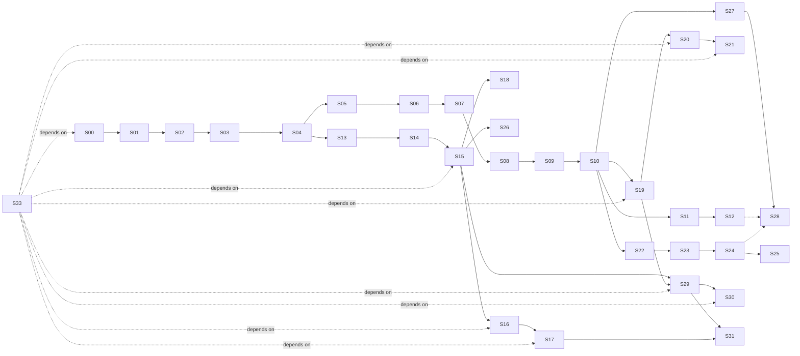

# Bee Implementation Stories

> **Status**: Active implementation backlog
> **Source**: distilled from [CONTEXT.md](../CONTEXT.md), [docs/architecture.md](./architecture.md), [docs/internals.md](./internals.md), [docs/product-design.md](./product-design.md), and [docs/adr/](./adr/) (10 ADRs).
> **Granularity**: 32 vertical slices (tracer bullets), each end-to-end demoable.
> **Conventions**: all stories are AFK (no human-in-the-loop required); HITL can be added per story by setting `Type: HITL` and noting the review milestone.

## How to use this document

1. **Pick a story** whose `Blocked by` list is satisfied.
2. Each story is a thin vertical slice — it should produce a runnable / testable artifact, not a layer-only change.
3. After implementing a story, mark its acceptance criteria and link any commits / PRs.
4. When a story is done, unblock downstream stories. Stories on the same level (no shared dependency) can be done in parallel.

## Naming conventions for examples

Throughout this document, the following names appear in **test scenarios** and **documentation examples**. **None of these are part of Bee core.** They are illustrative names for **separate third-party plugins** (or, where explicitly noted, generic test fixtures that ship with Bee for mechanism verification only).

| Name in docs | What it represents | Ships in Bee core? |
| --- | --- | --- |
| `binance` | A hypothetical exchange-data Datasource plugin | **No** — third-party plugin |
| `coingecko` / `google_news` | Hypothetical market data / news Datasource plugins | **No** — third-party plugins |
| `influxdb` / `mongodb` | Hypothetical sink Adapter plugins | **No** — third-party plugins |
| `macd` / `ema` / `kronos` | Hypothetical quant-indicator UDFs | **No** — third-party Handler plugins (or built-in UDFs in a future `bee-dsl-sql-builtins` crate, also separate) |
| `decision_tree` / `sentiment_analyzer` | Hypothetical UDFs | **No** — third-party Handler plugins |
| `mock_input` (S16) | A **generic test fixture** for verifying the Adapter mechanism | **Yes** — but only as a test util, not a production Datasource |

Bee core provides:
- The framework (Adapter / Handler traits, Registry, Datasource managed entity, `use` syntax, control plane, KV, BRP)
- A **generic mock** for testing the mechanism (`MockInputAdapter` in S16)
- **No domain-specific Datasource implementations**

## Dependency graph (top-level)



## 7 parallel paths after S10

Once **S10 (Scheduler bin-packing)** is done, the work forks into 7 paths that can each be picked up by a different agent:

| Path | Stories | Theme |
| --- | --- | --- |
| **A. Failover** | S11 → S12 | Heartbeat + Work-Stealing + Checkpoint recovery |
| **B. SQL + performance** | S13 → S14 → S15 → S26 | DataFusion integration + ms-level micro-batch / per-event / Hint |
| **C. SQL + Datasource + cross-Pipeline** | S16 → S17, S18 | Rate-limit sharing (Producer Pipeline) + cross-Pipeline edges |
| **D. Plugin system** | S19 → S20 → S21 | Rust plugins + strict ABI check + multi-version + version ranges |
| **E. Adaptive scheduling** | S22 → S23 → S24 → S25 | MLFQ + 4 alternative policies + cross-Node rebalancing |
| **F. Observability** | S27 → S28 | CLI panel (jobs / inspect / diagnostics / cluster status) |
| **G. Datasource management (ADR-0010)** | S29 → S30, S31 | `use` syntax + Datasource Registry + secret store + health / pause |
| **H. Quant trading spike** | S33 | End-to-end demo with separate mock plugin crates (HITL: seed-user demo) |

## Key milestones

- **S07**: 3-node Raft cluster; control plane SM visible
- **S10**: first **end-to-end demoable** — 3-node Bee running a hardcoded multi-Phase Pipeline
- **S12**: **Failover complete loop** — kill a Node, see Task go Orphaned, auto-Work-Stealing recovers
- **S17**: **Quant scenario A complete** — binance mock + multiple Pipelines sharing 1 Producer
- **S25**: **0.7 roadmap core** — runtime adaptive scheduling
- **S28**: **0.x → 1.0 production-ready** (CLI observability + scheduling + diagnostic)
- **S29–S31**: **Datasource management** — `use` syntax + secret store + pause/resume (admin governance)
- **S33**: **Quant trading spike complete** — end-to-end demo with separate mock plugins, validated against seed user (HITL)

---

# Stories

## Phase 0.1 — BRP PoC

---

### S00 · Bootstrap Cargo workspace

- **Type**: AFK
- **Blocked by**: None
- **ADRs**: none (foundation)

**What to build**
Initialize a Rust workspace at the repo root with the 8 crates defined in [docs/architecture.md §2 Crate structure](./internals.md#2-crate-structure):

```
crates/bee-transport   crates/bee-codec      crates/bee-session   crates/bee-runtime
crates/bee-control     crates/bee-registry   crates/bee-dsl-sql   (binary: bin/bee)
```

Each crate has a minimal `lib.rs` (or `main.rs` for `bee`) with a placeholder type, plus `Cargo.toml` declaring its dependencies. The `bee` binary prints `bee <version>` and exits.

**Acceptance criteria**
- [ ] `cargo build --workspace` succeeds
- [ ] `cargo run -p bee -- --version` prints `bee 0.1.0` (or similar)
- [ ] `cargo test --workspace` runs (no tests yet, but the harness works)
- [ ] `git init` + first commit captured
- [ ] `.gitignore` excludes `target/`, `Cargo.lock` for binaries (include for libraries)

---

### S01 · Frame type + 15-byte Header + bincode codec

- **Type**: AFK
- **Blocked by**: S00
- **ADRs**: [0001](./adr/0001-data-plane-p2p-control-plane-raft.md) (BRP wire format)

**What to build**
In `bee-codec`:
- `Frame` struct: `Magic(2B) | MessageType(1B) | RequestId(8B) | BodyLength(4B) | Body(Vec<u8>)`
- `Frame::encode(&self) -> [u8; 15 + body.len()]`
- `Frame::decode(bytes: &[u8]) -> Result<(Frame, usize), CodecError>` (returns frame + bytes consumed)
- `MessageType` enum (at minimum: `Heartbeat = 0x01`, `DataPacket = 0x02`, `StealTask = 0x03`)
- Magic bytes: `[0x42, 0x45]` (ASCII "BE")

**Acceptance criteria**
- [ ] Unit tests cover: encode round-trip, decode round-trip, magic mismatch, body length mismatch, partial buffer (less than 15 bytes), message-type parsing
- [ ] `cargo test -p bee-codec` shows all green
- [ ] No external runtime dependencies added (bincode allowed per ADR-0001)

---

### S02 · TCP transport + BRP echo round-trip

- **Type**: AFK
- **Blocked by**: S01
- **ADRs**: [0001](./adr/0001-data-plane-p2p-control-plane-raft.md)

**What to build**
In `bee-transport`:
- `Listener::bind(addr) -> Result<Listener>` using `tokio::net::TcpListener`
- `Listener::accept() -> Stream<Connection>` (one per incoming TCP connection)
- `Connection::send_frame(&Frame) -> Result<()>` and `Connection::recv_frame() -> Result<Frame>` using `tokio::io::AsyncReadExt` / `AsyncWriteExt` with `BytesMut` for buffering
- A `Framed` wrapper that handles partial reads / writes (TCP framing)

In `bee` binary:
- `bee echo <addr>` subcommand: connects to `<addr>`, sends a Heartbeat Frame, reads back the echoed Frame, prints "ok" or the echoed body, exits

**Acceptance criteria**
- [ ] Integration test: spawn a local listener on `127.0.0.1:0`, connect, send a Frame, read it back
- [ ] Integration test: handle partial reads (send 5 bytes, then 10 more — receiver reconstructs the full Frame)
- [ ] `cargo run -p bee -- echo 127.0.0.1:<port>` round-trips a Heartbeat Frame end-to-end
- [ ] Backpressure: sender pauses when local send buffer is full (deferred to S09 cross-Node Phase flow; for now, `tokio::sync::mpsc` between user code and Connection is sufficient)

---

## Phase 0.2 — Pipeline runtime (single Node)

---

### S03 · Phase + Handler traits + DAG type (1 Phase)

- **Type**: AFK
- **Blocked by**: S02
- **ADRs**: [0001](./adr/0001-data-plane-p2p-control-plane-raft.md), [0002](./adr/0002-datasource-is-a-phase.md)

**What to build**
In `bee-runtime`:
- `trait Handler<I, O>` with `async fn handle(&mut self, input: I) -> Result<O>` and `async fn finish(self) -> Result<()>` (lifecycle hooks)
- `struct Phase<H: Handler>`: holds the Handler instance + metadata (name, optional adapter reference)
- `struct Dag`: a collection of `Phase`s + edges between them; at minimum support 1-Phase DAG
- One example built-in `Handler`: `PassthroughHandler` that just forwards input to output (for testing)

**Acceptance criteria**
- [ ] Unit test: instantiate a 1-Phase DAG with `PassthroughHandler`, feed one input, assert one output
- [ ] `Dag` exposes `vertices() -> &[Phase]` and `edges() -> &[(PhaseId, PhaseId)]`
- [ ] No SQL / no Raft / no plugin loading in this slice (deferred)

---

### S04 · Runtime executes DAG + in-process mpsc channels

- **Type**: AFK
- **Blocked by**: S03
- **ADRs**: [0001](./adr/0001-data-plane-p2p-control-plane-raft.md)

**What to build**
In `bee-runtime`:
- `Runtime::run(dag: Dag) -> JoinHandle<Result<()>>` that:
  - Spawns one async task per Phase on `tokio::runtime::Runtime`
  - Connects adjacent Phases via `tokio::sync::mpsc` channels (in-process edges)
  - Topological order: source Phases start first; sink Phases last
- `Runtime` reads input from a user-provided `mpsc::Receiver<Event>`, sinks output to a user-provided `mpsc::Sender<Event>`

**Acceptance criteria**
- [ ] Integration test: 2-Phase chain (A → B), A uses `MapHandler(x => x+1)`, B uses `FilterHandler(x => x > 5)`, feed [1..10], assert output [6,7,8,9,10]
- [ ] Runtime cleanly shuts down when input channel closes
- [ ] No network, no Raft, no cross-Node edges in this slice

---

### S05 · DAG fork (1 input → 2 outputs) + topological order

- **Type**: AFK
- **Blocked by**: S04
- **ADRs**: [0001](./adr/0001-data-plane-p2p-control-plane-raft.md)

**What to build**
Extend `Dag` and `Runtime`:
- `Dag` supports a vertex with multiple outgoing edges (fan-out)
- `Runtime` correctly duplicates events to all downstream Phases
- Add a test DAG: Source → [BranchA, BranchB] → Sink (where Sink merges two streams)

**Acceptance criteria**
- [ ] Integration test: fork DAG, each branch produces N events, sink receives 2N events
- [ ] Topological order: when 3 Phases A, B, C where A → B, A → C, B and C can run in parallel
- [ ] DAG cycle detection at construction time (return error if cycle present)

---

## Phase 0.3 — Raft control plane + KV cluster

---

### S06 · Single-Node Raft loop + KV state machine

- **Type**: AFK
- **Blocked by**: S05
- **ADRs**: [0001](./adr/0001-data-plane-p2p-control-plane-raft.md), [0004](./adr/0004-bee-kv-cluster.md)

**What to build**
Choose a Raft library (recommendation: `openraft` 0.x or `raft-rs`). In a new `bee-raft` module (or fold into `bee-control`):
- Single-Node Raft loop: a Raft state machine that applies commands
- `KVStateMachine` implementing the Raft `StateMachine` trait
- `kv.get(key) -> Option<Vec<u8>>`, `kv.put(key, value)`, `kv.cas(key, expected, new) -> bool`, `kv.txn(ops: Vec<Op>) -> Result<(), TxnError>` (atomic)
- Keys are arbitrary strings; values are opaque bytes (bincode-serializable by caller)
- Namespace convention documented: `state/task/{TaskId}/...` (per [CONTEXT.md](../CONTEXT.md))

**Acceptance criteria**
- [ ] Unit test: single-node Raft loop applies a put, subsequent get returns the value
- [ ] Unit test: `cas` rejects mismatched `expected`
- [ ] Unit test: `txn` either applies all ops or none
- [ ] Smoke test: `bee-kv-test` binary spins up the single-node raft, runs 100 put/get round-trips, prints "ok"

---

### S07 · 3-Node Raft cluster bootstrap + leader election

- **Type**: AFK
- **Blocked by**: S06
- **ADRs**: [0001](./adr/0001-data-plane-p2p-control-plane-raft.md), [0007](./adr/0007-simplified-raft-topology-mvp.md)

**What to build**
- 3 separate `bee` processes (or threads) form a Raft cluster
- `bee cluster init --node 1,2,3` subcommand bootstraps the cluster (one node is initial leader, others join)
- `bee cluster status` prints: current leader, each node's `last_heartbeat`, Raft term, log length
- Leader election: kill the leader, watch a new leader be elected within `election_timeout` (default 1s)
- BRP control channel (over the same TCP stack from S02) carries Raft RPCs

**Acceptance criteria**
- [ ] Integration test: 3 processes on `127.0.0.1:7001/7002/7003`, init cluster, one leader elected
- [ ] Integration test: kill leader (SIGKILL), within 2s a new leader is elected
- [ ] `bee cluster status` returns correct info
- [ ] Raft logs persisted across process restart (replay on boot)

---

### S08 · ControlPlane SM (Job/Task metadata in Raft)

- **Type**: AFK
- **Blocked by**: S07
- **ADRs**: [0001](./adr/0001-data-plane-p2p-control-plane-raft.md), [0007](./adr/0007-simplified-raft-topology-mvp.md)

**What to build**
In `bee-control`, add a second logical state machine on the same Raft group:
- `ControlPlaneStateMachine` with commands:
  - `RegisterJob { job_id, dag_hash, owner_node, tenant }`
  - `RegisterTask { task_id, job_id, phase_id, owner_node, status }`
  - `UpdateTaskStatus { task_id, new_status: TaskStatus }`
- `TaskStatus` enum: `Pending | Scheduled | Running | Orphaned | Migrating | Revoked | Completed | Failed` (per [architecture.md §5.3](./architecture.md#53-lifecycle-states))
- `bee jobs list` CLI subcommand: reads from any Raft node, returns all `RegisterJob` entries

**Acceptance criteria**
- [ ] Integration test: 3-node cluster, submit a job on node 1, query `bee jobs list` from node 2 — returns the job
- [ ] Task status transitions are linearizable (read on any node returns the latest committed state)
- [ ] KV SM (S06) and ControlPlane SM coexist on the same Raft group without interference

---

## Phase 0.4 — Cross-Node + scheduler

---

### S09 · TaskPlacement + cross-Node Task execution

- **Type**: AFK
- **Blocked by**: S08
- **ADRs**: [0001](./adr/0001-data-plane-p2p-control-plane-raft.md), [0008](./adr/0008-optimizer-scheduler-adaptive.md)

**What to build**
- New BRP message type: `TaskPlacement { task_id, job_id, phase_id, dag_fragment }` (over the control channel)
- `bee deploy pipeline.json` CLI: parses a hardcoded DAG, computes a placement plan (for now: round-robin or random across Nodes), submits `RegisterJob` + `RegisterTask` per Task to ControlPlane SM, then sends `TaskPlacement` to each Task's assigned Node over BRP
- Receiving Node spawns the Task locally (re-uses S04 Runtime) and starts processing

**Acceptance criteria**
- [ ] Integration test: 3 nodes, deploy a 3-Task DAG (one Task per node), all Tasks start, each emits "started" log line
- [ ] Cross-Node edge: Task on node A emits to Task on node B — verified by a test that asserts the BRP data channel carries events
- [ ] `bee jobs inspect <JobId>` shows Task → Node mapping

---

### S10 · Scheduler module: bin-packing by resource declaration

- **Type**: AFK
- **Blocked by**: S09
- **ADRs**: [0008](./adr/0008-optimizer-scheduler-adaptive.md)

**What to build**
- `Scheduler` trait with method `place(dag: &Dag, nodes: &[NodeCapacity]) -> Vec<TaskPlacement>`
- Default implementation: bin-packing by `cpu` and `mem` declarations in the DAG
- Each Task declares resource needs (e.g., `cpu_millicores`, `mem_mb`); each Node reports current load
- Replace the "round-robin" placement in S09 with the real Scheduler

**Acceptance criteria**
- [ ] Unit test: 3 Tasks each requesting 500m CPU, 3 Nodes each with 1000m available — packing fits 2 on node 1, 1 on node 2
- [ ] Integration test: deploy 5 Tasks to 3 Nodes; verify the placement respects capacity
- [ ] Scheduler is pluggable: can be replaced with a different strategy (e.g., for S25 rebalance)

---

## Phase 0.5 — Heartbeat + Failover

---

### S11 · Heartbeat loop + 3× missed = Orphaned

- **Type**: AFK
- **Blocked by**: S10
- **ADRs**: [0001](./adr/0001-data-plane-p2p-control-plane-raft.md)

**What to build**
- Each Node sends `Heartbeat { node_id, timestamp }` to the Raft Leader every `heartbeat_interval` (default 10s)
- Leader tracks `last_heartbeat` per Node in ControlPlane SM
- Background task on Leader: if `now - last_heartbeat > 3 × heartbeat_interval`, mark all Tasks owned by that Node as `Orphaned` (via `UpdateTaskStatus` command)
- `bee jobs list` shows `Orphaned` Tasks distinctly (CLI: `STATUS: orphaned (was on node 2)`)

**Acceptance criteria**
- [ ] Integration test: 3-node cluster, kill node 2 (SIGKILL), within 35s node 2's Tasks show `Orphaned` on `bee jobs list`
- [ ] Heartbeat is high-priority (per ADR-0007): uses a dedicated channel, not contended with worker data flow
- [ ] Heartbeat interval and orphan threshold are configurable

---

### S12 · Work-Stealing RPC + KV Checkpoint recovery

- **Type**: AFK
- **Blocked by**: S11, S18 (Checkpoint is implemented in S18; S12 can read latest Checkpoint, S18 makes Checkpoint writes happen)

> **Note**: S12 logically needs S18 (Checkpoint writing). If a strict linear order is required, swap to `Blocked by: S11, S18`. If parallelizing is preferred, S12 can be implemented first to read whatever Checkpoint exists (S18 will fill it in later).

- **ADRs**: [0004](./adr/0004-bee-kv-cluster.md), [0001](./adr/0001-data-plane-p2p-control-plane-raft.md)

**What to build**
- `StealTask { thief_node, task_id }` BRP message (control channel)
- Free Node sends `StealTask` to Leader for an `Orphaned` Task
- Leader arbitrates: verifies the Task is still Orphaned and no other StealTask won; if yes, approves and changes Task status to `Migrating` with new owner
- Thief Node receives approval, reads `state/checkpoint/{TaskId}` from KV (gets Task state + saved offset)
- Thief restores Task state, re-establishes BRP data channel to upstream Task, resumes processing from saved offset
- Original (recovered) Node, if it comes back, is told the Task was stolen and cleans up

**Acceptance criteria**
- [ ] Integration test: 3-node cluster, deploy a 3-Task DAG, kill node 2, observe Work-Stealing, new owner resumes, output stream continues seamlessly
- [ ] Concurrent StealTask from two thieves: only one wins; the other gets a rejection
- [ ] No data loss: events between the original owner's last checkpoint and the crash are replayed

---

## Phase 0.6 — SQL DSL

---

### S13 · DataFusion SQL parser integration + simple SELECT

- **Type**: AFK
- **Blocked by**: S04
- **ADRs**: [0006](./adr/0006-sql-runtime-datafusion.md)

**What to build**
In `bee-dsl-sql`:
- Add `datafusion` as a dependency (verify version, Apache 2.0 compatible)
- `parse_sql(source: &str) -> Result<datafusion::sql::parser::Statement>`
- `analyze(statement) -> Result<datafusion::logical_expr::LogicalPlan>`
- Test: parse `SELECT a + 1 FROM stream WHERE a > 0` — assert it produces a valid LogicalPlan

**Acceptance criteria**
- [ ] Unit test: a few representative SQL statements parse and analyze without error
- [ ] No Bee-level extensions yet (ASOF JOIN, EMIT INTO) — those are in S14 / S15

---

### S14 · DataFusion LogicalPlan → Bee DAG type

- **Type**: AFK
- **Blocked by**: S13
- **ADRs**: [0006](./adr/0006-sql-runtime-datafusion.md), [0002](./adr/0002-datasource-is-a-phase.md)

**What to build**
- Mapping: each DataFusion LogicalPlan operator → Bee Phase (with corresponding Handler impl)
- Projection → `ProjectionHandler`
- Filter → `FilterHandler`
- Aggregate (basic) → `AggregateHandler`
- Source (table) → `DatasourcePhase` (per ADR-0002, a Phase with adapter field)
- `compile_to_dag(plan: LogicalPlan) -> Result<Dag>`

**Acceptance criteria**
- [ ] Unit test: `SELECT a + 1 AS b FROM stream WHERE a > 0` → DAG with [DatasourcePhase → FilterPhase → ProjectionPhase]
- [ ] DAG is executable by S04 Runtime (after S15 wires the executor)
- [ ] Schema is preserved across Phase boundaries

---

### S15 · DataFusion executor wrapper as Bee Phase + `bee run pipeline.sql`

- **Type**: AFK
- **Blocked by**: S14
- **ADRs**: [0006](./adr/0006-sql-runtime-datafusion.md)

**What to build**
- `DataFusionPhase` wraps a `datafusion::physical_plan::ExecutionPlan` and exposes the Bee `Handler` trait
- `bee run pipeline.sql` CLI: reads SQL file, parses → analyzes → compiles to DAG → runs via S04 Runtime
- Micro-batch executor loop: every `micro_batch_window_ms` (default 1s), drain input streams into a `RecordBatch`, run the DataFusion plan, emit results
- For MVP, the input is a mock "stream" (e.g., a CSV file read once and replayed)

**Acceptance criteria**
- [ ] `bee run tests/data/simple_select.sql` (test fixture with a small CSV) prints the projection output
- [ ] Micro-batch window is configurable
- [ ] Output schema matches the SQL projection

---

## Phase 0.7 — Datasource sharing (Producer Pipeline)

---

### S16 · Datasource Adapter trait + test fixture Adapter (no business code)

- **Type**: AFK
- **Blocked by**: S15
- **ADRs**: [0002](./adr/0002-datasource-is-a-phase.md), [0003](./adr/0003-producer-pipeline-pattern.md)

> **Bee core is business-agnostic.** This story defines the **mechanism** (Adapter trait + registry) and a **generic test fixture**. Concrete business Datasources (Binance, Google News, InfluxDB, etc.) ship as **separate plugins** in their own crates — they are NOT compiled into the Bee binary. The test fixture in this story is a generic `MockInputAdapter` for verifying the mechanism, with no domain-specific logic.

**What to build**
- `trait InputAdapter`: `async fn open(config) -> Result<Self>`, `async fn next(&mut self) -> Result<Option<Event>>`, `async fn close(self)`
- `trait OutputAdapter`: `async fn open`, `async fn emit(&mut self, event)`, `async fn close`
- Generic **test fixture** `MockInputAdapter` (lives in `bee-runtime` test-utils, NOT in main): emits `Event { timestamp: u64, sequence: u64, payload: Vec<u8> }` at a configurable rate. Configurable count so tests can deterministically produce N events then close.
- Adapter discovery mechanism: Adapters are looked up by name in the Plugin Manager (S19). Built-in Adapters for the runtime are **limited to the trait implementations themselves**; concrete business Adapters (binance, etc.) are **plugins**.

**Acceptance criteria**
- [ ] `MockInputAdapter` produces exactly N events then returns `Ok(None)` (deterministic, testable)
- [ ] No domain-specific Datasource implementation in `bee-runtime` or any other Bee core crate
- [ ] The `binance` / `coingecko` / `influxdb` examples used elsewhere in this doc are clearly labeled as **external plugins** (not built-in) — see S19
- [ ] A test Pipeline using `MockInputAdapter` (registered via S29's Datasource mechanism with `--adapter mock_input`) runs end-to-end and emits events

---

### S17 · Datasource signature (hash) + Producer Pipeline detection + Subscriber mode

- **Type**: AFK
- **Blocked by**: S16
- **ADRs**: [0003](./adr/0003-producer-pipeline-pattern.md), [0004](./adr/0004-bee-kv-cluster.md), [0010](./adr/0010-datasource-managed-entity.md)

**What to build**
- `DatasourceSignature` (Provider-level): `sha256(adapter_id + config_payload)` (per ADR-0003) — used to identify if a Provider already exists
- `StreamSignature` (Stream-level): `sha256(datasource_name || adapter_method || canonicalized_call_args)` (per ADR-0010 refinement) — used to identify if a Stream already exists
- During deploy, control plane checks the KV: is there a Job with this StreamSignature?
  - **No**: this Job's "Stream-producing Phase" is marked as a "Producer" (becomes a single-Phase Pipeline Job that runs the Adapter)
  - **Yes**: this Job's "Stream-consuming Phases" are "degraded" into subscriber edges pointing to the existing Producer
- Subscribers consume the Producer's stream over BRP (S09 cross-Node machinery, or in-process if same Node)
- KV state key: `state/producer/{stream_signature} -> JobId`

**Acceptance criteria**
- [ ] Integration test: deploy Job A with `binance.subscribe('BTC/USDT', '5min')` — creates Producer
- [ ] Integration test: deploy Job B with same StreamSignature — does NOT create a second Adapter instance; instead subscribes to Job A's Producer
- [ ] `bee jobs list` shows Job A as a Producer (one Phase, the Datasource), Job B as a Subscriber (no Datasource Phase, just a subscription edge)
- [ ] Kill Job A's Node: subscribers enter `Waiting for Upstream`; on Producer re-deploy, they reconnect
- [ ] Different args create different Producers: `binance.subscribe('ETH/USDT', '5min')` gets its own Producer (different StreamSignature), even though the Provider config is the same

---

### S18 · Cross-Pipeline edge SQL syntax + resolution + dependency tracking

- **Type**: AFK
- **Blocked by**: S15
- **ADRs**: [0001](./adr/0001-data-plane-p2p-control-plane-raft.md), [0006](./adr/0006-sql-runtime-datafusion.md)

**What to build**
- SQL syntax: `CREATE VIEW v_x AS SELECT ... FROM pipeline_a.output` where `pipeline_a` is a known JobId
- Compiler resolves the cross-Pipeline reference: if both Jobs are deployed to the same Node, the edge is in-process; if different Nodes, it's a BRP data channel subscription
- ControlPlane SM tracks cross-Pipeline dependencies: `Job B depends on Job A's output stream X`
- A dependent Job waits for upstream to be `Running` before its consumer Phase starts

**Acceptance criteria**
- [ ] Integration test: 2 Jobs deployed, Job B subscribes to Job A's output, both running, events flow A → B
- [ ] Kill Job A: Job B enters `Waiting for Upstream` (visible in `bee jobs list`)
- [ ] Restart Job A on a different Node: Job B reconnects automatically

---

## Phase 0.9 — Plugin system

---

### S19 · Plugin trait + BeeHostV1 + libloading + sha256 → PluginId

- **Type**: AFK
- **Blocked by**: S10
- **ADRs**: [0005](./adr/0005-plugin-ffi-rust-cdylib-mvp.md), [0009](./adr/0009-plugin-multiversion-hash-abi.md)

**What to build**
- `bee-plugin-sdk` crate: defines `Plugin` trait, `BeeHostV1` C struct (opaque handle + function pointer table)
- `PluginManager` in `bee-registry`:
  - Watches a configured directory (default `/etc/bee/plugins/`) for `.so` / `.dylib` / `.dll`
  - On new file: compute `sha256(binary_content)` → `PluginId`; load via `libloading`; resolve `bee_plugin_init` symbol; call init with `BeeHost*`; register returned Adapters/Handlers
  - On file removal: unload (after refcount drops to zero)
- `bee plugin list` CLI: shows all loaded plugins with their `PluginId` (full hash) and refcount

**Acceptance criteria**
- [ ] Integration test: drop a sample `libbee_plugin_fake.so` into the plugin dir, see it appear in `bee plugin list` with its hash
- [ ] ABI mismatched plugin: rejected with clear error log (precise error format in S20)
- [ ] `bee plugin list` output format documented

---

### S20 · ABI version check at load

- **Type**: AFK
- **Blocked by**: S19
- **ADRs**: [0009](./adr/0009-plugin-multiversion-hash-abi.md)

**What to build**
- Each Plugin declares `abi_version` in its Plugin Manifest
- Bee has a configured supported `abi_version_range` (e.g., "1.x")
- During load, if plugin's `abi_version` not in range: reject with a clear error log including the plugin's claimed `abi_version`, Bee's expected range, and remediation instructions
- The plugin's `.so` remains on disk for inspection; it is not deleted

**Acceptance criteria**
- [ ] Integration test: plugin with `abi_version = "2.0"` is rejected when Bee expects `1.x`
- [ ] Error log format includes: plugin path, computed hash, claimed `abi_version`, expected range, link to migration docs
- [ ] `bee plugin inspect <path>` shows the would-be hash + claimed `abi_version` (useful for debugging before placing the plugin)

---

### S21 · Multi-version coexistence + version range resolution

- **Type**: AFK
- **Blocked by**: S20
- **ADRs**: [0009](./adr/0009-plugin-multiversion-hash-abi.md), [0010](./adr/0010-datasource-managed-entity.md)

**What to build**
- Multiple `.so` files for the same logical Plugin (same `name` in Manifest, different `version`, different `sha256`) load simultaneously
- Each version gets a unique `PluginId` (its hash)
- Pipeline references Plugin with SemVer range syntax: `binance:1.0` (exact) / `binance:^1.0` (1.x compatible) / `binance:latest`
- At Pipeline submit time, the compiler resolves the range to a specific `PluginId`; the resolution result is part of the Job's spec
- If no matching plugin is available, Pipeline submit fails with a clear error
- For Datasource-managed Plugin references: `use binance;` defaults to the Datasource's configured `version_spec`; `use binance@1.4.2;` overrides

**Acceptance criteria**
- [ ] Integration test: 2 versions of `binance` (1.4.2 and 2.0.0) both loaded; 2 Pipelines each referencing one version; both run independently
- [ ] Integration test: `binance:^1.0` resolves to 1.4.2; `binance:latest` resolves to 2.0.0
- [ ] `bee plugin list` shows both versions with their distinct hashes and refcounts
- [ ] Old versions auto-unload when all referencing Pipelines stop (refcount = 0)

---

## Phase 0.10 — Runtime Scheduler

---

### S22 · Tokio task wrapper + per-Task priority queue (cooperative)

- **Type**: AFK
- **Blocked by**: S10
- **ADRs**: [0008](./adr/0008-optimizer-scheduler-adaptive.md)

**What to build**
- A `RuntimeScheduler` that wraps each Task in a `tokio::task` with priority metadata
- A priority queue (e.g., `tokio::sync::Notify` with priority levels) decides which ready Task gets polled next
- Cooperative (not preemptive): the scheduler biases polling order; a running Task is not interrupted
- `bee.runtime.scheduler_policy` config (in MVP, only "priority" matters; MLFQ etc. are in S23)

**Acceptance criteria**
- [ ] Integration test: 3 Tasks with priorities [high, medium, low]; instrument which Task is polled in which order; assert high comes first more often
- [ ] No measurable throughput regression vs. the S10 baseline scheduler
- [ ] The scheduler is opt-in: `bee.runtime.scheduler_policy = "tokio-default"` falls back to S10 behavior

---

### S23 · MLFQ default + SJF/HRRN/SRTN alternatives + config

- **Type**: AFK
- **Blocked by**: S22
- **ADRs**: [0008](./adr/0008-optimizer-scheduler-adaptive.md)

**What to build**
- Implement 4 scheduling policies as drop-in alternatives:
  - **MLFQ** (Multi-Level Feedback Queue) — default; 3-4 priority queues; aging for starvation prevention
  - **SJF** (Shortest Job First) — needs `expected_duration` estimate per Task (use historical average)
  - **HRRN** (Highest Response Ratio Next) — `(waiting_time + service_time) / service_time`
  - **SRTN** (Shortest Remaining Time Next) — preemptive SJF (cooperative variant)
- Each policy exposes the same `RuntimeScheduler` trait; the active one is selected at startup via `bee.runtime.scheduler_policy`
- `bee cluster status` shows the current policy

**Acceptance criteria**
- [ ] Unit tests for each policy: feed a known mix of Task durations, assert the expected dispatch order
- [ ] Integration test: 3 Tasks with known CPU costs; under MLFQ, short Tasks complete before long Tasks
- [ ] Switching policy via config requires only a Node restart (no DAG re-deploy)

---

## Phase 0.11 — Cross-Node rebalance

---

### S24 · Per-Phase metrics (latency / throughput / CPU) + `bee diagnostics`

- **Type**: AFK
- **Blocked by**: S23
- **ADRs**: [0008](./adr/0008-optimizer-scheduler-adaptive.md)

**What to build**
- Each Phase Assignment continuously records:
  - `events_processed_total` (counter)
  - `processing_latency_p50/p99` (histogram)
  - `cpu_seconds_total` (counter, from `cgroup` or process stats)
  - `backpressure_wait_seconds_total` (counter)
- Metrics stored in-memory per Task; exposed via `bee diagnostics <TaskId>` and a basic `/metrics` HTTP endpoint
- Default scrape interval: 5s

**Acceptance criteria**
- [ ] `bee diagnostics <TaskId>` prints all four metrics for the given Task
- [ ] Histogram buckets are sensible (e.g., 1ms, 10ms, 100ms, 1s, 10s)
- [ ] No regression: adding metrics adds < 1% CPU overhead

---

### S25 · Cross-Node rebalance: trigger + Task migration

- **Type**: AFK
- **Blocked by**: S24
- **ADRs**: [0008](./adr/0008-optimizer-scheduler-adaptive.md), [0001](./adr/0001-data-plane-p2p-control-plane-raft.md)

**What to build**
- Scheduler (S10) periodically reads metrics from S24 (every `rebalance_interval`, default 60s)
- If a Node's load exceeds 1.5× the cluster average AND a Task on it has been there > 5 min, the Scheduler triggers a rebalance
- Rebalance = StealTask-like flow: pick a Task to move, mark it `Migrating`, follow the S12 migration protocol (read Checkpoint from KV, transfer to new Node, resume)
- `bee cluster status` shows last rebalance event (when, which Task, from where to where)

**Acceptance criteria**
- [ ] Integration test: deploy 10 Tasks to 3 Nodes unevenly (8/1/1), wait 5 min, observe rebalance to ~3/3/4 distribution
- [ ] During rebalance, the migrating Task's `bee diagnostics` shows `Migrating` status, then `Running` on the new Node
- [ ] Re-enable the trigger: if a Node's load drops back to normal, no rebalance fires (no flapping)

---

## Phase 0.12 — SQL performance tuning

---

### S26 · Micro-batch window + per-event mode + DataFusion Hint

- **Type**: AFK
- **Blocked by**: S15
- **ADRs**: [0006](./adr/0006-sql-runtime-datafusion.md)

**What to build**
- `bee.dsl.sql.micro_batch_window_ms` config (default 1000, can be tightened to 10)
- `bee.dsl.sql.execution_mode = "micro_batch" | "per_event"` — per-event mode bypasses batching for ultra-low latency
- SQL hint syntax integration with DataFusion: `SELECT /*+ JOIN_ORDER(a, b) */ ...`
- Latency measurement: `bee run pipeline.sql --measure` reports p50/p99 end-to-end latency

**Acceptance criteria**
- [ ] `micro_batch_window_ms = 10` reduces measured p99 latency vs. default (test: deploy a SQL Pipeline, measure both configs)
- [ ] `per_event` mode shows further latency reduction (subject to DataFusion per-event overhead)
- [ ] Hint syntax is passed through to DataFusion's optimizer (verify via EXPLAIN)

---

## Phase 0.13 — CLI observability

---

### S27 · `bee jobs` + `bee jobs inspect <JobId>`

- **Type**: AFK
- **Blocked by**: S10
- **ADRs**: [0001](./adr/0001-data-plane-p2p-control-plane-raft.md)

**What to build**
- `bee jobs`: lists all Jobs with `JobId | Name | Status | Tasks | Owner Node`
- `bee jobs inspect <JobId>`:
  - DAG visualization (ASCII or mermaid)
  - Per-Task status, owner Node, runtime metrics summary
  - Cross-Pipeline dependencies (input from / output to which other Jobs)
- Both commands read from any Node (queries ControlPlane SM via Raft read)

**Acceptance criteria**
- [ ] `bee jobs` works on a fresh cluster (returns empty)
- [ ] After S10's deploy, `bee jobs` shows the Job
- [ ] `bee jobs inspect <JobId>` shows a DAG diagram and per-Task status
- [ ] Color-coded output (green = running, yellow = migrating, red = failed)

---

### S28 · `bee diagnostics <TaskId>` + `bee cluster status`

- **Type**: AFK
- **Blocked by**: S27, S24, S12
- **ADRs**: [0001](./adr/0001-data-plane-p2p-control-plane-raft.md), [0008](./adr/0008-optimizer-scheduler-adaptive.md)

**What to build**
- `bee diagnostics <TaskId>`: detailed per-Task view — metrics from S24, recent log lines, event traces
- `bee cluster status`:
  - Raft health (term, leader, log lag per node)
  - Per-Node resource summary (CPU, memory)
  - Last rebalance event (from S25)
  - Plugin summary (from S19)
- Both commands work on any Node

**Acceptance criteria**
- [ ] `bee diagnostics <TaskId>` shows all metrics from S24
- [ ] `bee cluster status` shows Raft health correctly after a leader change (test: kill leader, verify the next status call reflects new leader)
- [ ] `bee diagnostics <TaskId>` for a `Migrating` Task shows `Migrating` status, source Node, target Node, progress

---

## Phase 0.5 / 0.6 — Datasource management (ADR-0010)

---

### S29 · Datasource managed entity + `use` SQL syntax + strict mode

- **Type**: AFK
- **Blocked by**: S15 (DataFusion executor for SQL integration), S19 (Plugin loading for PluginId resolution)
- **ADRs**: [0010](./adr/0010-datasource-managed-entity.md), [0002](./adr/0002-datasource-is-a-phase.md), [0003](./adr/0003-producer-pipeline-pattern.md)

**What to build**
Promote Datasource from runtime concept to **first-class managed Provider entity**:

- **Data model** (the Provider):
  ```yaml
  Datasource:
    name: "binance"                  # Provider handle
    tenant: 0
    adapter: "binance_subscribe"     # which Adapter the Provider wraps
    plugin_id: "a3f5..."             # sha256 (ADR-0009)
    version_spec: "^1.0"
    config:                          # ⭐ connection-level only: credentials, base_url, rate limits
      api_key_secret_id: "secret-001"
      base_url: "wss://api.binance.com"
      rate_limit_per_sec: 10
    status: Active | Paused | Disabled
    created_at, updated_at, owner_node
  ```
  Stored in KV at `ds/{tenant}/{name}`. **No per-call args** (symbol, interval, query) in the Datasource — those go in the SQL call site.

- **CLI**:
  - `bee datasource list [--tenant <n>]`
  - `bee datasource create <name> --adapter <a> --plugin-version <v> --config <json>`
  - `bee datasource inspect <name>`
  - `bee datasource test <name>` (probes via Plugin's `test_connection` method)
  - `bee datasource pause <name>` / `resume <name>` / `delete <name>`
- **SQL preprocessor**: scan for `use <name>[@<version_spec>];` statements at the top of the SQL file. Resolve each to a registered Datasource; bind to a specific `PluginId` (using the Datasource's `version_spec` if no explicit pin, or matching SemVer range if pinned).
- **Call site**: `binance.subscribe('BTC/USDT', '5min')` — `binance` is the Datasource name; `subscribe` is a method on the Adapter; `('BTC/USDT', '5min')` are per-call args selecting the stream. **Not** in the Datasource config.
- **Strict mode enforcement**: any reference to an adapter function (e.g., `binance.subscribe(...)`) without a prior `use binance;` is a **compile error**. Inline `api_key=...` in call args is also a compile error (credentials live in the Datasource config / secret store, never in SQL).
- **Tenant field**: `tenant: u16` exists on both Datasource and Job structs. MVP enforcement: `ds.tenant == job.tenant || ds.tenant == 0` (struct field only, no ACL enforcement in MVP; 1.x turns it on).
- **Output Datasources**: same `use` syntax works for sinks — `use influxdb; EMIT INTO influxdb.emit('bitcoin.trade', ...) SELECT ...`.

**Acceptance criteria**
- [ ] `bee datasource create binance --adapter binance_subscribe --plugin-version ^1.0 --config '{"base_url":"wss://api.binance.com","rate_limit_per_sec":10}'` succeeds and the Datasource appears in `bee datasource list`
- [ ] Datasource config schema rejects per-call args (e.g., `--config '{"symbol":"BTC/USDT"}'` produces a clear error: "symbol belongs at the call site, not in Datasource config")
- [ ] SQL: `use binance; SELECT * FROM binance.subscribe('BTC/USDT', '5min');` compiles and deploys
- [ ] SQL: `SELECT * FROM binance.subscribe('BTC/USDT', '5min');` (no `use`) is a compile error with a clear message
- [ ] SQL: `use binance; SELECT * FROM coingecko.subscribe(...);` is a compile error (coingecko is not used)
- [ ] SQL: `binance.subscribe('BTC/USDT', '5min', api_key='...')` (inline credential) is a compile error
- [ ] `use binance@^1.0;` resolves to the highest 1.x Plugin version loaded
- [ ] `use binance@1.4.2;` resolves to exactly that version
- [ ] `use binance;` with no version spec resolves to the Datasource's configured `version_spec`
- [ ] `bee datasource pause binance` triggers Draining on all referencing Jobs
- [ ] Job's `tenant` field defaults to 0; struct field exists but no ACL check in MVP
- [ ] **StreamSignature test**: two Pipelines calling `binance.subscribe('BTC/USDT', '5min')` share 1 Producer; calling `binance.subscribe('ETH/USDT', '5min')` (different args) creates a separate Producer; calling `binance.ticker('BTC/USDT')` (different method) also creates a separate Producer

---

### S30 · Secret store integration for Datasource credentials

- **Type**: AFK
- **Blocked by**: S29 (Datasource management), S06 (KV client)
- **ADRs**: [0010](./adr/0010-datasource-managed-entity.md)

**What to build**
Move credentials out of Datasource `config` and into a dedicated secret store:

- `SecretStore` trait with `get(secret_id) -> Vec<u8>` / `put(secret_id, value)` / `delete(secret_id)`
- MVP implementation: store secrets in KV at key `secret/{tenant}/{secret_id}`; values are opaque bytes (bincode or raw)
- Datasource `config` references secrets by ID (e.g., `api_key_secret_id: "secret-001"`); the Plugin reads the actual value via the `BeeHost` API at runtime
- `bee secret put/get/list/delete` CLI (admin)
- Encryption-at-rest: MVP uses Raft log encryption if available; 1.x plugs in HashiCorp Vault / AWS Secrets Manager

**Acceptance criteria**
- [ ] `bee secret put api_key=secret-001 --value <raw>` stores the secret
- [ ] Datasource config can reference `api_key_secret_id: "secret-001"` instead of inlining the key
- [ ] Plugin reads the secret at runtime via `BeeHost.secret_get(secret_id)`; the raw value never appears in Datasource `config` or in any Pipeline log
- [ ] `bee secret list` shows secret IDs only (not values)
- [ ] Secrets are scoped per tenant (MVP: all tenant 0)

---

### S31 · Datasource health metrics + pause / resume behavior

- **Type**: AFK
- **Blocked by**: S29 (Datasource management), S17 (Producer Pipeline mode for Draining)
- **ADRs**: [0010](./adr/0010-datasource-managed-entity.md)

**What to build**
Datasource-level observability and lifecycle:

- **Health probe**: the Producer of a Datasource periodically probes the external connection (default every 30s). Metrics: connection_success_total, connection_failure_total, last_success_at, last_failure_at, error_message_recent.
- **Auto-pause on N consecutive failures** (configurable, default 10): triggers Draining on all referencing Jobs (uses the S17 Producer's lifecycle).
- **`bee datasource inspect <name>`** shows the health metrics + current Producer Node + referencing Job count.
- **Pause behavior**:
  - `bee datasource pause <name>`: Producer's Adapter stops receiving new events; existing in-flight events flush; Subscribers complete; Job lifecycle ends cleanly.
  - `bee datasource resume <name>`: re-establish connection; if the original Plugin + config are still loaded, recreate Producer; Subscribers re-attach automatically.
- **SLO dashboard** (basic, 1.x): `bee datasource sl` shows all Datasources with their health rollup.

**Acceptance criteria**
- [ ] `bee datasource inspect binance` shows: Producer Node, plugin_id, version, health metrics, referencing Job count
- [ ] Killing the external connection 10 times in a row triggers auto-pause
- [ ] `bee datasource pause binance` and `bee datasource resume binance` work end-to-end
- [ ] Subscribers cleanly `Draining` during pause; cleanly reconnect on resume
- [ ] Pause/resume does not lose events (either buffered or backpressured)

---

## Phase 0.5 / 0.6 — Quant trading spike (HITL)

---

### S33 · Quant trading spike: end-to-end BTC 5min decision pipeline with **separate** mock plugin crates

- **Type**: **HITL** (first end-to-end demo to seed user is a design-review milestone)
- **Blocked by**: S00, S15, S16, S17, S19, S20, S21, S29, S30
- **ADRs**: all 10 (this story is the end-to-end validator for the whole architecture)
- **HITL review milestone**: when the demo script runs cleanly, schedule a 30-minute walkthrough with the first seed user. They sign off (or note gaps) before S33 is marked done.

> **Why this story exists**: All previous stories are layered — each proves one mechanism in isolation. S33 is the **spike** that proves the mechanisms compose. It validates that the architecture doc's mermaid diagrams aren't fiction. It produces the canonical "5-minute demo" that a seed user can run.
>
> **Why separate plugin crates**: Each plugin (binance / google_news / influxdb / mongodb / UDFs) ships in its **own `cdylib` crate**, not bundled together. This is the core principle of Bee (ADR-0005: no business code in core) AND the user's explicit requirement to maximize reusability.

**Deliverables**

#### 1. Four (or more) independent mock plugin crates

Each lives under `plugins/` as its own workspace member; each is a `cdylib`; each depends only on `bee-plugin-sdk` + `bincode` (no HTTP / WS / DB clients — all mock locally).

| Crate | Role | Behavior |
| --- | --- | --- |
| `bee-plugin-binance-mock` | Input Adapter (`binance_subscribe`) | Generates synthetic K-line events on a configurable schedule (default 1 Hz); price follows a sine wave so `MACD` / `EMA` are observable; `config` accepts `{"symbol", "interval"}` |
| `bee-plugin-google-news-mock` | Input Adapter (`google_news_search`) | Generates synthetic news article events with timestamps; query string from `config`; emits 1 event per minute by default |
| `bee-plugin-influxdb-mock` | Output Adapter (`influxdb_emit`) | Writes to a local append-only log file (`/tmp/bee_demo_influxdb.log`) in line-protocol-ish text; `config` accepts `{"database", "measurement"}` |
| `bee-plugin-mongodb-mock` | Output Adapter (`mongodb_emit`) | Writes to a local JSON-lines file (`/tmp/bee_demo_mongodb.jsonl`); `config` accepts `{"database", "collection"}` |
| `bee-plugin-ta-lib-mock` (optional) | Handler UDFs (`MACD`, `EMA`, `KRONOS`, `decision_tree`, `sentiment_analyzer`) | Pure-compute UDFs over a tiny in-crate time-series state; deterministic outputs |

Each plugin's `Cargo.toml` declares its own deps; no cross-plugin imports. Each has its own `Plugin Manifest` (with independent `name` / `version` / `abi_version`).

#### 2. The canonical SQL Pipeline: `examples/quant_btc_strategy.sql`

```sql
use binance;
use google_news;
use influxdb;
use mongodb;

CREATE VIEW v_btc_metrics AS
SELECT
    *,
    MACD(price, 26, 12, 9, timestamp)  AS macd,
    EMA(price, 26, timestamp)          AS ema26
FROM binance.subscribe('BTC/USDT', '5min');

CREATE VIEW v_btc_sentiment AS
SELECT
    *,
    sentiment_analyzer(article) AS sentiment_score
FROM google_news.search('Bitcoin');

CREATE VIEW v_decision_input AS
SELECT p.*, s.sentiment_score
FROM v_btc_metrics      p
ASOF JOIN v_btc_sentiment s
  ON p.timestamp >= s.timestamp;

CREATE VIEW v_final_decision AS
SELECT
    decision_tree(di.*) AS order_decision,
    di.*
FROM v_decision_input di;

EMIT INTO influxdb.emit('bitcoin.trade')
SELECT
    MAP_CONSTRUCT('symbol', symbol, 'is_bullish', macd.is_bullish) AS tags,
    MAP_CONSTRUCT('price', price)                                AS fields
FROM v_final_decision;

EMIT INTO mongodb.emit('order_decision')
SELECT order_decision.*, price, timestamp
FROM v_final_decision
WHERE order_decision IS NOT NULL;
```

#### 3. The second strategy, `examples/quant_btc_strategy_v2.sql`

Same `use` declarations (proving Provider / Stream separation per ADR-0010); different filter + decision logic; should **share the Producer** with strategy 1.

#### 4. One-click demo script: `scripts/demo-quant.sh`

Idempotent end-to-end runner:

```bash
#!/usr/bin/env bash
set -euo pipefail

# 1. Build all mock plugins
for plugin in plugins/bee-plugin-{binance,google-news,influxdb,mongodb,ta-lib}-mock; do
  (cd "$plugin" && cargo build --release)
done

# 2. Drop all plugins into the plugin dir
mkdir -p /tmp/bee_demo_plugins
cp plugins/bee-plugin-*/target/release/libbee_plugin_*.so /tmp/bee_demo_plugins/

# 3. Start 3-node cluster (or use existing)
# (delegated to scripts/start-cluster.sh or similar)

# 4. Register the 4 Datasources (Providers)
bee datasource create binance \
  --adapter binance_subscribe \
  --plugin-version ^1.0 \
  --config '{"symbol":"BTC/USDT","interval":"5min"}'

bee datasource create google_news \
  --adapter google_news_search \
  --plugin-version ^1.0 \
  --config '{"query":"Bitcoin"}'

bee datasource create influxdb \
  --adapter influxdb_emit \
  --plugin-version ^1.0 \
  --config '{"database":"bitcoin","measurement":"trade"}'

bee datasource create mongodb \
  --adapter mongodb_emit \
  --plugin-version ^1.0 \
  --config '{"database":"trading","collection":"order_decision"}'

# 5. Deploy both strategies
bee deploy examples/quant_btc_strategy.sql
bee deploy examples/quant_btc_strategy_v2.sql

# 6. Verify outputs in mock sinks
sleep 30  # let some events accumulate
echo "==== influxdb sink ===="
cat /tmp/bee_demo_influxdb.log
echo "==== mongodb sink ===="
cat /tmp/bee_demo_mongodb.jsonl

# 7. Verify Producer sharing
ASSERT_MSG="Expected: only 1 active binance_subscribe Producer across 2 Jobs"
N_PRODUCERS=$(bee jobs list --filter 'producer' | wc -l)
test "$N_PRODUCERS" -eq 1 && echo "✓ Producer sharing OK" || (echo "✗ $ASSERT_MSG"; exit 1)
```

#### 5. README.md and product-design.md updates

- README.md "Quickstart" section now reads: "See [`scripts/demo-quant.sh`](scripts/demo-quant.sh) for a 5-minute end-to-end walkthrough."
- product-design.md §4.1 "Scenario A" now references `examples/quant_btc_strategy.sql` as the canonical canonical example.

**Acceptance criteria**

- [ ] All 4 (+ 1 optional) mock plugin crates build independently via `cargo build --release`
- [ ] Each plugin's `.so` is a separate file; one plugin's failure does not block the others
- [ ] `bee plugin list` shows all 5 plugins with distinct `PluginId` (sha256 hashes) and their declared `abi_version`
- [ ] All 4 Datasource registrations via `bee datasource create` succeed with the right `--adapter` names
- [ ] `bee compile examples/quant_btc_strategy.sql` passes (0 errors, 0 warnings) — strict-mode `use` enforcement validated
- [ ] `bee deploy examples/quant_btc_strategy.sql` deploys a Job that produces events to both mock sinks
- [ ] `bee deploy examples/quant_btc_strategy_v2.sql` deploys a second Job; `bee jobs list` shows **both Jobs reference the same `binance` Datasource but have separate Streams**; the `binance_subscribe` Producer count is exactly 1 (StreamSignature sharing)
- [ ] Killing the Node that hosts the `binance` Producer triggers Work-Stealing; both strategies continue
- [ ] After all 10 ADRs' "Consequences" sections, run the demo and **explicitly check** each one:
  - [ ] ADR-0001: data still flows P2P; control still goes through Raft
  - [ ] ADR-0002: Datasource Phase appears in DAG with `adapter` field
  - [ ] ADR-0003: shared Stream serves both strategies
  - [ ] ADR-0004: Task state / checkpoints visible in KV (`bee kv get state/...`)
  - [ ] ADR-0005: plugins are `cdylib`; ABI check passes
  - [ ] ADR-0006: SQL extensions (`ASOF JOIN`, `EMIT INTO`, UDFs) work
  - [ ] ADR-0007: cluster runs in simplified all-in-one topology
  - [ ] ADR-0008: scheduler policy observable (`bee cluster status`)
  - [ ] ADR-0009: dropping a new version of a plugin (e.g., `binance v2`) loads alongside v1; `bee plugin list` shows both
  - [ ] ADR-0010: `use` syntax enforced; per-call args go in SQL; Provider / Stream separation works
- [ ] README.md Quickstart links to `scripts/demo-quant.sh`
- [ ] product-design.md §4.1 references `examples/quant_btc_strategy.sql`
- [ ] **HITL review done**: first seed user walkthrough; feedback captured; gaps recorded as new stories or ADR amendments

---

# Conventions

## Story format

- **Type**: `AFK` (can be implemented and merged without human interaction) or `HITL` (requires human design review)
- **Blocked by**: explicit list of story numbers; "None" if no blockers
- **ADRs**: relevant ADRs to read before implementing (e.g., for wire format, lifecycle semantics)
- **Acceptance criteria**: verifiable checklist items; the story is "done" when all are checked

## Lifecycle

- `pending` → `in_progress` → `done` (or `blocked` / `cancelled`)
- A story is `done` only when all acceptance criteria are checked AND any defined tests pass
- After `done`, the next downstream stories are unblocked

## Parallelism

- Stories on the same level (no shared dependency) can be done in parallel by different agents
- For 7-way parallelism, dispatch agents on the 7 paths after S10
- Each agent should commit to its own worktree (per `using-git-worktrees` skill) to avoid conflicts

## ADR conventions

- Numbered sequentially (`0001`, `0002`, ...); next available is `0011`
- When a decision is reversed, write a new ADR that supersedes; do not modify accepted ADRs
- Update `docs/adr/README.md` index when adding a new ADR
