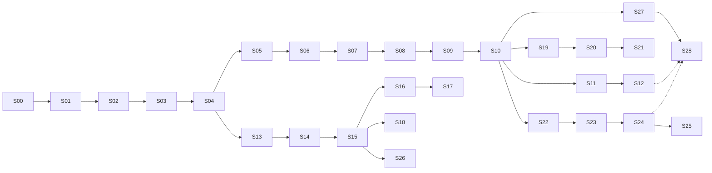

# Bee Implementation Stories

> **Status**: Active implementation backlog
> **Source**: distilled from [CONTEXT.md](../CONTEXT.md), [docs/architecture.md](./architecture.md), [docs/product-design.md](./product-design.md), and [docs/adr/](./adr/) (9 ADRs).
> **Granularity**: 29 vertical slices (tracer bullets), each end-to-end demoable.
> **Conventions**: all stories are AFK (no human-in-the-loop required); HITL can be added per story by setting `Type: HITL` and noting the review milestone.

## How to use this document

1. **Pick a story** whose `Blocked by` list is satisfied.
2. Each story is a thin vertical slice — it should produce a runnable / testable artifact, not a layer-only change.
3. After implementing a story, mark its acceptance criteria and link any commits / PRs.
4. When a story is done, unblock downstream stories. Stories on the same level (no shared dependency) can be done in parallel.

## Dependency graph (top-level)



## 6 parallel paths after S10

Once **S10 (Scheduler bin-packing)** is done, the work forks into 6 paths that can each be picked up by a different agent:

| Path | Stories | Theme |
| --- | --- | --- |
| **A. Failover** | S11 → S12 | Heartbeat + Work-Stealing + Checkpoint recovery |
| **B. SQL + 性能** | S13 → S14 → S15 → S26 | DataFusion 集成 + 毫秒级微批 / per-event / Hint |
| **C. SQL + Datasource + 跨 Pipeline** | S16 → S17, S18 | 限流共享 (Producer Pipeline) + 跨 Pipeline 边 |
| **D. Plugin 系统** | S19 → S20 → S21 | Rust 插件 + ABI 严格检查 + 多版本 + 版本范围 |
| **E. 自适应调度** | S22 → S23 → S24 → S25 | MLFQ + 4 个备选调度策略 + 跨 Node 再平衡 |
| **F. 可观测性** | S27 → S28 | CLI 面板 (jobs / inspect / diagnostics / cluster status) |

## Key milestones

- **S07**: 3 节点 Raft 集群能拉起，控制面 SM 写入可见
- **S10**: 第一个**端到端 demoable**——3 节点 Bee 跑一个硬编码多 Phase Pipeline
- **S12**: **Failover 完整闭环**——杀节点、Task Orphaned、自动 Work-Stealing 恢复
- **S17**: **量化场景 A 完整跑通**——binance mock + 多 Pipeline 共享 1 个 Producer
- **S25**: **0.7 路线图核心**——运行时自适应调度
- **S28**: **0.x → 1.0 生产化就绪**（CLI 可观测 + 调度 + 故障可诊断）

---

# Stories

## Phase 0.1 — BRP PoC

---

### S00 · Bootstrap Cargo workspace

- **Type**: AFK
- **Blocked by**: None
- **ADRs**: none (foundation)

**What to build**
Initialize a Rust workspace at the repo root with the 8 crates defined in [docs/architecture.md 附录](./architecture.md#附录crate-边界草案):

```
bee-transport   bee-codec      bee-session   bee-runtime
bee-control     bee-registry   bee-dsl-sql   (binary: bee)
```

Each crate has a minimal `lib.rs` (or `main.rs` for `bee`) with a placeholder type, plus `Cargo.toml` declaring its dependencies. The `bee` binary prints `bee <version>` and exits.

**Acceptance criteria**
- [ ] `cargo build --workspace` succeeds
- [ ] `cargo run -p bee -- --version` prints `bee 0.1.0` (or similar)
- [ ] `cargo test --workspace` runs (no tests, but the harness works)
- [ ] `git init` + first commit captured
- [ ] `.gitignore` excludes `target/`, `Cargo.lock` for binaries (include for libraries)

---

### S01 · Frame type + 15-byte Header + bincode codec

- **Type**: AFK
- **Blocked by**: S00
- **ADRs**: [0001](./adr/0001-data-plane-p2p-control-plane-raft.md) (BRP wire format)

**What to build**
In `bee-codec`:
- `Frame` struct: `Magic(2B) | MessageType(1B) | RequestId(8B) | BodyLength(4B) | Body(Vec<u8>)`
- `Frame::encode(&self) -> [u8; 15 + body.len()]`
- `Frame::decode(bytes: &[u8]) -> Result<(Frame, usize), CodecError>` (returns frame + bytes consumed)
- `MessageType` enum (at minimum: `Heartbeat = 0x01`, `DataPacket = 0x02`, `StealTask = 0x03`)
- Magic bytes: `[0x42, 0x45]` (ASCII "BE")

**Acceptance criteria**
- [ ] Unit tests cover: encode round-trip, decode round-trip, magic mismatch, body length mismatch, partial buffer (less than 15 bytes), message-type parsing
- [ ] `cargo test -p bee-codec` shows all green
- [ ] No external runtime dependencies added (bincode allowed per ADR-0001)

---

### S02 · TCP transport + BRP echo round-trip

- **Type**: AFK
- **Blocked by**: S01
- **ADRs**: [0001](./adr/0001-data-plane-p2p-control-plane-raft.md)

**What to build**
In `bee-transport`:
- `Listener::bind(addr) -> Result<Listener>` using `tokio::net::TcpListener`
- `Listener::accept() -> Stream<Connection>` (one per incoming TCP connection)
- `Connection::send_frame(&Frame) -> Result<()>` and `Connection::recv_frame() -> Result<Frame>` using `tokio::io::AsyncReadExt` / `AsyncWriteExt` with `BytesMut` for buffering
- A `Framed` wrapper that handles partial reads / writes (TCP 粘包/半包)

In `bee` binary:
- `bee echo <addr>` subcommand: connects to `<addr>`, sends a Heartbeat Frame, reads back the echoed Frame, prints "ok" or the echoed body, exits

**Acceptance criteria**
- [ ] Integration test: spawn a local listener on `127.0.0.1:0`, connect, send a Frame, read it back
- [ ] Integration test: handle partial reads (send 5 bytes, then 10 more — receiver reconstructs the full Frame)
- [ ] `cargo run -p bee -- echo 127.0.0.1:<port>` round-trips a Heartbeat Frame end-to-end
- [ ] Backpressure: sender pauses when local send buffer is full (deferred to S09 cross-Node Phase flow; for now, `tokio::sync::mpsc` between user code and Connection is sufficient)

---

## Phase 0.2 — Pipeline runtime (single Node)

---

### S03 · Phase + Handler traits + DAG type (1 Phase)

- **Type**: AFK
- **Blocked by**: S02
- **ADRs**: [0001](./adr/0001-data-plane-p2p-control-plane-raft.md), [0002](./adr/0002-datasource-is-a-phase.md)

**What to build**
In `bee-runtime`:
- `trait Handler<I, O>` with `async fn handle(&mut self, input: I) -> Result<O>` and `async fn finish(self) -> Result<()>` (lifecycle hooks)
- `struct Phase<H: Handler>`: holds the Handler instance + metadata (name, optional adapter reference)
- `struct Dag`: a collection of `Phase`s + edges between them; at minimum support 1-Phase DAG
- One example built-in `Handler`: `PassthroughHandler` that just forwards input to output (for testing)

**Acceptance criteria**
- [ ] Unit test: instantiate a 1-Phase DAG with `PassthroughHandler`, feed one input, assert one output
- [ ] `Dag` exposes `vertices() -> &[Phase]` and `edges() -> &[(PhaseId, PhaseId)]`
- [ ] No SQL / no Raft / no plugin loading in this slice (deferred)

---

### S04 · Runtime executes DAG + in-process mpsc channels

- **Type**: AFK
- **Blocked by**: S03
- **ADRs**: [0001](./adr/0001-data-plane-p2p-control-plane-raft.md)

**What to build**
In `bee-runtime`:
- `Runtime::run(dag: Dag) -> JoinHandle<Result<()>>` that:
  - Spawns one async task per Phase on `tokio::runtime::Runtime`
  - Connects adjacent Phases via `tokio::sync::mpsc` channels (in-process edges)
  - Topological order: source Phases start first; sink Phases last
- `Runtime` reads input from a user-provided `mpsc::Receiver<Event>`, sinks output to a user-provided `mpsc::Sender<Event>`

**Acceptance criteria**
- [ ] Integration test: 2-Phase chain (A → B), A uses `MapHandler(x => x+1)`, B uses `FilterHandler(x => x > 5)`, feed [1..10], assert output [6,7,8,9,10]
- [ ] Runtime cleanly shuts down when input channel closes
- [ ] No network, no Raft, no cross-Node edges in this slice

---

### S05 · DAG fork (1 input → 2 outputs) + topological order

- **Type**: AFK
- **Blocked by**: S04
- **ADRs**: [0001](./adr/0001-data-plane-p2p-control-plane-raft.md)

**What to build**
Extend `Dag` and `Runtime`:
- `Dag` supports a vertex with multiple outgoing edges (fan-out)
- `Runtime` correctly duplicates events to all downstream Phases
- Add a test DAG: Source → [BranchA, BranchB] → Sink (where Sink merges two streams)

**Acceptance criteria**
- [ ] Integration test: fork DAG, each branch produces N events, sink receives 2N events
- [ ] Topological order: when 3 Phases A, B, C where A → B, A → C, B and C can run in parallel
- [ ] DAG cycle detection at construction time (return error if cycle present)

---

## Phase 0.3 — Raft control plane + KV cluster

---

### S06 · Single-Node Raft loop + KV state machine

- **Type**: AFK
- **Blocked by**: S05
- **ADRs**: [0001](./adr/0001-data-plane-p2p-control-plane-raft.md), [0004](./adr/0004-bee-kv-cluster.md)

**What to build**
Choose a Raft library (recommendation: `openraft` 0.x or `raft-rs`). In a new `bee-raft` module (or fold into `bee-control`):
- Single-Node Raft loop: a Raft state machine that applies commands
- `KVStateMachine` implementing the Raft `StateMachine` trait
- `kv.get(key) -> Option<Vec<u8>>`, `kv.put(key, value)`, `kv.cas(key, expected, new) -> bool`, `kv.txn(ops: Vec<Op>) -> Result<(), TxnError>` (atomic)
- Keys are arbitrary strings; values are opaque bytes (bincode-serializable by caller)
- Namespace convention documented: `state/task/{TaskId}/...` (per [CONTEXT.md](../CONTEXT.md))

**Acceptance criteria**
- [ ] Unit test: single-node Raft loop applies a put, subsequent get returns the value
- [ ] Unit test: `cas` rejects mismatched `expected`
- [ ] Unit test: `txn` either applies all ops or none
- [ ] Smoke test: `bee-kv-test` binary spins up the single-node raft, runs 100 put/get round-trips, prints "ok"

---

### S07 · 3-Node Raft cluster bootstrap + leader election

- **Type**: AFK
- **Blocked by**: S06
- **ADRs**: [0001](./adr/0001-data-plane-p2p-control-plane-raft.md), [0007](./adr/0007-simplified-raft-topology-mvp.md)

**What to build**
- 3 separate `bee` processes (or threads) form a Raft cluster
- `bee cluster init --node 1,2,3` subcommand bootstraps the cluster (one node is initial leader, others join)
- `bee cluster status` prints: current leader, each node's `last_heartbeat`, Raft term, log length
- Leader election: kill the leader, watch a new leader be elected within `election_timeout` (default 1s)
- BRP control channel (over the same TCP stack from S02) carries Raft RPCs

**Acceptance criteria**
- [ ] Integration test: 3 processes on `127.0.0.1:7001/7002/7003`, init cluster, one leader elected
- [ ] Integration test: kill leader (SIGKILL), within 2s a new leader is elected
- [ ] `bee cluster status` returns correct info
- [ ] Raft logs persisted across process restart (replay on boot)

---

### S08 · ControlPlane SM (Job/Task metadata in Raft)

- **Type**: AFK
- **Blocked by**: S07
- **ADRs**: [0001](./adr/0001-data-plane-p2p-control-plane-raft.md), [0007](./adr/0007-simplified-raft-topology-mvp.md)

**What to build**
In `bee-control`, add a second logical state machine on the same Raft group:
- `ControlPlaneStateMachine` with commands:
  - `RegisterJob { job_id, dag_hash, owner_node }`
  - `RegisterTask { task_id, job_id, phase_id, owner_node, status }`
  - `UpdateTaskStatus { task_id, new_status: TaskStatus }`
- `TaskStatus` enum: `Pending | Scheduled | Running | Orphaned | Migrating | Revoked | Completed | Failed` (per [architecture.md §4.2](./architecture.md#42-phase-assignmenttask))
- `bee jobs list` CLI subcommand: reads from any Raft node, returns all `RegisterJob` entries

**Acceptance criteria**
- [ ] Integration test: 3-node cluster, submit a job on node 1, query `bee jobs list` from node 2 — returns the job
- [ ] Task status transitions are linearizable (read on any node returns the latest committed state)
- [ ] KV SM (S06) and ControlPlane SM coexist on the same Raft group without interference

---

## Phase 0.4 — Cross-Node + scheduler

---

### S09 · TaskPlacement + cross-Node Task execution

- **Type**: AFK
- **Blocked by**: S08
- **ADRs**: [0001](./adr/0001-data-plane-p2p-control-plane-raft.md), [0008](./adr/0008-optimizer-scheduler-adaptive.md)

**What to build**
- New BRP message type: `TaskPlacement { task_id, job_id, phase_id, dag_fragment }` (over the control channel)
- `bee deploy pipeline.json` CLI: parses a hardcoded DAG, computes a placement plan (for now: round-robin or random across Nodes), submits `RegisterJob` + `RegisterTask` per Task to ControlPlane SM, then sends `TaskPlacement` to each Task's assigned Node over BRP
- Receiving Node spawns the Task locally (re-uses S04 Runtime) and starts processing

**Acceptance criteria**
- [ ] Integration test: 3 nodes, deploy a 3-Task DAG (one Task per node), all Tasks start, each emits "started" log line
- [ ] Cross-Node edge: Task on node A emits to Task on node B — verified by a test that asserts the BRP data channel carries events
- [ ] `bee jobs inspect <JobId>` shows Task → Node mapping

---

### S10 · Scheduler module: bin-packing by resource declaration

- **Type**: AFK
- **Blocked by**: S09
- **ADRs**: [0008](./adr/0008-optimizer-scheduler-adaptive.md)

**What to build**
- `Scheduler` trait with method `place(dag: &Dag, nodes: &[NodeCapacity]) -> Vec<TaskPlacement>`
- Default implementation: bin-packing by `cpu` and `mem` declarations in the DAG
- Each Task declares resource needs (e.g., `cpu_millicores`, `mem_mb`); each Node reports current load
- Replace the "round-robin" placement in S09 with the real Scheduler

**Acceptance criteria**
- [ ] Unit test: 3 Tasks each requesting 500m CPU, 3 Nodes each with 1000m available — packing fits 2 on node 1, 1 on node 2
- [ ] Integration test: deploy 5 Tasks to 3 Nodes; verify the placement respects capacity
- [ ] Scheduler is pluggable: can be replaced with a different strategy (e.g., for S25 rebalance)

---

## Phase 0.5 — Heartbeat + Failover

---

### S11 · Heartbeat loop + 3× missed = Orphaned

- **Type**: AFK
- **Blocked by**: S10
- **ADRs**: [0001](./adr/0001-data-plane-p2p-control-plane-raft.md)

**What to build**
- Each Node sends `Heartbeat { node_id, timestamp }` to the Raft Leader every `heartbeat_interval` (default 10s)
- Leader tracks `last_heartbeat` per Node in ControlPlane SM
- Background task on Leader: if `now - last_heartbeat > 3 × heartbeat_interval`, mark all Tasks owned by that Node as `Orphaned` (via `UpdateTaskStatus` command)
- `bee jobs list` shows `Orphaned` Tasks distinctly (CLI: `STATUS: orphaned (was on node 2)`)

**Acceptance criteria**
- [ ] Integration test: 3-node cluster, kill node 2 (SIGKILL), within 35s node 2's Tasks show `Orphaned` on `bee jobs list`
- [ ] Heartbeat is high-priority (per ADR-0007): uses a dedicated channel, not contended with worker data flow
- [ ] Heartbeat interval and orphan threshold are configurable

---

### S12 · Work-Stealing RPC + KV Checkpoint recovery

- **Type**: AFK
- **Blocked by**: S11, S18 (Checkpoint is implemented in S18; S12 can read latest Checkpoint, S18 makes Checkpoint writes happen)

> **Note**: S12 logically needs S18 (Checkpoint writing). If a strict linear order is required, swap to `Blocked by: S11, S18`. If parallelizing is preferred, S12 can be implemented first to read whatever Checkpoint exists (S18 will fill it in later).

- **ADRs**: [0004](./adr/0004-bee-kv-cluster.md), [0001](./adr/0001-data-plane-p2p-control-plane-raft.md)

**What to build**
- `StealTask { thief_node, task_id }` BRP message (control channel)
- Free Node sends `StealTask` to Leader for an `Orphaned` Task
- Leader arbitrates: verifies the Task is still Orphaned and no other StealTask won; if yes, approves and changes Task status to `Migrating` with new owner
- Thief Node receives approval, reads `state/checkpoint/{TaskId}` from KV (gets Task state + saved offset)
- Thief restores Task state, re-establishes BRP data channel to upstream Task, resumes processing from saved offset
- Original (recovered) Node, if it comes back, is told the Task was stolen and cleans up

**Acceptance criteria**
- [ ] Integration test: 3-node cluster, deploy a 3-Task DAG, kill node 2, observe Work-Stealing, new owner resumes, output stream continues seamlessly
- [ ] Concurrent StealTask from two thieves: only one wins; the other gets a rejection
- [ ] No data loss: events between the original owner's last checkpoint and the crash are replayed

---

## Phase 0.6 — SQL DSL

---

### S13 · DataFusion SQL parser integration + simple SELECT

- **Type**: AFK
- **Blocked by**: S04
- **ADRs**: [0006](./adr/0006-sql-runtime-datafusion.md)

**What to build**
In `bee-dsl-sql`:
- Add `datafusion` as a dependency (verify version, Apache 2.0 compatible)
- `parse_sql(source: &str) -> Result<datafusion::sql::parser::Statement>`
- `analyze(statement) -> Result<datafusion::logical_expr::LogicalPlan>`
- Test: parse `SELECT a + 1 FROM stream WHERE a > 0` — assert it produces a valid LogicalPlan

**Acceptance criteria**
- [ ] Unit test: a few representative SQL statements parse and analyze without error
- [ ] No Bee-level extensions yet (ASOF JOIN, EMIT INTO) — those are in S14 / S15

---

### S14 · DataFusion LogicalPlan → Bee DAG type

- **Type**: AFK
- **Blocked by**: S13
- **ADRs**: [0006](./adr/0006-sql-runtime-datafusion.md), [0002](./adr/0002-datasource-is-a-phase.md)

**What to build**
- Mapping: each DataFusion LogicalPlan operator → Bee Phase (with corresponding Handler impl)
- Projection → `ProjectionHandler`
- Filter → `FilterHandler`
- Aggregate (basic) → `AggregateHandler`
- Source (table) → `DatasourcePhase` (per ADR-0002, a Phase with adapter field)
- `compile_to_dag(plan: LogicalPlan) -> Result<Dag>`

**Acceptance criteria**
- [ ] Unit test: `SELECT a + 1 AS b FROM stream WHERE a > 0` → DAG with [DatasourcePhase → FilterPhase → ProjectionPhase]
- [ ] DAG is executable by S04 Runtime (after S15 wires the executor)
- [ ] Schema is preserved across Phase boundaries

---

### S15 · DataFusion executor wrapper as Bee Phase + `bee run pipeline.sql`

- **Type**: AFK
- **Blocked by**: S14
- **ADRs**: [0006](./adr/0006-sql-runtime-datafusion.md)

**What to build**
- `DataFusionPhase` wraps a `datafusion::physical_plan::ExecutionPlan` and exposes the Bee `Handler` trait
- `bee run pipeline.sql` CLI: reads SQL file, parses → analyzes → compiles to DAG → runs via S04 Runtime
- Micro-batch executor loop: every `micro_batch_window_ms` (default 1s), drain input streams into a `RecordBatch`, run the DataFusion plan, emit results
- For MVP, the input is a mock "stream" (e.g., a CSV file read once and replayed)

**Acceptance criteria**
- [ ] `bee run tests/data/simple_select.sql` (test fixture with a small CSV) prints the projection output
- [ ] Micro-batch window is configurable
- [ ] Output schema matches the SQL projection

---

## Phase 0.7 — Datasource sharing (Producer Pipeline)

---

### S16 · Datasource Adapter trait + built-in mock Adapter

- **Type**: AFK
- **Blocked by**: S15
- **ADRs**: [0002](./adr/0002-datasource-is-a-phase.md), [0003](./adr/0003-producer-pipeline-pattern.md)

**What to build**
- `trait InputAdapter`: `async fn open(config) -> Result<Self>`, `async fn next(&mut self) -> Result<Option<Event>>`, `async fn close(self)`
- `trait OutputAdapter`: `async fn open`, `async fn emit(&mut self, event)`, `async fn close`
- One built-in mock: `FakeBinanceAdapter` — generates random price events at 1Hz with a configurable symbol

**Acceptance criteria**
- [ ] Unit test: `FakeBinanceAdapter` generates 10 events then returns `Ok(None)` (signals end of stream)
- [ ] Adapter is loaded as a built-in (compiled into Bee binary), not as a plugin
- [ ] `bee run` with `binance.subscribe('BTC/USDT')` (a SQL syntax that maps to the mock adapter) produces events

---

### S17 · Datasource signature (hash) + Producer Pipeline detection + Subscriber mode

- **Type**: AFK
- **Blocked by**: S16
- **ADRs**: [0003](./adr/0003-producer-pipeline-pattern.md), [0004](./adr/0004-bee-kv-cluster.md)

**What to build**
- `DatasourceSignature = sha256(adapter_id || config_payload)` — computed at compile time
- During deploy, control plane checks the KV: is there a Job with this signature?
  - **No**: this Job's Datasource Phase is marked as a "Producer" (becomes a single-Phase Pipeline Job that runs the Adapter)
  - **Yes**: this Job's Datasource Phase is "degraded" into a subscriber edge pointing to the existing Producer
- Subscribers consume the Producer's stream over BRP (S09 cross-Node machinery, or in-process if same Node)
- KV state key: `state/producer/{signature} -> JobId`

**Acceptance criteria**
- [ ] Integration test: deploy Job A with `binance.subscribe('BTC/USDT', '5min')` — creates Producer
- [ ] Integration test: deploy Job B with same Datasource — does NOT create a second Adapter instance; instead subscribes to Job A's Producer
- [ ] `bee jobs list` shows Job A as a Producer (one Phase, the Datasource), Job B as a Subscriber (no Datasource Phase, just a subscription edge)
- [ ] Kill Job A's Node: subscribers enter `Waiting for Upstream`; on Producer re-deploy, they reconnect

---

## Phase 0.8 — Cross-Pipeline edges

---

### S18 · Cross-Pipeline edge SQL syntax + resolution + dependency tracking

- **Type**: AFK
- **Blocked by**: S15
- **ADRs**: [0001](./adr/0001-data-plane-p2p-control-plane-raft.md), [0006](./adr/0006-sql-runtime-datafusion.md)

**What to build**
- SQL syntax: `CREATE VIEW v_x AS SELECT ... FROM pipeline_a.output` where `pipeline_a` is a known JobId
- Compiler resolves the cross-Pipeline reference: if both Jobs are deployed to the same Node, the edge is in-process; if different Nodes, it's a BRP data channel subscription
- ControlPlane SM tracks cross-Pipeline dependencies: `Job B depends on Job A's output stream X`
- A dependent Job waits for upstream to be `Running` before its consumer Phase starts

**Acceptance criteria**
- [ ] Integration test: 2 Jobs deployed, Job B subscribes to Job A's output, both running, events flow A → B
- [ ] Kill Job A: Job B enters `Waiting for Upstream` (visible in `bee jobs list`)
- [ ] Restart Job A on a different Node: Job B reconnects automatically

---

## Phase 0.9 — Plugin system

---

### S19 · Plugin trait + BeeHostV1 + libloading + sha256 → PluginId

- **Type**: AFK
- **Blocked by**: S10
- **ADRs**: [0005](./adr/0005-plugin-ffi-rust-cdylib-mvp.md), [0009](./adr/0009-plugin-multiversion-hash-abi.md)

**What to build**
- `bee-plugin-sdk` crate: defines `Plugin` trait, `BeeHostV1` C struct (opaque handle + function pointer table)
- `PluginManager` in `bee-registry`:
  - Watches a configured directory (default `/etc/bee/plugins/`) for `.so` / `.dylib` / `.dll`
  - On new file: compute `sha256(binary_content)` → `PluginId`; load via `libloading`; resolve `bee_plugin_init` symbol; call init with `BeeHost*`; register returned Adapters/Handlers
  - On file removal: unload (after refcount drops to zero)
- `bee plugin list` CLI: shows all loaded plugins with their `PluginId` (full hash) and refcount

**Acceptance criteria**
- [ ] Integration test: drop a sample `libbee_plugin_fake.so` into the plugin dir, see it appear in `bee plugin list` with its hash
- [ ] ABI mismatched plugin: rejected with clear error log (precise error format in S20)
- [ ] `bee plugin list` output format documented

---

### S20 · ABI version check at load

- **Type**: AFK
- **Blocked by**: S19
- **ADRs**: [0009](./adr/0009-plugin-multiversion-hash-abi.md)

**What to build**
- Each Plugin declares `abi_version` in its Plugin Manifest
- Bee has a configured supported `abi_version_range` (e.g., "1.x")
- During load, if plugin's `abi_version` not in range: reject with a clear error log including the plugin's claimed `abi_version`, Bee's expected range, and remediation instructions
- The plugin's `.so` remains on disk for inspection; it is not deleted

**Acceptance criteria**
- [ ] Integration test: plugin with `abi_version = "2.0"` is rejected when Bee expects `1.x`
- [ ] Error log format includes: plugin path, computed hash, claimed `abi_version`, expected range, link to migration docs
- [ ] `bee plugin inspect <path>` shows the would-be hash + claimed `abi_version` (useful for debugging before placing the plugin)

---

### S21 · Multi-version coexistence + version range resolution

- **Type**: AFK
- **Blocked by**: S20
- **ADRs**: [0009](./adr/0009-plugin-multiversion-hash-abi.md)

**What to build**
- Multiple `.so` files for the same logical Plugin (same `name` in Manifest, different `version`, different `sha256`) load simultaneously
- Each version gets a unique `PluginId` (its hash)
- Pipeline references Plugin with SemVer range syntax: `binance:1.0` (exact) / `binance:^1.0` (1.x compatible) / `binance:latest`
- At Pipeline submit time, the compiler resolves the range to a specific `PluginId`; the resolution result is part of the Job's spec
- If no matching plugin is available, Pipeline submit fails with a clear error

**Acceptance criteria**
- [ ] Integration test: 2 versions of `binance` (1.4.2 and 2.0.0) both loaded; 2 Pipelines each referencing one version; both run independently
- [ ] Integration test: `binance:^1.0` resolves to 1.4.2; `binance:latest` resolves to 2.0.0
- [ ] `bee plugin list` shows both versions with their distinct hashes and refcounts
- [ ] Old versions auto-unload when all referencing Pipelines stop (refcount = 0)

---

## Phase 0.10 — Runtime Scheduler

---

### S22 · Tokio task wrapper + per-Task priority queue (cooperative)

- **Type**: AFK
- **Blocked by**: S10
- **ADRs**: [0008](./adr/0008-optimizer-scheduler-adaptive.md)

**What to build**
- A `RuntimeScheduler` that wraps each Task in a `tokio::task` with priority metadata
- A priority queue (e.g., `tokio::sync::Notify` with priority levels) decides which ready Task gets polled next
- Cooperative (not preemptive): the scheduler biases polling order; a running Task is not interrupted
- `bee.runtime.scheduler_policy` config (in MVP, only "priority" matters; MLFQ etc. are in S23)

**Acceptance criteria**
- [ ] Integration test: 3 Tasks with priorities [high, medium, low]; instrument which Task is polled in which order; assert high comes first more often
- [ ] No measurable throughput regression vs. the S10 baseline scheduler
- [ ] The scheduler is opt-in: `bee.runtime.scheduler_policy = "tokio-default"` falls back to S10 behavior

---

### S23 · MLFQ default + SJF/HRRN/SRTN alternatives + config

- **Type**: AFK
- **Blocked by**: S22
- **ADRs**: [0008](./adr/0008-optimizer-scheduler-adaptive.md)

**What to build**
- Implement 4 scheduling policies as drop-in alternatives:
  - **MLFQ** (Multi-Level Feedback Queue) — default; 3-4 priority queues; aging for starvation prevention
  - **SJF** (Shortest Job First) — needs `expected_duration` estimate per Task (use historical average)
  - **HRRN** (Highest Response Ratio Next) — `(waiting_time + service_time) / service_time`
  - **SRTN** (Shortest Remaining Time Next) — preemptive SJF (cooperative variant)
- Each policy exposes the same `RuntimeScheduler` trait; the active one is selected at startup via `bee.runtime.scheduler_policy`
- `bee cluster status` shows the current policy

**Acceptance criteria**
- [ ] Unit tests for each policy: feed a known mix of Task durations, assert the expected dispatch order
- [ ] Integration test: 3 Tasks with known CPU costs; under MLFQ, short Tasks complete before long Tasks
- [ ] Switching policy via config requires only a Node restart (no DAG re-deploy)

---

## Phase 0.11 — Cross-Node rebalance

---

### S24 · Per-Phase metrics (latency / throughput / CPU) + `bee diagnostics`

- **Type**: AFK
- **Blocked by**: S23
- **ADRs**: [0008](./adr/0008-optimizer-scheduler-adaptive.md)

**What to build**
- Each Phase Assignment continuously records:
  - `events_processed_total` (counter)
  - `processing_latency_p50/p99` (histogram)
  - `cpu_seconds_total` (counter, from `cgroup` or process stats)
  - `backpressure_wait_seconds_total` (counter)
- Metrics stored in-memory per Task; exposed via `bee diagnostics <TaskId>` and a basic `/metrics` HTTP endpoint
- Default scrape interval: 5s

**Acceptance criteria**
- [ ] `bee diagnostics <TaskId>` prints all four metrics for the given Task
- [ ] Histogram buckets are sensible (e.g., 1ms, 10ms, 100ms, 1s, 10s)
- [ ] No regression: adding metrics adds < 1% CPU overhead

---

### S25 · Cross-Node rebalance: trigger + Task migration

- **Type**: AFK
- **Blocked by**: S24
- **ADRs**: [0008](./adr/0008-optimizer-scheduler-adaptive.md), [0001](./adr/0001-data-plane-p2p-control-plane-raft.md)

**What to build**
- Scheduler (S10) periodically reads metrics from S24 (every `rebalance_interval`, default 60s)
- If a Node's load exceeds 1.5× the cluster average AND a Task on it has been there > 5 min, the Scheduler triggers a rebalance
- Rebalance = StealTask-like flow: pick a Task to move, mark it `Migrating`, follow the S12 migration protocol (read Checkpoint from KV, transfer to new Node, resume)
- `bee cluster status` shows last rebalance event (when, which Task, from where to where)

**Acceptance criteria**
- [ ] Integration test: deploy 10 Tasks to 3 Nodes unevenly (8/1/1), wait 5 min, observe rebalance to ~3/3/4 distribution
- [ ] During rebalance, the migrating Task's `bee diagnostics` shows `Migrating` status, then `Running` on the new Node
- [ ] Re-enable the trigger: if a Node's load drops back to normal, no rebalance fires (no flapping)

---

## Phase 0.12 — SQL performance tuning

---

### S26 · Micro-batch window + per-event mode + DataFusion Hint

- **Type**: AFK
- **Blocked by**: S15
- **ADRs**: [0006](./adr/0006-sql-runtime-datafusion.md)

**What to build**
- `bee.dsl.sql.micro_batch_window_ms` config (default 1000, can be tightened to 10)
- `bee.dsl.sql.execution_mode = "micro_batch" | "per_event"` — per-event mode bypasses batching for ultra-low latency
- SQL hint syntax integration with DataFusion: `SELECT /*+ JOIN_ORDER(a, b) */ ...`
- Latency measurement: `bee run pipeline.sql --measure` reports p50/p99 end-to-end latency

**Acceptance criteria**
- [ ] `micro_batch_window_ms = 10` reduces measured p99 latency vs. default (test: deploy a SQL Pipeline, measure both configs)
- [ ] `per_event` mode shows further latency reduction (subject to DataFusion per-event overhead)
- [ ] Hint syntax is passed through to DataFusion's optimizer (verify via EXPLAIN)

---

## Phase 0.13 — CLI observability

---

### S27 · `bee jobs` + `bee jobs inspect <JobId>`

- **Type**: AFK
- **Blocked by**: S10
- **ADRs**: [0001](./adr/0001-data-plane-p2p-control-plane-raft.md)

**What to build**
- `bee jobs`: lists all Jobs with `JobId | Name | Status | Tasks | Owner Node`
- `bee jobs inspect <JobId>`:
  - DAG visualization (ASCII or mermaid)
  - Per-Task status, owner Node, runtime metrics summary
  - Cross-Pipeline dependencies (input from / output to which other Jobs)
- Both commands read from any Node (queries ControlPlane SM via Raft read)

**Acceptance criteria**
- [ ] `bee jobs` works on a fresh cluster (returns empty)
- [ ] After S10's deploy, `bee jobs` shows the Job
- [ ] `bee jobs inspect <JobId>` shows a DAG diagram and per-Task status
- [ ] Color-coded output (green = running, yellow = migrating, red = failed)

---

### S28 · `bee diagnostics <TaskId>` + `bee cluster status`

- **Type**: AFK
- **Blocked by**: S27, S24, S12
- **ADRs**: [0001](./adr/0001-data-plane-p2p-control-plane-raft.md), [0008](./adr/0008-optimizer-scheduler-adaptive.md)

**What to build**
- `bee diagnostics <TaskId>`: detailed per-Task view — metrics from S24, recent log lines, event traces
- `bee cluster status`:
  - Raft health (term, leader, log lag per node)
  - Per-Node resource summary (CPU, memory)
  - Last rebalance event (from S25)
  - Plugin summary (from S19)
- Both commands work on any Node

**Acceptance criteria**
- [ ] `bee diagnostics <TaskId>` shows all metrics from S24
- [ ] `bee cluster status` shows Raft health correctly after a leader change (test: kill leader, verify the next status call reflects new leader)
- [ ] `bee diagnostics <TaskId>` for a `Migrating` Task shows `Migrating` status, source Node, target Node, progress

---

# Conventions

## Story format

- **Type**: `AFK` (can be implemented and merged without human interaction) or `HITL` (requires human design review)
- **Blocked by**: explicit list of story numbers; "None" if no blockers
- **ADRs**: relevant ADRs to read before implementing (e.g., for wire format, lifecycle semantics)
- **Acceptance criteria**: verifiable checklist items; the story is "done" when all are checked

## Lifecycle

- `pending` → `in_progress` → `done` (or `blocked` / `cancelled`)
- A story is `done` only when all acceptance criteria are checked AND any defined tests pass
- After `done`, the next downstream stories are unblocked

## Parallelism

- Stories on the same level (no shared dependency) can be done in parallel by different agents
- For 6-way parallelism, dispatch agents on the 6 paths after S10
- Each agent should commit to its own worktree (per `using-git-worktrees` skill) to avoid conflicts

## ADR conventions

- Numbered sequentially (`0001`, `0002`, ...); next ADR is `0010`
- When a decision is reversed, write a new ADR that supersedes; do not modify accepted ADRs
- Update `docs/adr/README.md` index when adding a new ADR
