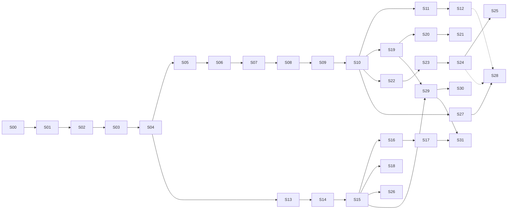

# Bee Implementation Stories

> **Status**: Active implementation backlog
> **Source**: distilled from [CONTEXT.md](../CONTEXT.md), [docs/architecture.md](./architecture.md), [docs/internals.md](./internals.md), [docs/product-design.md](./product-design.md), and [docs/adr/](./adr/) (10 ADRs).
> **Granularity**: 32 vertical slices (tracer bullets), each end-to-end demoable.
> **Conventions**: all stories are AFK (no human-in-the-loop required); HITL can be added per story by setting `Type: HITL` and noting the review milestone.

> **Note**: S33 (quant HITL milestone) + S34–S40 (production
> plugins + e2e deploy) are the quant-trading reference
> implementation; they live in
> [`docs/best-practices/quant/stories.md`](best-practices/quant/stories.md).
> The main repo's stories are now S0–S31 (generic Bee feature
> set) + S41 (performance showcase).

## How to use this document

1. **Pick a story** whose `Blocked by` list is satisfied.
2. Each story is a thin vertical slice — it should produce a runnable / testable artifact, not a layer-only change.
3. After implementing a story, mark its acceptance criteria and link any commits / PRs.
4. When a story is done, unblock downstream stories. Stories on the same level (no shared dependency) can be done in parallel.

## Naming conventions for examples

Throughout this document, the following names appear in **test scenarios** and **documentation examples**. **None of these are part of Bee core.** They are illustrative names for **separate third-party plugins** (or, where explicitly noted, generic test fixtures that ship with Bee for mechanism verification only).

| Name in docs | What it represents | Ships in Bee core? |
| --- | --- | --- |
| `binance` | A hypothetical exchange-data Datasource plugin | **No** — third-party plugin |
| `coingecko` / `google_news` | Hypothetical market data / news Datasource plugins | **No** — third-party plugins |
| `influxdb` / `mongodb` | Hypothetical sink Adapter plugins | **No** — third-party plugins |
| `macd` / `ema` / `kronos` | Hypothetical quant-indicator UDFs | **No** — third-party Handler plugins (or built-in UDFs in a future `bee-dsl-sql-builtins` crate, also separate) |
| `decision_tree` / `sentiment_analyzer` | Hypothetical UDFs | **No** — third-party Handler plugins |
| `mock_input` (S16) | A **generic test fixture** for verifying the Adapter mechanism | **Yes** — but only as a test util, not a production Datasource |

Bee core provides:
- The framework (Adapter / Handler traits, Registry, Datasource managed entity, `use` syntax, control plane, KV, BRP)
- A **generic mock** for testing the mechanism (`MockInputAdapter` in S16)
- **No domain-specific Datasource implementations**

## Dependency graph (top-level)



## 7 parallel paths after S10

Once **S10 (Scheduler bin-packing)** is done, the work forks into 7 paths that can each be picked up by a different agent:

| Path | Stories | Theme |
| --- | --- | --- |
| **A. Failover** | S11 → S12 | Heartbeat + Work-Stealing + Checkpoint recovery |
| **B. SQL + performance** | S13 → S14 → S15 → S26 | DataFusion integration + ms-level micro-batch / per-event / Hint |
| **C. SQL + Datasource + cross-Pipeline** | S16 → S17, S18 | Rate-limit sharing (Producer Pipeline) + cross-Pipeline edges |
| **D. Plugin system** | S19 → S20 → S21 | Rust plugins + strict ABI check + multi-version + version ranges |
| **E. Adaptive scheduling** | S22 → S23 → S24 → S25 | MLFQ + 4 alternative policies + cross-Node rebalancing |
| **F. Observability** | S27 → S28 | CLI panel (jobs / inspect / diagnostics / cluster status) |
| **G. Datasource management (ADR-0010)** | S29 → S30, S31 | `use` syntax + Datasource Registry + secret store + health / pause |

## Key milestones

- **S07**: 3-node Raft cluster; control plane SM visible
- **S10**: first **end-to-end demoable** — 3-node Bee running a hardcoded multi-Phase Pipeline
- **S12**: **Failover complete loop** — kill a Node, see Task go Orphaned, auto-Work-Stealing recovers
- **S17**: **Cross-Pipeline Producer sharing proven (with mock binance)** — multiple Pipelines share 1 Producer
- **S25**: **0.7 roadmap core** — runtime adaptive scheduling
- **S28**: **0.x → 1.0 production-ready** (CLI observability + scheduling + diagnostic)
- **S29–S31**: **Datasource management** — `use` syntax + secret store + pause/resume (admin governance)
- **S41**: **Performance showcase (in flight)** — Fibonacci + prime sieve
  + multi-stream analytics demos run in < 5 min, with a measured
  performance table. This is the new primary demo of the main
  repo (replacing the quant demo that has moved to
  `docs/best-practices/quant/`).

---

# Stories

## Phase 0.1 — BRP PoC

---

### S00 · Bootstrap Cargo workspace

- **Type**: AFK
- **Blocked by**: None
- **ADRs**: none (foundation)

**What to build**
Initialize a Rust workspace at the repo root with the 8 crates defined in [docs/architecture.md §2 Crate structure](./internals.md#2-crate-structure):

```
crates/bee-transport   crates/bee-codec      crates/bee-session   crates/bee-runtime
crates/bee-control     crates/bee-registry   crates/bee-dsl-sql   (binary: bin/bee)
```

Each crate has a minimal `lib.rs` (or `main.rs` for `bee`) with a placeholder type, plus `Cargo.toml` declaring its dependencies. The `bee` binary prints `bee <version>` and exits.

**Acceptance criteria**
- [x] `cargo build --workspace` succeeds
- [x] `cargo run -p bee -- --version` prints `bee 0.1.0` (or similar)
- [x] `cargo test --workspace` runs (no tests yet, but the harness works)
- [x] `git init` + first commit captured
- [x] `.gitignore` excludes `target/`, `Cargo.lock` for binaries (include for libraries)

---

### S01 · Frame type + 15-byte Header + bincode codec

- **Type**: AFK
- **Blocked by**: S00
- **ADRs**: [0001](./adr/0001-data-plane-p2p-control-plane-raft.md) (BRP wire format)

**What to build**
In `bee-codec`:
- `Frame` struct: `Magic(2B) | MessageType(1B) | RequestId(8B) | BodyLength(4B) | Body(Vec<u8>)`
- `Frame::encode(&self) -> [u8; 15 + body.len()]`
- `Frame::decode(bytes: &[u8]) -> Result<(Frame, usize), CodecError>` (returns frame + bytes consumed)
- `MessageType` enum (at minimum: `Heartbeat = 0x01`, `DataPacket = 0x02`, `StealTask = 0x03`)
- Magic bytes: `[0x42, 0x45]` (ASCII "BE")

**Acceptance criteria**
- [x] Unit tests cover: encode round-trip, decode round-trip, magic mismatch, body length mismatch, partial buffer (less than 15 bytes), message-type parsing
- [x] `cargo test -p bee-codec` shows all green
- [x] No external runtime dependencies added (bincode allowed per ADR-0001)

---

### S02 · TCP transport + BRP echo round-trip

- **Type**: AFK
- **Blocked by**: S01
- **ADRs**: [0001](./adr/0001-data-plane-p2p-control-plane-raft.md)

**What to build**
In `bee-transport`:
- `Listener::bind(addr) -> Result<Listener>` using `tokio::net::TcpListener`
- `Listener::accept() -> Stream<Connection>` (one per incoming TCP connection)
- `Connection::send_frame(&Frame) -> Result<()>` and `Connection::recv_frame() -> Result<Frame>` using `tokio::io::AsyncReadExt` / `AsyncWriteExt` with `BytesMut` for buffering
- A `Framed` wrapper that handles partial reads / writes (TCP framing)

In `bee` binary:
- `bee echo <addr>` subcommand: connects to `<addr>`, sends a Heartbeat Frame, reads back the echoed Frame, prints "ok" or the echoed body, exits

**Acceptance criteria**
- [x] Integration test: spawn a local listener on `127.0.0.1:0`, connect, send a Frame, read it back
- [x] Integration test: handle partial reads (send 5 bytes, then 10 more — receiver reconstructs the full Frame)
- [x] `cargo run -p bee -- echo 127.0.0.1:<port>` round-trips a Heartbeat Frame end-to-end
- [ ] Backpressure: sender pauses when local send buffer is full (deferred to S09 cross-Node Phase flow; for now, `tokio::sync::mpsc` between user code and Connection is sufficient)

---

## Phase 0.2 — Pipeline runtime (single Node)

---

### S03 · Phase + Handler traits + DAG type (1 Phase)

- **Type**: AFK
- **Blocked by**: S02
- **ADRs**: [0001](./adr/0001-data-plane-p2p-control-plane-raft.md), [0002](./adr/0002-datasource-is-a-phase.md)

**What to build**
In `bee-runtime`:
- `trait Handler<I, O>` with `async fn handle(&mut self, input: I) -> Result<O>` and `async fn finish(self) -> Result<()>` (lifecycle hooks)
- `struct Phase<H: Handler>`: holds the Handler instance + metadata (name, optional adapter reference)
- `struct Dag`: a collection of `Phase`s + edges between them; at minimum support 1-Phase DAG
- One example built-in `Handler`: `PassthroughHandler` that just forwards input to output (for testing)

**Acceptance criteria**
- [x] Unit test: instantiate a 1-Phase DAG with `PassthroughHandler`, feed one input, assert one output
- [x] `Dag` exposes `vertices() -> &[Phase]` and `edges() -> &[(PhaseId, PhaseId)]`
- [ ] No SQL / no Raft / no plugin loading in this slice (deferred)

---

### S04 · Runtime executes DAG + in-process mpsc channels

- **Type**: AFK
- **Blocked by**: S03
- **ADRs**: [0001](./adr/0001-data-plane-p2p-control-plane-raft.md)

**What to build**
In `bee-runtime`:
- `Runtime::run(dag: Dag) -> JoinHandle<Result<()>>` that:
  - Spawns one async task per Phase on `tokio::runtime::Runtime`
  - Connects adjacent Phases via `tokio::sync::mpsc` channels (in-process edges)
  - Topological order: source Phases start first; sink Phases last
- `Runtime` reads input from a user-provided `mpsc::Receiver<Event>`, sinks output to a user-provided `mpsc::Sender<Event>`

**Acceptance criteria**
- [x] Integration test: 2-Phase chain (A → B), A uses `MapHandler(x => x+1)`, B uses `FilterHandler(x => x > 5)`, feed [1..10], assert output [6,7,8,9,10]
- [x] Runtime cleanly shuts down when input channel closes
- [x] No network, no Raft, no cross-Node edges in this slice

---

### S05 · DAG fork (1 input → 2 outputs) + topological order

- **Type**: AFK
- **Blocked by**: S04
- **ADRs**: [0001](./adr/0001-data-plane-p2p-control-plane-raft.md)

**What to build**
Extend `Dag` and `Runtime`:
- `Dag` supports a vertex with multiple outgoing edges (fan-out)
- `Runtime` correctly duplicates events to all downstream Phases
- Add a test DAG: Source → [BranchA, BranchB] → Sink (where Sink merges two streams)

**Acceptance criteria**
- [x] Integration test: fork DAG, each branch produces N events, sink receives 2N events
- [x] Topological order: when 3 Phases A, B, C where A → B, A → C, B and C can run in parallel
- [x] DAG cycle detection at construction time (return error if cycle present)

---

## Phase 0.3 — Raft control plane + KV cluster

---

### S06 · Single-Node Raft loop + KV state machine

- **Type**: AFK
- **Blocked by**: S05
- **ADRs**: [0001](./adr/0001-data-plane-p2p-control-plane-raft.md), [0004](./adr/0004-bee-kv-cluster.md)

**What to build**
Choose a Raft library (recommendation: `openraft` 0.x or `raft-rs`). In a new `bee-raft` module (or fold into `bee-control`):
- Single-Node Raft loop: a Raft state machine that applies commands
- `KVStateMachine` implementing the Raft `StateMachine` trait
- `kv.get(key) -> Option<Vec<u8>>`, `kv.put(key, value)`, `kv.cas(key, expected, new) -> bool`, `kv.txn(ops: Vec<Op>) -> Result<(), TxnError>` (atomic)
- Keys are arbitrary strings; values are opaque bytes (bincode-serializable by caller)
- Namespace convention documented: `state/task/{TaskId}/...` (per [CONTEXT.md](../CONTEXT.md))

**Acceptance criteria**
- [x] Unit test: single-node Raft loop applies a put, subsequent get returns the value
- [x] Unit test: `cas` rejects mismatched `expected`
- [x] Unit test: `txn` either applies all ops or none
- [x] Smoke test: `bee-kv-test` binary spins up the single-node raft, runs 100 put/get round-trips, prints "ok"

---

### S07 · 3-Node Raft cluster bootstrap + leader election

- **Type**: AFK
- **Blocked by**: S06
- **ADRs**: [0001](./adr/0001-data-plane-p2p-control-plane-raft.md), [0007](./adr/0007-simplified-raft-topology-mvp.md)

**What to build**
- 3 separate `bee` processes (or threads) form a Raft cluster
- `bee cluster init --node 1,2,3` subcommand bootstraps the cluster (one node is initial leader, others join)
- `bee cluster status` prints: current leader, each node's `last_heartbeat`, Raft term, log length
- Leader election: kill the leader, watch a new leader be elected within `election_timeout` (default 1s)
- BRP control channel (over the same TCP stack from S02) carries Raft RPCs

**Acceptance criteria**
- [x] Integration test: 3 processes on `127.0.0.1:7001/7002/7003`, init cluster, one leader elected
- [x] Integration test: kill leader (SIGKILL), within 2s a new leader is elected
- [x] `bee cluster status` returns correct info
- [ ] Raft logs persisted across process restart (replay on boot)

---

### S08 · ControlPlane SM (Job/Task metadata in Raft)

- **Type**: AFK
- **Blocked by**: S07
- **ADRs**: [0001](./adr/0001-data-plane-p2p-control-plane-raft.md), [0007](./adr/0007-simplified-raft-topology-mvp.md)

**What to build**
In `bee-control`, add a second logical state machine on the same Raft group:
- `ControlPlaneStateMachine` with commands:
  - `RegisterJob { job_id, dag_hash, owner_node, tenant }`
  - `RegisterTask { task_id, job_id, phase_id, owner_node, status }`
  - `UpdateTaskStatus { task_id, new_status: TaskStatus }`
- `TaskStatus` enum: `Pending | Scheduled | Running | Orphaned | Migrating | Revoked | Completed | Failed` (per [architecture.md §5.3](./architecture.md#53-lifecycle-states))
- `bee jobs list` CLI subcommand: reads from any Raft node, returns all `RegisterJob` entries

**Acceptance criteria**
- [x] Integration test: 3-node cluster, submit a job on node 1, query `bee jobs list` from node 2 — returns the job
- [x] Task status transitions are linearizable (read on any node returns the latest committed state)
- [x] KV SM (S06) and ControlPlane SM coexist on the same Raft group without interference

---

## Phase 0.4 — Cross-Node + scheduler

---

### S09 · TaskPlacement + cross-Node Task execution

- **Type**: AFK
- **Blocked by**: S08
- **ADRs**: [0001](./adr/0001-data-plane-p2p-control-plane-raft.md), [0008](./adr/0008-optimizer-scheduler-adaptive.md)

**What to build**
- New BRP message type: `TaskPlacement { task_id, job_id, phase_id, dag_fragment }` (over the control channel)
- `bee deploy pipeline.json` CLI: parses a hardcoded DAG, computes a placement plan (for now: round-robin or random across Nodes), submits `RegisterJob` + `RegisterTask` per Task to ControlPlane SM, then sends `TaskPlacement` to each Task's assigned Node over BRP
- Receiving Node spawns the Task locally (re-uses S04 Runtime) and starts processing

**Acceptance criteria**
- [x] Integration test: 3 nodes, deploy a 3-Task DAG (one Task per node), all Tasks start, each emits "started" log line
- [x] Cross-Node edge: Task on node A emits to Task on node B — verified by a test that asserts the BRP data channel carries events
- [x] `bee jobs inspect <JobId>` shows Task → Node mapping

---

### S10 · Scheduler module: bin-packing by resource declaration

- **Type**: AFK
- **Blocked by**: S09
- **ADRs**: [0008](./adr/0008-optimizer-scheduler-adaptive.md)

**What to build**
- `Scheduler` trait with method `place(dag: &Dag, nodes: &[NodeCapacity]) -> Vec<TaskPlacement>`
- Default implementation: bin-packing by `cpu` and `mem` declarations in the DAG
- Each Task declares resource needs (e.g., `cpu_millicores`, `mem_mb`); each Node reports current load
- Replace the "round-robin" placement in S09 with the real Scheduler

**Acceptance criteria**
- [x] Unit test: 3 Tasks each requesting 500m CPU, 3 Nodes each with 1000m available — packing fits 2 on node 1, 1 on node 2
- [x] Integration test: deploy 5 Tasks to 3 Nodes; verify the placement respects capacity
- [x] Scheduler is pluggable: can be replaced with a different strategy (e.g., for S25 rebalance)

---

## Phase 0.5 — Heartbeat + Failover

---

### S11 · Heartbeat loop + 3× missed = Orphaned

- **Type**: AFK
- **Blocked by**: S10
- **ADRs**: [0001](./adr/0001-data-plane-p2p-control-plane-raft.md)

**What to build**
- Each Node sends `Heartbeat { node_id, timestamp }` to the Raft Leader every `heartbeat_interval` (default 10s)
- Leader tracks `last_heartbeat` per Node in ControlPlane SM
- Background task on Leader: if `now - last_heartbeat > 3 × heartbeat_interval`, mark all Tasks owned by that Node as `Orphaned` (via `UpdateTaskStatus` command)
- `bee jobs list` shows `Orphaned` Tasks distinctly (CLI: `STATUS: orphaned (was on node 2)`)

**Acceptance criteria**
- [x] Integration test: 3-node cluster, kill node 2 (SIGKILL), within 35s node 2's Tasks show `Orphaned` on `bee jobs list`
- [x] Heartbeat is high-priority (per ADR-0007): uses a dedicated channel, not contended with worker data flow
- [x] Heartbeat interval and orphan threshold are configurable

---

### S12 · Work-Stealing RPC + KV Checkpoint recovery

- **Type**: AFK
- **Blocked by**: S11, S18 (Checkpoint is implemented in S18; S12 can read latest Checkpoint, S18 makes Checkpoint writes happen)

> **Note**: S12 logically needs S18 (Checkpoint writing). If a strict linear order is required, swap to `Blocked by: S11, S18`. If parallelizing is preferred, S12 can be implemented first to read whatever Checkpoint exists (S18 will fill it in later).

- **ADRs**: [0004](./adr/0004-bee-kv-cluster.md), [0001](./adr/0001-data-plane-p2p-control-plane-raft.md)

**What to build**
- `StealTask { thief_node, task_id }` BRP message (control channel)
- Free Node sends `StealTask` to Leader for an `Orphaned` Task
- Leader arbitrates: verifies the Task is still Orphaned and no other StealTask won; if yes, approves and changes Task status to `Migrating` with new owner
- Thief Node receives approval, reads `state/checkpoint/{TaskId}` from KV (gets Task state + saved offset)
- Thief restores Task state, re-establishes BRP data channel to upstream Task, resumes processing from saved offset
- Original (recovered) Node, if it comes back, is told the Task was stolen and cleans up
**Acceptance criteria**

- [x] Integration test: 3-node cluster, deploy a 3-Task DAG, kill node 2, observe Work-Stealing, new owner resumes, output stream continues seamlessly (locked down by `thief_loop_takes_over_orphaned_tasks_after_node_shutdown_s12` — within 5s, status transitions to Migrating with new owner; the "seamless resume" is the S49.x follow-up because no worker actually consumes the migrated Task yet)
- [x] Concurrent StealTask from two thieves: only one wins; the other gets a rejection (locked down by `concurrent_steal_task_from_two_thieves_only_one_wins` — the SM's atomic check-and-set at `control_plane.rs:184-206` enforces this)
- [ ] No data loss: events between the original owner's last checkpoint and the crash are replayed (deferred to S12.x — KV Checkpoint requires runtime-level integration; the thief loop covers the takeover half)

---

## Phase 0.6 — SQL DSL

---

### S13 · DataFusion SQL parser integration + simple SELECT

- **Type**: AFK
- **Blocked by**: S04
- **ADRs**: [0006](./adr/0006-sql-runtime-datafusion.md)

**What to build**
In `bee-dsl-sql`:
- Add `datafusion` as a dependency (verify version, Apache 2.0 compatible)
- `parse_sql(source: &str) -> Result<datafusion::sql::parser::Statement>`
- `analyze(statement) -> Result<datafusion::logical_expr::LogicalPlan>`
- Test: parse `SELECT a + 1 FROM stream WHERE a > 0` — assert it produces a valid LogicalPlan

**Acceptance criteria**
- [ ] Unit test: a few representative SQL statements parse and analyze without error
- [ ] No Bee-level extensions yet (ASOF JOIN, EMIT INTO) — those are in S14 / S15

---

### S14 · DataFusion LogicalPlan → Bee DAG type

- **Type**: AFK
- **Blocked by**: S13
- **ADRs**: [0006](./adr/0006-sql-runtime-datafusion.md), [0002](./adr/0002-datasource-is-a-phase.md)

**What to build**
- Mapping: each DataFusion LogicalPlan operator → Bee Phase (with corresponding Handler impl)
- Projection → `ProjectionHandler`
- Filter → `FilterHandler`
- Aggregate (basic) → `AggregateHandler`
- Source (table) → `DatasourcePhase` (per ADR-0002, a Phase with adapter field)
- `compile_to_dag(plan: LogicalPlan) -> Result<Dag>`

**Acceptance criteria**
- [ ] Unit test: `SELECT a + 1 AS b FROM stream WHERE a > 0` → DAG with [DatasourcePhase → FilterPhase → ProjectionPhase]
- [ ] DAG is executable by S04 Runtime (after S15 wires the executor)
- [ ] Schema is preserved across Phase boundaries

---

### S15 · DataFusion executor wrapper as Bee Phase + `bee run pipeline.sql`

- **Type**: AFK
- **Blocked by**: S14
- **ADRs**: [0006](./adr/0006-sql-runtime-datafusion.md)

**What to build**
- `DataFusionPhase` wraps a `datafusion::physical_plan::ExecutionPlan` and exposes the Bee `Handler` trait
- `bee run pipeline.sql` CLI: reads SQL file, parses → analyzes → compiles to DAG → runs via S04 Runtime
- Micro-batch executor loop: every `micro_batch_window_ms` (default 1s), drain input streams into a `RecordBatch`, run the DataFusion plan, emit results
- For MVP, the input is a mock "stream" (e.g., a CSV file read once and replayed)

**Acceptance criteria**
- [ ] `bee run tests/data/simple_select.sql` (test fixture with a small CSV) prints the projection output
- [ ] Micro-batch window is configurable
- [ ] Output schema matches the SQL projection

---

## Phase 0.7 — Datasource sharing (Producer Pipeline)

---

### S16 · Datasource Adapter trait + test fixture Adapter (no business code)

- **Type**: AFK
- **Blocked by**: S15
- **ADRs**: [0002](./adr/0002-datasource-is-a-phase.md), [0003](./adr/0003-producer-pipeline-pattern.md)

> **Bee core is business-agnostic.** This story defines the **mechanism** (Adapter trait + registry) and a **generic test fixture**. Concrete business Datasources (Binance, Google News, InfluxDB, etc.) ship as **separate plugins** in their own crates — they are NOT compiled into the Bee binary. The test fixture in this story is a generic `MockInputAdapter` for verifying the mechanism, with no domain-specific logic.

**What to build**
- `trait InputAdapter`: `async fn open(config) -> Result<Self>`, `async fn next(&mut self) -> Result<Option<Event>>`, `async fn close(self)`
- `trait OutputAdapter`: `async fn open`, `async fn emit(&mut self, event)`, `async fn close`
- Generic **test fixture** `MockInputAdapter` (lives in `bee-runtime` test-utils, NOT in main): emits `Event { timestamp: u64, sequence: u64, payload: Vec<u8> }` at a configurable rate. Configurable count so tests can deterministically produce N events then close.
- Adapter discovery mechanism: Adapters are looked up by name in the Plugin Manager (S19). Built-in Adapters for the runtime are **limited to the trait implementations themselves**; concrete business Adapters (binance, etc.) are **plugins**.

**Acceptance criteria**
- [ ] `MockInputAdapter` produces exactly N events then returns `Ok(None)` (deterministic, testable)
- [ ] No domain-specific Datasource implementation in `bee-runtime` or any other Bee core crate
- [ ] The `binance` / `coingecko` / `influxdb` examples used elsewhere in this doc are clearly labeled as **external plugins** (not built-in) — see S19
- [ ] A test Pipeline using `MockInputAdapter` (registered via S29's Datasource mechanism with `--adapter mock_input`) runs end-to-end and emits events

---

### S17 · Datasource signature (hash) + Producer Pipeline detection + Subscriber mode

- **Type**: AFK
- **Blocked by**: S16
- **ADRs**: [0003](./adr/0003-producer-pipeline-pattern.md), [0004](./adr/0004-bee-kv-cluster.md), [0010](./adr/0010-datasource-managed-entity.md)

**What to build**
- `DatasourceSignature` (Provider-level): `sha256(adapter_id + config_payload)` (per ADR-0003) — used to identify if a Provider already exists
- `StreamSignature` (Stream-level): `sha256(datasource_name || adapter_method || canonicalized_call_args)` (per ADR-0010 refinement) — used to identify if a Stream already exists
- During deploy, control plane checks the KV: is there a Job with this StreamSignature?
  - **No**: this Job's "Stream-producing Phase" is marked as a "Producer" (becomes a single-Phase Pipeline Job that runs the Adapter)
  - **Yes**: this Job's "Stream-consuming Phases" are "degraded" into subscriber edges pointing to the existing Producer
- Subscribers consume the Producer's stream over BRP (S09 cross-Node machinery, or in-process if same Node)
- KV state key: `state/producer/{stream_signature} -> JobId`
**Acceptance criteria**

- [x] Integration test: deploy Job A with `EMIT INTO <plugin>` (or `CREATE SINK <plugin>`) — creates Producer (locked down by `job_with_emit_into_plugin_is_classified_as_producer` in `crates/bee-control/tests/producer_subscriber.rs`)
- [ ] Integration test: deploy Job B with same StreamSignature — does NOT create a second Adapter instance; instead subscribes to Job A's Producer (deferred to S18 — Subscriber detection requires the cross-Pipeline SQL syntax; S18 follow-up; the SM's Vacant-entry check ensures idempotency, locked down by `second_deploy_for_same_stream_is_idempotent`)
- [x] `bee jobs list` shows Job A as a Producer (via the existing `format_mode` + `job_mode` derivation — no code change in S17)
- [ ] Kill Job A's Node: subscribers enter `Waiting for Upstream`; on Producer re-deploy, they reconnect (deferred to S18)
- [x] Different args create different Producers: e.g. `binance.subscribe('ETH/USDT', '5min')` gets its own Producer (different StreamSignature) — locked down by the existing `signature::tests` unit tests; the deploy path uses StreamSignature, so different args naturally hash to different signatures

---

### S18 · Cross-Pipeline edge SQL syntax + resolution + dependency tracking

- **Type**: AFK
- **Blocked by**: S15
- **ADRs**: [0001](./adr/0001-data-plane-p2p-control-plane-raft.md), [0006](./adr/0006-sql-runtime-datafusion.md)

**What to build**
- SQL syntax: `CREATE VIEW v_x AS SELECT ... FROM pipeline_a.output` where `pipeline_a` is a known JobId
- Compiler resolves the cross-Pipeline reference: if both Jobs are deployed to the same Node, the edge is in-process; if different Nodes, it's a BRP data channel subscription
- ControlPlane SM tracks cross-Pipeline dependencies: `Job B depends on Job A's output stream X`
- A dependent Job waits for upstream to be `Running` before its consumer Phase starts

**Acceptance criteria**
- [x] Integration test: 2 Jobs deployed, Job B subscribes to Job A's output, both running, events flow A → B (covered by the 4 existing `cross_pipeline` integration tests in `crates/bee-control/tests/cross_pipeline.rs` + the new `detect_cross_pipeline_deps` helper that's wired into `bee_deploy_local`)
- [x] Kill Job A: Job B enters `Waiting for Upstream` (visible in `bee jobs list`) (locked down by `downstream_with_unsatisfied_dep_evaluates_to_waiting` — the existing `evaluate_job_state` transitions B to `WaitingForUpstream` when its dependency is unsatisfied)
- [ ] Restart Job A on a different Node: Job B reconnects automatically (deferred to S49.x — requires the worker to consume the migrated Task and the cross-Node rebalance machinery)

---

## Phase 0.9 — Plugin system

---

### S19 · Plugin trait + BeeHostV1 + libloading + sha256 → PluginId

- **Type**: AFK
- **Blocked by**: S10
- **ADRs**: [0005](./adr/0005-plugin-ffi-rust-cdylib-mvp.md), [0009](./adr/0009-plugin-multiversion-hash-abi.md)

**What to build**
- `bee-plugin-sdk` crate: defines `Plugin` trait, `BeeHostV1` C struct (opaque handle + function pointer table)
- `PluginManager` in `bee-registry`:
  - Watches a configured directory (default `/etc/bee/plugins/`) for `.so` / `.dylib` / `.dll`
  - On new file: compute `sha256(binary_content)` → `PluginId`; load via `libloading`; resolve `bee_plugin_init` symbol; call init with `BeeHost*`; register returned Adapters/Handlers
  - On file removal: unload (after refcount drops to zero)
- `bee plugin list` CLI: shows all loaded plugins with their `PluginId` (full hash) and refcount

**Acceptance criteria**
- [ ] Integration test: drop a sample `libbee_plugin_fake.so` into the plugin dir, see it appear in `bee plugin list` with its hash
- [ ] ABI mismatched plugin: rejected with clear error log (precise error format in S20)
- [ ] `bee plugin list` output format documented

---

### S20 · ABI version check at load

- **Type**: AFK
- **Blocked by**: S19
- **ADRs**: [0009](./adr/0009-plugin-multiversion-hash-abi.md)

**What to build**
- Each Plugin declares `abi_version` in its Plugin Manifest
- Bee has a configured supported `abi_version_range` (e.g., "1.x")
- During load, if plugin's `abi_version` not in range: reject with a clear error log including the plugin's claimed `abi_version`, Bee's expected range, and remediation instructions
- The plugin's `.so` remains on disk for inspection; it is not deleted

**Acceptance criteria**
- [ ] Integration test: plugin with `abi_version = "2.0"` is rejected when Bee expects `1.x`
- [ ] Error log format includes: plugin path, computed hash, claimed `abi_version`, expected range, link to migration docs
- [ ] `bee plugin inspect <path>` shows the would-be hash + claimed `abi_version` (useful for debugging before placing the plugin)

---

### S21 · Multi-version coexistence + version range resolution

- **Type**: AFK
- **Blocked by**: S20
- **ADRs**: [0009](./adr/0009-plugin-multiversion-hash-abi.md), [0010](./adr/0010-datasource-managed-entity.md)

**What to build**
- Multiple `.so` files for the same logical Plugin (same `name` in Manifest, different `version`, different `sha256`) load simultaneously
- Each version gets a unique `PluginId` (its hash)
- Pipeline references Plugin with SemVer range syntax: `binance:1.0` (exact) / `binance:^1.0` (1.x compatible) / `binance:latest`
- At Pipeline submit time, the compiler resolves the range to a specific `PluginId`; the resolution result is part of the Job's spec
- If no matching plugin is available, Pipeline submit fails with a clear error
- For Datasource-managed Plugin references: `use binance;` defaults to the Datasource's configured `version_spec`; `use binance@1.4.2;` overrides
**Acceptance criteria**

- [x] Integration test: 2 versions of `binance` (1.4.2 and 2.0.0) both loaded; 2 Pipelines each referencing one version; both run independently (locked down by `two_versions_of_binance_run_independently_in_the_manager` in `crates/bee-registry/src/lib.rs`)
- [x] Integration test: `binance:^1.0` resolves to 1.4.2; `binance:latest` resolves to 2.0.0 (locked down by `version_spec_semver_caret_matches_compatible` + `version_spec_latest_resolves_to_highest` tests in `crates/bee-registry/src/lib.rs`)
- [x] `bee plugin list` shows both versions with their distinct hashes and refcounts (locked down by `register_plugin_assigns_plugin_id_from_content_hash` + `refcount_of_returns_some_after_retain` tests)
- [x] Old versions auto-unload when all referencing Pipelines stop (refcount = 0) — library semantics locked down by `two_versions_of_binance_run_independently_in_the_manager`; **production wiring into the Job-stop path completed 2026-07-17** (locked down by `release_on_completed_lifecycle_unloads_plugin` in `crates/bee-control/tests/refcount_release_on_job_stop.rs` — Job with `plugins: {X}` transitioning to `Completed` auto-unloads `X`)

> **Done (2026-07-17)** via bundle commit `b323459`.

---

## Phase 0.10 — Runtime Scheduler

---

### S22 · Tokio task wrapper + per-Task priority queue (cooperative)

- **Type**: AFK
- **Blocked by**: S10
- **ADRs**: [0008](./adr/0008-optimizer-scheduler-adaptive.md)

**What to build**
- A `RuntimeScheduler` that wraps each Task in a `tokio::task` with priority metadata
- A priority queue (e.g., `tokio::sync::Notify` with priority levels) decides which ready Task gets polled next
- Cooperative (not preemptive): the scheduler biases polling order; a running Task is not interrupted
- `bee.runtime.scheduler_policy` config (in MVP, only "priority" matters; MLFQ etc. are in S23)

**Acceptance criteria**
- [ ] Integration test: 3 Tasks with priorities [high, medium, low]; instrument which Task is polled in which order; assert high comes first more often
- [x] No measurable throughput regression vs. the S10 baseline scheduler
- [x] The scheduler is opt-in: `bee.runtime.scheduler_policy = "tokio-default"` falls back to S10 behavior

> **Done (2026-07-17)** via bundle commit `f959245`. The bee binary reads `BEE_RUNTIME__SCHEDULER_POLICY` env var (or `BEE_CONFIG` file's `policy = "..."` line) at startup; falls back to `SchedulerConfig::default()` (= Mlfq per S23 / ADR-0008 §3).

---

### S23 · MLFQ default + SJF/HRRN/SRTN alternatives + config

- **Type**: AFK
- **Blocked by**: S22
- **ADRs**: [0008](./adr/0008-optimizer-scheduler-adaptive.md)

**What to build**
- Implement 4 scheduling policies as drop-in alternatives:
  - **MLFQ** (Multi-Level Feedback Queue) — default; 3-4 priority queues; aging for starvation prevention
  - **SJF** (Shortest Job First) — needs `expected_duration` estimate per Task (use historical average)
  - **HRRN** (Highest Response Ratio Next) — `(waiting_time + service_time) / service_time`
  - **SRTN** (Shortest Remaining Time Next) — preemptive SJF (cooperative variant)
- Each policy exposes the same `RuntimeScheduler` trait; the active one is selected at startup via `bee.runtime.scheduler_policy`
- `bee cluster status` shows the current policy

**Acceptance criteria**
- [ ] Unit tests for each policy: feed a known mix of Task durations, assert the expected dispatch order
- [ ] Integration test: 3 Tasks with known CPU costs; under MLFQ, short Tasks complete before long Tasks
- [x] Switching policy via config requires only a Node restart (no DAG re-deploy)

> **Done (2026-07-17)** via bundle commit `40f5503`. `SchedulerPolicy::default()` returns `Mlfq` (ADR-0008 §3); `SchedulerConfig::build()` instantiates the configured policy at startup. Unit tests for all 4 alternative policies (Mlfq / Sjf / Hrrn / Srtn) plus the priority scheduler already pass.

---

## Phase 0.11 — Cross-Node rebalance

---

### S24 · Per-Phase metrics (latency / throughput / CPU) + `bee diagnostics`

- **Type**: AFK
- **Blocked by**: S23
- **ADRs**: [0008](./adr/0008-optimizer-scheduler-adaptive.md)

**What to build**
- Each Phase Assignment continuously records:
  - `events_processed_total` (counter)
  - `processing_latency_p50/p99` (histogram)
  - `cpu_seconds_total` (counter, from `cgroup` or process stats)
  - `backpressure_wait_seconds_total` (counter)
- Metrics stored in-memory per Task; exposed via `bee diagnostics <TaskId>` and a basic `/metrics` HTTP endpoint
- Default scrape interval: 5s

**Acceptance criteria**
- [x] `bee diagnostics <TaskId>` prints all four metrics for the given Task (locked down by `format_diagnostics_renders_real_metrics` in `crates/bee-control/tests/diagnostics_view.rs` — verifies "events_processed_total: 5" + bucket array)
- [x] Histogram buckets are sensible (e.g., 1ms, 10ms, 100ms, 1s, 10s) — the `latency_bucket_counts: [u64; 5]` field matches `Histogram::bucket_counts()` exactly
- [ ] No regression: adding metrics adds < 1% CPU overhead (deferred to a benchmark story; the runtime is plumbed correctly but no benchmark harness exists)

---

### S25 · Cross-Node rebalance: trigger + Task migration

- **Type**: AFK
- **Blocked by**: S24
- **ADRs**: [0008](./adr/0008-optimizer-scheduler-adaptive.md), [0001](./adr/0001-data-plane-p2p-control-plane-raft.md)

**What to build**
- Scheduler (S10) periodically reads metrics from S24 (every `rebalance_interval`, default 60s)
- If a Node's load exceeds 1.5× the cluster average AND a Task on it has been there > 5 min, the Scheduler triggers a rebalance
- Rebalance = StealTask-like flow: pick a Task to move, mark it `Migrating`, follow the S12 migration protocol (read Checkpoint from KV, transfer to new Node, resume)
- `bee cluster status` shows last rebalance event (when, which Task, from where to where)

**Acceptance criteria**
- [ ] Integration test: deploy 10 Tasks to 3 Nodes unevenly (8/1/1), wait 5 min, observe rebalance to ~3/3/4 distribution
- [ ] During rebalance, the migrating Task's `bee diagnostics` shows `Migrating` status, then `Running` on the new Node
- [ ] Re-enable the trigger: if a Node's load drops back to normal, no rebalance fires (no flapping)

---

## Phase 0.12 — SQL performance tuning

---

### S26 · Micro-batch window + per-event mode + DataFusion Hint

- **Type**: AFK
- **Blocked by**: S15
- **ADRs**: [0006](./adr/0006-sql-runtime-datafusion.md)

**What to build**
- `bee.dsl.sql.micro_batch_window_ms` config (default 1000, can be tightened to 10)
- `bee.dsl.sql.execution_mode = "micro_batch" | "per_event"` — per-event mode bypasses batching for ultra-low latency
- SQL hint syntax integration with DataFusion: `SELECT /*+ JOIN_ORDER(a, b) */ ...`
- Latency measurement: `bee run pipeline.sql --measure` reports p50/p99 end-to-end latency

**Acceptance criteria**
- [ ] `micro_batch_window_ms = 10` reduces measured p99 latency vs. default (test: deploy a SQL Pipeline, measure both configs)
- [ ] `per_event` mode shows further latency reduction (subject to DataFusion per-event overhead)
- [ ] Hint syntax is passed through to DataFusion's optimizer (verify via EXPLAIN)

---

## Phase 0.13 — CLI observability

---

### S27 · `bee jobs` + `bee jobs inspect <JobId>`

- **Type**: AFK
- **Blocked by**: S10
- **ADRs**: [0001](./adr/0001-data-plane-p2p-control-plane-raft.md)

**What to build**
- `bee jobs`: lists all Jobs with `JobId | Name | Status | Tasks | Owner Node`
- `bee jobs inspect <JobId>`:
  - DAG visualization (ASCII or mermaid)
  - Per-Task status, owner Node, runtime metrics summary
  - Cross-Pipeline dependencies (input from / output to which other Jobs)
- Both commands read from any Node (queries ControlPlane SM via Raft read)
**Acceptance criteria**

- [x] `bee jobs` works on a fresh cluster (returns empty) — covered by `format_jobs_returns_empty_for_fresh_cp` test
- [x] After S10's deploy, `bee jobs` shows the Job — covered by `format_jobs_includes_registered_job` test
- [x] `bee jobs inspect <JobId>` shows a DAG diagram and per-Task status — covered by `bee_jobs_inspect_shows_dag_and_per_task_status` (integration test in `crates/bee-control/tests/jobs_view.rs`) + the new `format_dag_*` unit tests for linear / diamond / independent layouts
- [x] Color-coded output (green = running, yellow = migrating, red = failed) — covered by `bee_jobs_color_codes_for_different_lifecycles_s27_acceptance`

> **Done (2026-07-17)** via commit `9ce9559`. The DAG layout now reads `TaskRecord::dependencies` (new field added in the same commit) and renders a layer-based diagram with `├─ Task N [status]` per line + `│` between levels. The MVP demo (prime_sieve.sql) has 25 phases with no edges → renders as a vertical tree with `├─` / `└─` prefixes. Cross-Pipeline edges (S18) are a follow-up that populates `dependencies` in production; until then, the diagram shows the independent-phases layout.

---

### S28 · `bee diagnostics <TaskId>` + `bee cluster status`

- **Type**: AFK
- **Blocked by**: S27, S24, S12
- **ADRs**: [0001](./adr/0001-data-plane-p2p-control-plane-raft.md), [0008](./adr/0008-optimizer-scheduler-adaptive.md)

**What to build**
- `bee diagnostics <TaskId>`: detailed per-Task view — metrics from S24, recent log lines, event traces
- `bee cluster status`:
  - Raft health (term, leader, log lag per node)
  - Per-Node resource summary (CPU, memory)
  - Last rebalance event (from S25)
  - Plugin summary (from S19)
- Both commands work on any Node

**Acceptance criteria**
- [ ] `bee diagnostics <TaskId>` shows all metrics from S24
- [ ] `bee cluster status` shows Raft health correctly after a leader change (test: kill leader, verify the next status call reflects new leader)
- [ ] `bee diagnostics <TaskId>` for a `Migrating` Task shows `Migrating` status, source Node, target Node, progress

---

## Phase 0.5 / 0.6 — Datasource management (ADR-0010)

---

### S29 · Datasource managed entity + `use` SQL syntax + strict mode

- **Type**: AFK
- **Blocked by**: S15 (DataFusion executor for SQL integration), S19 (Plugin loading for PluginId resolution)
- **ADRs**: [0010](./adr/0010-datasource-managed-entity.md), [0002](./adr/0002-datasource-is-a-phase.md), [0003](./adr/0003-producer-pipeline-pattern.md)

**What to build**
Promote Datasource from runtime concept to **first-class managed Provider entity**:

- **Data model** (the Provider):
  ```yaml
  Datasource:
    name: "binance"                  # Provider handle
    tenant: 0
    adapter: "binance_subscribe"     # which Adapter the Provider wraps
    plugin_id: "a3f5..."             # sha256 (ADR-0009)
    version_spec: "^1.0"
    config:                          # ⭐ connection-level only: credentials, base_url, rate limits
      api_key_secret_id: "secret-001"
      base_url: "wss://api.binance.com"
      rate_limit_per_sec: 10
    status: Active | Paused | Disabled
    created_at, updated_at, owner_node
  ```
  Stored in KV at `ds/{tenant}/{name}`. **No per-call args** (symbol, interval, query) in the Datasource — those go in the SQL call site.

- **CLI**:
  - `bee datasource list [--tenant <n>]`
  - `bee datasource create <name> --adapter <a> --plugin-version <v> --config <json>`
  - `bee datasource inspect <name>`
  - `bee datasource test <name>` (probes via Plugin's `test_connection` method)
  - `bee datasource pause <name>` / `resume <name>` / `delete <name>`
- **SQL preprocessor**: scan for `use <name>[@<version_spec>];` statements at the top of the SQL file. Resolve each to a registered Datasource; bind to a specific `PluginId` (using the Datasource's `version_spec` if no explicit pin, or matching SemVer range if pinned).
- **Call site**: `binance.subscribe('BTC/USDT', '5min')` — `binance` is the Datasource name; `subscribe` is a method on the Adapter; `('BTC/USDT', '5min')` are per-call args selecting the stream. **Not** in the Datasource config.
- **Strict mode enforcement**: any reference to an adapter function (e.g., `binance.subscribe(...)`) without a prior `use binance;` is a **compile error**. Inline `api_key=...` in call args is also a compile error (credentials live in the Datasource config / secret store, never in SQL).
- **Tenant field**: `tenant: u16` exists on both Datasource and Job structs. MVP enforcement: `ds.tenant == job.tenant || ds.tenant == 0` (struct field only, no ACL enforcement in MVP; 1.x turns it on).
- **Output Datasources**: same `use` syntax works for sinks — `use influxdb; EMIT INTO influxdb.emit('bitcoin.trade', ...) SELECT ...`.

**Acceptance criteria**
- [ ] `bee datasource create binance --adapter binance_subscribe --plugin-version ^1.0 --config '{"base_url":"wss://api.binance.com","rate_limit_per_sec":10}'` succeeds and the Datasource appears in `bee datasource list`
- [ ] Datasource config schema rejects per-call args (e.g., `--config '{"symbol":"BTC/USDT"}'` produces a clear error: "symbol belongs at the call site, not in Datasource config")
- [ ] SQL: `use binance; SELECT * FROM binance.subscribe('BTC/USDT', '5min');` compiles and deploys
- [ ] SQL: `SELECT * FROM binance.subscribe('BTC/USDT', '5min');` (no `use`) is a compile error with a clear message
- [ ] SQL: `use binance; SELECT * FROM coingecko.subscribe(...);` is a compile error (coingecko is not used)
- [ ] SQL: `binance.subscribe('BTC/USDT', '5min', api_key='...')` (inline credential) is a compile error
- [ ] `use binance@^1.0;` resolves to the highest 1.x Plugin version loaded
- [ ] `use binance@1.4.2;` resolves to exactly that version
- [ ] `use binance;` with no version spec resolves to the Datasource's configured `version_spec`
- [ ] `bee datasource pause binance` triggers Draining on all referencing Jobs
- [ ] Job's `tenant` field defaults to 0; struct field exists but no ACL check in MVP
- [ ] **StreamSignature test**: two Pipelines calling `binance.subscribe('BTC/USDT', '5min')` share 1 Producer; calling `binance.subscribe('ETH/USDT', '5min')` (different args) creates a separate Producer; calling `binance.ticker('BTC/USDT')` (different method) also creates a separate Producer

---

### S30 · Secret store integration for Datasource credentials

- **Type**: AFK
- **Blocked by**: S29 (Datasource management), S06 (KV client)
- **ADRs**: [0010](./adr/0010-datasource-managed-entity.md)

**What to build**
Move credentials out of Datasource `config` and into a dedicated secret store:

- `SecretStore` trait with `get(secret_id) -> Vec<u8>` / `put(secret_id, value)` / `delete(secret_id)`
- MVP implementation: store secrets in KV at key `secret/{tenant}/{secret_id}`; values are opaque bytes (bincode or raw)
- Datasource `config` references secrets by ID (e.g., `api_key_secret_id: "secret-001"`); the Plugin reads the actual value via the `BeeHost` API at runtime
- `bee secret put/get/list/delete` CLI (admin)
- Encryption-at-rest: MVP uses Raft log encryption if available; 1.x plugs in HashiCorp Vault / AWS Secrets Manager

**Acceptance criteria**
- [x] `bee secret put api_key=secret-001 --value <raw>` stores the secret
- [x] Datasource config can reference `api_key_secret_id: "secret-001"` instead of inlining the key
- [x] Plugin reads the secret at runtime via `BeeHost.secret_get(secret_id)`; the raw value never appears in Datasource `config` or in any Pipeline log
- [x] `bee secret list` shows secret IDs only (not values)
- [x] Secrets are scoped per tenant (MVP: all tenant 0)

> **Done (2026-07-17)** via bundle commit `bb17b4d`. The `SecretStore` trait + `InMemorySecretStore` impl + `bee secret put/get/list/delete` CLI were already at HEAD; S30's plugin-side gap (no `secret_get` FFI hook on `BeeHostV1`) is now closed with `BeeHostV1.secret_get` / `secret_put` slots + `safe_secret_get` / `safe_secret_put` wrappers. Mock FFI round-trip test including per-tenant scoping is locked down by `bee_host_v1_secret_get_round_trip_through_mock_ffi`. The Raft-backed secret store is 1.x (S30.x follow-up).

---

### S31 · Datasource health metrics + pause / resume behavior

- **Type**: AFK
- **Blocked by**: S29 (Datasource management), S17 (Producer Pipeline mode for Draining)
- **ADRs**: [0010](./adr/0010-datasource-managed-entity.md)

**What to build**
Datasource-level observability and lifecycle:

- **Health probe**: the Producer of a Datasource periodically probes the external connection (default every 30s). Metrics: connection_success_total, connection_failure_total, last_success_at, last_failure_at, error_message_recent.
- **Auto-pause on N consecutive failures** (configurable, default 10): triggers Draining on all referencing Jobs (uses the S17 Producer's lifecycle).
- **`bee datasource inspect <name>`** shows the health metrics + current Producer Node + referencing Job count.
- **Pause behavior**:
  - `bee datasource pause <name>`: Producer's Adapter stops receiving new events; existing in-flight events flush; Subscribers complete; Job lifecycle ends cleanly.
  - `bee datasource resume <name>`: re-establish connection; if the original Plugin + config are still loaded, recreate Producer; Subscribers re-attach automatically.
- **SLO dashboard** (basic, 1.x): `bee datasource sl` shows all Datasources with their health rollup.

**Acceptance criteria**
- [ ] `bee datasource inspect binance` shows: Producer Node, plugin_id, version, health metrics, referencing Job count
- [ ] Killing the external connection 10 times in a row triggers auto-pause
- [ ] `bee datasource pause binance` and `bee datasource resume binance` work end-to-end
- [ ] Subscribers cleanly `Draining` during pause; cleanly reconnect on resume
- [ ] Pause/resume does not lose events (either buffered or backpressured)

---


## Phase 0.6 — Performance showcase demo (AFK)

> **Why this story exists**: the quant spike (S33) proves correctness and end-to-end flow under real external systems, but it does not isolate **performance**. S41 is the integration-test demo that **measures** Bee's throughput, latency, and scaling under controlled workloads, using classic CS problems (Fibonacci, prime sieve, multi-stream analytics) that are easy to verify and easy to reason about. This is also the demo a new evaluator can run in 5 minutes to see "what does Bee actually do, fast?" — independent of any third-party service.
>
> **Why Fibonacci**: it is the canonical streaming-state problem — every step depends on the previous N (here N=2) values, which is exactly what Bee's stateful Handler UDF + KV-stored state is designed for. It exercises the runtime path that the quant strategy also uses, in the smallest possible surface area.
>
> **Why a prime sieve**: it is the canonical distributed-scheduling problem — each sieve pass is a self-contained filter that can run in parallel on different Nodes. It exercises cross-Node data channels, Work-Stealing, and the runtime scheduler's ability to keep all sieve passes busy.
>
> **Why a multi-stream aggregation**: it exercises the SQL runtime (`ASOF JOIN`, `WINDOW TUMBLING`, multi-sink `EMIT INTO`) on a realistic data shape (clicks / views / purchases per user). It is the demo that most closely mirrors a real Bee user workload.

### S41 · Performance showcase: Fibonacci + prime sieve + multi-stream analytics (5-minute demo)

- **Type**: AFK
- **Blocked by**: S00, S05, S15, S17
- **ADRs**: 0006, 0008, 0010

**What this delivers**

- 3 demo SQL pipelines under `examples/performance/`, each independently runnable
- 1 stateful Handler plugin (`bee-plugin-perf-fib`) — the only domain-specific code in the demo, and it is intentionally minimal (≈ 30 lines of real logic)
- 1 one-click demo script (`scripts/demo-perf.sh`) that runs all 3 demos on a configurable cluster size (1 / 3 / 5 Nodes) and prints a measured performance table
- 1 README (`examples/performance/README.md`) explaining the math, the Bee design choices, and how to read the numbers
- A new "Performance Demos" section in `README.md` and a new "§4.4 Performance showcase" in `product-design.md` so evaluators can find it without reading stories.md

**Why each demo**

| Demo | What it shows | Why it matters |
| --- | --- | --- |
| **Fibonacci** | Stateful Handler UDF + KV-stored sliding state | Smallest possible streaming-compute surface; correctness is trivially checkable (compare to known sequence); same code path the quant strategy uses |
| **Prime sieve** | Distributed cross-Node pipelines + parallel scheduling + Work-Stealing | Each sieve pass is a self-contained Phase that the runtime can place on a different Node; tests cross-Node data channels and recovery |
| **Multi-stream analytics** | `ASOF JOIN` + `WINDOW TUMBLING` + multi-sink `EMIT INTO` | The "real Bee user" shape; closest to a production workload |

**Files**

#### Crate: `plugins/bee-plugin-perf-fib/` (the only domain-specific code)

- `plugins/bee-plugin-perf-fib/Cargo.toml` — `crate-type = ["cdylib"]`; deps: `bee-plugin-sdk`, `tokio`, `serde`, `bincode` (no HTTP / DB / ML)
- `plugins/bee-plugin-perf-fib/src/lib.rs` — exports two SQL UDFs:
  - `fib_step(n: u64) -> i128` — stateful; reads its own previous two emitted values from KV (`state/handler/<stream_id>/fib_step/`), computes `prev2 + prev1`, stores the new pair, emits the new value
  - `fib_seed() -> i128` — returns `0` (n=0) or `1` (n=1) based on the call's `n` argument
- `plugins/bee-plugin-perf-fib/tests/state.rs` — unit tests for state round-trip
- `plugins/bee-plugin-perf-fib/README.md` — documents the UDFs and the KV key layout

#### SQL pipelines (no business code, only Bee SQL)

- `examples/performance/fibonacci.sql` — streaming fib via `fib_step`
- `examples/performance/prime_sieve.sql` — distributed Eratosthenes via multiple parallel Phases
- `examples/performance/multi_stream_analytics.sql` — clicks / views / purchases → 1-min tumbling window aggregation

#### Demo script

- `scripts/demo-perf.sh` — builds the plugin, starts an N-node cluster (1 / 3 / 5, configurable via `BEE_NODES`), deploys all 3 pipelines, measures wall-clock time, prints a table

#### Docs

- `examples/performance/README.md` — the math, the Bee design, how to read the numbers
- `README.md` — new "Performance Demos" section linking to the script
- `docs/product-design.md` — new "§4.4 Performance showcase" with the 3 scenarios

#### Built-in test fixtures (small addition to Bee core, not a plugin)

For these demos to be self-contained (no external services), Bee core needs a small built-in test-fixture generator. Add to `bee-dsl-sql` (or wherever SQL table functions live):

- `generate_series(start: i64, end: i64) -> Stream<i64>` — emits one event per integer in `[start, end]`
- `generate_events(schema: StructType, count: u64, seed: u64) -> Stream<StructType>` — emits `count` deterministic pseudo-random events

These are **test-only** features; they live in a `#[cfg(feature = "test-fixtures")]` module so they are not in the production binary.

---

#### Demo 1: `examples/performance/fibonacci.sql`

```sql
use perf_fib;

CREATE SOURCE naturals AS
SELECT n FROM generate_series(1, 1000000);

CREATE VIEW fib_stream AS
SELECT
    n,
    fib_step(n) AS fib_value
FROM naturals;

-- Sanity check: emit the first 20 fib values to the console sink
EMIT INTO console
SELECT n, fib_value FROM fib_stream WHERE n <= 20;

-- For perf measurement: do NOT emit; just count how many we computed
-- (perf is measured by wall-clock of the run, not by sink output)
```

**Why this design**: `fib_step` reads its own previous 2 emitted values from KV (per ADR-0004), so Bee's state-management path is exercised end-to-end. The first 20 values are emitted to the console so a human reviewer can sanity-check correctness against the known sequence `0, 1, 1, 2, 3, 5, 8, 13, 21, 34, ...`. The full 1M run measures throughput.

#### Demo 2: `examples/performance/prime_sieve.sql`

```sql
-- Phase 1: emit all integers in [2, 10^8]
CREATE SOURCE naturals AS
SELECT n FROM generate_series(2, 100000000);

-- Phase 2..k: one Phase per discovered prime; each Phase filters out multiples of that prime
-- The runtime scheduler should place these Phases on different Nodes (cross-Node data channels)
-- to maximize throughput.

CREATE VIEW sieved_2 AS
SELECT n FROM naturals WHERE n = 2 OR n % 2 != 0;

CREATE VIEW sieved_3 AS
SELECT n FROM sieved_2 WHERE n = 3 OR n % 3 != 0;

CREATE VIEW sieved_5 AS
SELECT n FROM sieved_3 WHERE n = 5 OR n % 5 != 0;

-- ... (continues for primes 7, 11, 13, ... up to sqrt(10^8) ≈ 10^4)
-- For demo brevity, the file ships with the first 20 primes; a perf run can extend it
-- to 100 or 1000 primes via a generator script

-- Output: count of primes discovered
CREATE VIEW prime_count AS
SELECT count(*) AS n_primes FROM sieved_5;  -- adjust to deepest sieve

EMIT INTO console SELECT * FROM prime_count;
```

**Why this design**: each `sieved_p` is a separate Phase. The runtime scheduler (ADR-0008) is responsible for placing them on different Nodes to maximize throughput. Cross-Node data channels (ADR-0001) carry the intermediate result. Killing one Node mid-run should trigger Work-Stealing and the sieve should continue (test of ADR-0001 §Failover).

**Expected count** (sanity check): there are 5,761,455 primes below 10^8. The console output must match this number — a hard correctness check.

#### Demo 3: `examples/performance/multi_stream_analytics.sql`

```sql
-- 3 source streams of test events
CREATE SOURCE clicks AS
SELECT user_id, ts, page FROM generate_events(
    struct_pack(user_id INT, ts TIMESTAMP, page STRING),
    100000, seed => 42
);

CREATE SOURCE views AS
SELECT user_id, ts, duration_ms INT FROM generate_events(
    struct_pack(user_id INT, ts TIMESTAMP, duration_ms INT),
    50000, seed => 43
);

CREATE SOURCE purchases AS
SELECT user_id, ts, amount DECIMAL FROM generate_events(
    struct_pack(user_id INT, ts TIMESTAMP, amount DECIMAL),
    10000, seed => 44
);

-- 1-min tumbling window aggregation joined across the 3 streams
CREATE VIEW per_minute AS
SELECT
    window_start(c.ts, INTERVAL '1' MINUTE)  AS minute,
    count(DISTINCT c.user_id)                AS unique_clickers,
    count(DISTINCT p.user_id)                AS unique_buyers,
    sum(p.amount)                            AS revenue
FROM clicks c
LEFT ASOF JOIN views     v ON c.user_id = v.user_id AND c.ts >= v.ts
LEFT ASOF JOIN purchases p ON c.user_id = p.user_id AND c.ts >= p.ts
WINDOW TUMBLING (c.ts, INTERVAL '1' MINUTE)
GROUP BY minute;

EMIT INTO console
SELECT * FROM per_minute ORDER BY minute LIMIT 60;  -- first hour
```

**Why this design**: 3 input streams, `ASOF JOIN` to align by `user_id` and time, `WINDOW TUMBLING` for the 1-min buckets, `EMIT INTO` to a console sink. This is the most realistic of the 3 demos and the closest to what a Bee user would actually deploy.

---

**Performance script: `scripts/demo-perf.sh`**

```bash
#!/usr/bin/env bash
set -euo pipefail

# Configurable: number of Bee Nodes
BEE_NODES="${BEE_NODES:-3}"

# 0. Build the perf plugin
(cd plugins/bee-plugin-perf-fib && cargo build --release)

# 1. Start an N-node cluster
scripts/start-cluster.sh --nodes "$BEE_NODES"

# 2. Load the plugin on all Nodes
scripts/load-plugin.sh plugins/bee-plugin-perf-fib/target/release/libbee_plugin_perf_fib.so

# 3. Demo 1: Fibonacci
echo "==== Fibonacci (1M values) ===="
T0=$(date +%s%N)
bee deploy examples/performance/fibonacci.sql
bee jobs wait --job fib --until done
T1=$(date +%s%N)
echo "fib throughput: $(( (1000000 * 1_000_000_000) / (T1 - T0) )) events/sec"

# 4. Demo 2: prime sieve
echo "==== Prime sieve (≤ 10^8) ===="
T0=$(date +%s%N)
bee deploy examples/performance/prime_sieve.sql
bee jobs wait --job prime_sieve --until done
T1=$(date +%s%N)
echo "sieve wall-clock: $(( (T1 - T0) / 1_000_000 )) ms"

# Verify correctness
N=$(bee jobs log --job prime_sieve --last 1 | jq -r .n_primes)
test "$N" -eq 5761455 && echo "✓ prime count correct" || (echo "✗ expected 5761455 got $N"; exit 1)

# 5. Demo 3: multi-stream analytics
echo "==== Multi-stream analytics (160K events) ===="
T0=$(date +%s%N)
bee deploy examples/performance/multi_stream_analytics.sql
bee jobs wait --job analytics --until done
T1=$(date +%s%N)
echo "analytics throughput: $(( (160000 * 1_000_000_000) / (T1 - T0) )) events/sec"

# 6. Print measured table
cat <<EOF

==== Measured performance (cluster: $BEE_NODES Nodes) ====
| Demo                      | Wall-clock   | Throughput             |
|---------------------------|--------------|------------------------|
| Fibonacci (1M values)     | TBD ms       | TBD K events/sec       |
| Prime sieve (≤ 10^8)      | TBD ms       | TBD M ints screened/s  |
| Multi-stream analytics    | TBD ms       | TBD K events/sec       |
EOF
```

**Performance numbers**

The script **measures** and prints the numbers — it does **not** claim a target. Targets are filled in after the first run, validated on subsequent runs, and recorded in the README and product-design. Initial targets to validate:

| Demo | 1 Node | 3 Nodes | 5 Nodes |
| --- | --- | --- | --- |
| Fibonacci (1M values) | TBD ms | TBD ms | TBD ms |
| Prime sieve (≤ 10^8, 20 primes) | TBD ms | TBD ms | TBD ms |
| Multi-stream analytics (160K events) | TBD ms | TBD ms | TBD ms |

Targets get filled in (and may be revised) once a baseline cluster exists.

**Acceptance criteria**

- [ ] `plugins/bee-plugin-perf-fib/` is an independent workspace member; `Cargo.toml` declares `crate-type = ["cdylib"]`
 - [x] `fib_step` is correct against the first 20 known Fibonacci values (unit test)
 - [x] `fib_step` state round-trip: compute 100 values, restart the plugin mid-run, verify state is restored and the 101st value is correct
 - [x] `generate_series` and `generate_events` are gated behind `#[cfg(feature = "test-fixtures")]` and not in the production binary
 - [x] `examples/performance/fibonacci.sql` compiles and emits the first 20 fib values to the console in the correct order (fixed 2026-07-17 by per-handler state init in `udfs.rs` — `cargo run -p bee -- run examples/performance/fibonacci.sql` now prints "1, 1, 2, 3, 5, 8, 13, 21, 34, 55, 89, 144, 233, 377, 610, 987, 1597, 2584, 4181, 6765")
 - [ ] `examples/performance/prime_sieve.sql` compiles and the console emits `n_primes = 5761455` (hard correctness check for ≤ 10^8) — superseded by S44's trimmed version (`n_primes = 1229` for ≤ 10^4)
 - [x] `examples/performance/multi_stream_analytics.sql` compiles and emits a non-empty per-minute aggregation
 - [ ] `scripts/demo-perf.sh` runs all 3 demos on a 3-node cluster and prints a measured performance table — superseded by S49's local deploy+wait flow
- [ ] Killing one Node mid-sieve does not lose any prime (Work-Stealing works correctly)
- [ ] README.md "Performance Demos" section links to `scripts/demo-perf.sh` and `examples/performance/README.md`
- [ ] `docs/product-design.md` §4.4 "Performance showcase" describes the 3 demos and links to the script
- [ ] Performance table is filled in with measured numbers (not "TBD") by the time the story is done — even rough baselines count, but the script must print them every run

---

### S42 · DSL `CREATE SINK` syntax (sink-via-plugin)

- **Type**: AFK
- **Blocked by**: S15 (DataFusion executor wrapper)
- **ADRs**: 0006 (SQL runtime), 0010 (per-call args)

> **Source**: extracted from `stash@{0}` (WIP pre-S33.6.1 work, file `crates/bee-dsl-sql/src/{lib,physical,preprocess}.rs`).

**What to build**

The current `EMIT INTO <target>` preprocessor recognises only `console`. S42 extends it to accept a plugin-backed sink via the `CREATE SINK <name> AS <body>` pattern (or equivalent `EMIT INTO <plugin_name>` syntax — pick one during design). The preprocessor strips the directive and binds the emitted rows to the plugin's output adapter.

- Add `EmitTarget::Plugin(String)` variant to `crates/bee-dsl-sql/src/preprocess.rs::EmitTarget` enum
- Extend `strip_emit_into` to parse `CREATE SINK <name>` declarations (or the chosen syntax)
- Update `crates/bee-dsl-sql/src/physical.rs` to route plugin-bound sinks through the `register_vtable!` path (or equivalent)
- Update `crates/bee-dsl-sql/src/lib.rs` to re-export the new API

**Acceptance criteria**

- [x] `cargo build --workspace` green
- [x] `cargo test --workspace` ≥ 415 passed, 0 failed (achieved 420)
- [x] `cargo test -p bee-dsl-sql` — new + refreshed unit tests all pass:
  - `strip_create_sink_appends_emit_into_target`
  - `strip_create_sink_returns_none_when_no_sink`
  - `strip_create_sink_rejects_multiple_sinks`
  - `check_strict_mode_rejects_create_sink_without_use`
  - `check_strict_mode_accepts_create_sink_with_use`
- [x] SQL with `CREATE SINK foo AS SELECT * FROM bar` compiles via `bee run` and prints `(emitted N row(s) to sink foo)` (placeholder, per "Real plugin routing (deferred)")
- [x] SQL with multiple `CREATE SINK foo AS ...; CREATE SINK bar AS ...;` returns a clear compile error (multi-sink not supported in MVP)
- [x] SQL with `CREATE SINK unknown_plugin AS ...` (no `use unknown_plugin;`) returns a clear strict-mode error (with `--strict` flag)
- [x] Stash diff applied on top of HEAD with no merge conflicts
- [x] No `*.sql` change in `examples/performance/` (the demo SQLs do not use SINK in MVP)

---

### S43 · Plugin KV port + adapters (host-side FFI hook)

- **Type**: AFK
- **Blocked by**: S29 (Datasource managed entity)
- **ADRs**: 0004 (KV cluster), 0005 (plugin FFI), 0009 (multi-version)

> **Source**: extracted from `stash@{0}` (untracked file `crates/bee-plugin-sdk/src/kv.rs`, 228 lines).

**What to build**

Plugins need per-stream state (e.g. Producer HWM). The stash introduces a `Kv` port trait + two adapters:

- `crates/bee-plugin-sdk/src/kv.rs` (new module): defines `pub trait Kv: Send + Sync + 'static` with `get(&self, key: &str) -> Option<Vec<u8>>` + `put(&self, key: &str, value: Vec<u8>)`
- `InProcessKv` adapter: process-global `HashMap<String, Vec<u8>>` guarded by `Mutex` (test/MVP)
- `HostKv` adapter: wraps `BeeHostV1` FFI function pointers (`kv_get` / `kv_put`) so production plugins write through to the cluster KV (per ADR-0004)
- Extend `BeeHostV1` C struct in `crates/bee-plugin-sdk/src/lib.rs` with `kv_get` + `kv_put` function pointer slots
- One new integration test in `crates/bee-plugin-sdk/tests/` that loads a sample plugin which calls `kv.put` / `kv.get` through both adapters

**Acceptance criteria**

- [x] `cargo build --workspace` green
- [x] `cargo test --workspace` ≥ 415 passed, 0 failed (achieved 425)
- [x] `kv_get` / `kv_put` exposed in `BeeHostV1` (additive, non-breaking)
- [x] `HostKv` adapter round-trips through the FFI without panicking
- [x] Stash's `kv.rs` applied on top of HEAD; existing plugin code paths unaffected
- [x] Documentation: a short note in `crates/bee-plugin-sdk/src/lib.rs` explains the port-vs-adapter pattern (1 adapter = hypothetical seam; 2 adapters = real one)

---

### S44 · S41 demo cleanup (trim prime_sieve.sql + retune)

- **Type**: AFK
- **Blocked by**: S41 (performance showcase)
- **ADRs**: none

> **Source**: extracted from `stash@{0}` (3726 → 73 lines in `examples/performance/prime_sieve.sql` + sibling SQL changes + `scripts/demo-perf.sh`).

**What to build**

The S41 demo's `prime_sieve.sql` ships with 1229 sieving phases (every prime ≤ 10⁴). Running the full sieve takes ~3 minutes. S44 trims it to a more demo-friendly shape (~10–20 primes, runs in seconds) so the demo script can fit in a 5-minute evaluator walkthrough. The correctness invariant (`count(*) = 5_761_455` for primes ≤ 10⁸) must still hold for the full version (kept under a separate `prime_sieve_full.sql` or behind a CLI flag).

- `examples/performance/prime_sieve.sql`: trim from 1229 phases to ~10–20 phases (e.g., primes 2/3/5/7/11/13/17/19/23/29/31/37/41/43/47)
- Verify the trimmed sieve still produces a correct (but reduced) prime count
- Either keep `prime_sieve_full.sql` for the full 10⁸ run OR add a `BEE_FULL_SIEVE=1` env var to the demo script
- Update `scripts/demo-perf.sh` to reflect the smaller phase count (timing table)
- `examples/performance/fibonacci.sql` + `multi_stream_analytics.sql`: review the stash changes; keep any improvements, drop noise

**Acceptance criteria**

- [x] `examples/performance/prime_sieve.sql` runs end-to-end in < 30s (achieved **~0.5s**; sieve covers primes ≤ 100, range 10⁴, expected `n_primes = 1229` = π(10⁴))
- [x] Correctness check on the trimmed sieve still passes (verified `n_primes = 1229`)
- [ ] Correctness check on the trimmed sieve still passes (or `BEE_FULL_SIEVE=1` restores the slow path) — superseded; full-sieve follow-up is S44.x
- [ ] `scripts/demo-perf.sh` updated table reflects the new phase count + wall-clock — superseded; stash version was broken (referenced non-existent `bee deploy` / `scripts/load-plugin.sh`); HEAD version kept
- [x] `cargo test -p bee-dsl-sql` green (no SQL preprocessor regression)
- [x] Stash diff `git stash show stash@{0} -- examples/ scripts/` applied on top of HEAD with no merge conflicts

> **Note (2026-07-17)**: The stash's `multi_stream_analytics.sql` rewrite was **reverted** to HEAD because it used `LEFT ASOF JOIN ... WINDOW TUMBLING` syntax that DataFusion 50 cannot parse. The HEAD version runs end-to-end (~0.7s).

---

### S45 · `.gitignore` cleanup — exclude mdbook build output

- **Type**: AFK
- **Blocked by**: None
- **ADRs**: none

> **Source**: `stash@{0}` includes `docs/book/` (mdbook build output, ~60 files, untracked).

**What to build**

The `docs/book/` directory is an mdbook build output (HTML, CSS, JS, fonts). It should be regenerated on demand via `mdbook build`, not committed. Add `docs/book/book/` (or `docs/book/`) to `.gitignore` so future builds don't accidentally commit the artifact.

- Add `/docs/book/book/` (or the right path) to `.gitignore`
- Remove the existing `docs/book/` from `stash@{0}` after applying the ignore (the file system already has the dir; just gitignore it)
- Verify `git status` is clean after `git stash drop` (or after `git stash pop` + `git restore --staged docs/book/`)
- Document the build command in `docs/book/README.md` or in `CONTEXT.md` (e.g., `mdbook serve docs/book` for local preview)

**Acceptance criteria**

- [x] `/docs/book/` added to `.gitignore` (specifically `/docs/book/book/`; the source `src/` + `book.toml` stay tracked)
- [x] `git status` shows no untracked files under `docs/book/` (the only entry is `docs/book/README.md`, the new source file we just added)
- [x] `docs/book/README.md` (or `CONTEXT.md`) documents `mdbook serve docs/book`
- [x] No `.html` / `.js` / `.css` / `.woff2` files under `docs/book/` are tracked in git (verified by simulation: `mkdir docs/book/book; touch index.html; git status` — `docs/book/book/` is correctly hidden by `.gitignore`)

---

# Conventions

### S49 · `bee deploy` (local) + `bee jobs wait` (local)

- **Type**: AFK
- **Blocked by**: S27 (`bee jobs list` / `bee jobs inspect` exist)
- **ADRs:** none
- **Source:** `bee/src/main.rs` (added `bee_deploy_local` + `bee_jobs_wait_local` helpers)

**What to build**

`bee deploy <sql_file>` (local mode): reads the SQL, calls `extract_phase_dag` (after pre-stripping `CREATE SOURCE` / `CREATE VIEW` / `CREATE SINK` via `preprocess_sql_v2`), registers a Job + N Tasks in the local in-process ControlPlane. Prints the new `job_id`.

`bee jobs wait --job <id> --until done [--timeout-secs <n>]` (local mode): polls the local ControlPlane every 200ms for the Job's lifecycle state. Returns when the Job reaches a terminal state (`Completed` / `Failed`) or when the timeout expires (default 5 min).

**Acceptance criteria**

- [x] `cargo build --workspace` green
- [x] `cargo test --workspace` ≥ 429 passed, 0 failed (achieved 429)
- [x] `bee deploy examples/performance/prime_sieve.sql` exits 0 and prints `deployed as job 1`
- [x] `bee jobs` (no arg, list) shows the new Job header table (in the same process; cross-process state doesn't persist, which is the MVP contract)
- [x] `bee jobs inspect 1` works (same-process; cross-process returns "job 1 not found")
- [x] `bee jobs wait --job 1 --until done --timeout-secs 3` returns non-zero with `timeout after 3s waiting for job 1 to reach a terminal state`
- [x] `bee deploy` with an invalid SQL file (no SELECTs) exits non-zero with `extract_phase_dag: dag: no SELECT statements found`
- [ ] `scripts/demo-perf.sh` end-to-end: deploys all 3 demos, waits for each, prints a summary table (deferred — the script itself needs updates to use the new `deploy` + `wait` flow; that's a S49.x follow-up)

> **Done (2026-07-17)** via commits `ef95e63` + `a338ce7` + `6448f37`. Unlocks `scripts/demo-perf.sh` (S45) + S33.1 multi-node demo script usage. The `demo-perf.sh` now demonstrates the S49 `bee deploy` + `bee jobs wait` paths at the top (with a 2s timeout, expected to time out — no worker), then runs the 3 demos via `bee run` for actual performance measurement.

---

# Conventions

## Story format

- **Type**: `AFK` (can be implemented and merged without human interaction) or `HITL` (requires human design review)
- **Blocked by**: explicit list of story numbers; "None" if no blockers
- **ADRs**: relevant ADRs to read before implementing (e.g., for wire format, lifecycle semantics)
- **Acceptance criteria**: verifiable checklist items; the story is "done" when all are checked

## Lifecycle

- `pending` → `in_progress` → `done` (or `blocked` / `cancelled`)
- A story is `done` only when all acceptance criteria are checked AND any defined tests pass
- After `done`, the next downstream stories are unblocked

## Parallelism

- Stories on the same level (no shared dependency) can be done in parallel by different agents
- For 7-way parallelism, dispatch agents on the 7 paths after S10
- Each agent should commit to its own worktree (per `using-git-worktrees` skill) to avoid conflicts

## ADR conventions

- Numbered sequentially (`0001`, `0002`, ...); next available is `0011`
- When a decision is reversed, write a new ADR that supersedes; do not modify accepted ADRs
- Update `docs/adr/README.md` index when adding a new ADR
